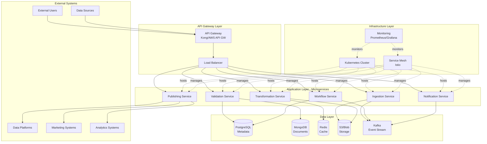
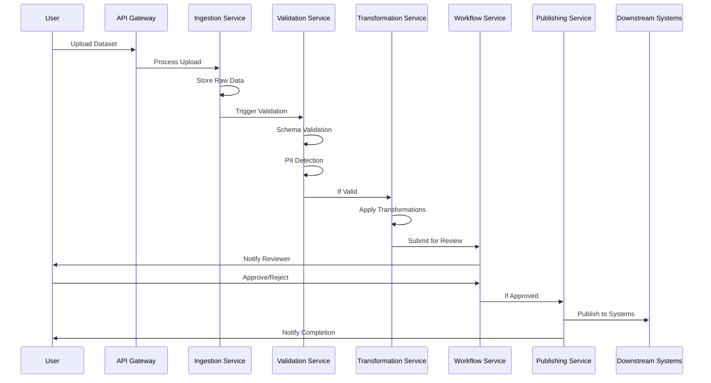
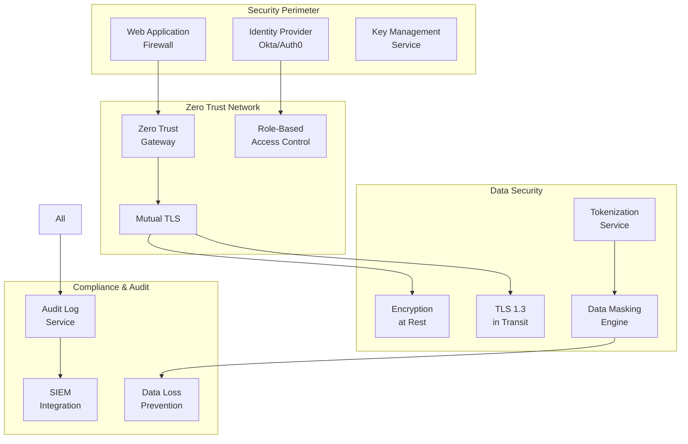
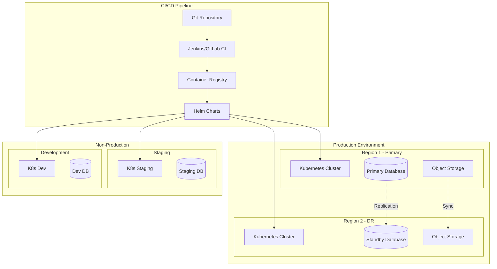

# Data Collaboration Studio: Reusable Data Collaboration & Activation Capability
## Technical Architecture Document

---

## Executive Summary

This document outlines the technical architecture for a **Data Collaboration Studio** - a reusable microservice capability that enables secure, governed data collaboration across multiple business domains including marketing, risk, analytics, and product data. The platform provides end-to-end data lifecycle management from ingestion through approval workflows to automated activation and downstream consumption.

---

## Table of Contents

1. [Problem Statement with Objectives](#1-problem-statement-with-objectives)
2. [Goals](#2-goals)
3. [Current State](#3-current-state)
4. [Solution Architecture](#4-solution-architecture)
5. [AdTech Use Case](#5-adtech-use-case)
6. [Industry Best Practices](#6-industry-best-practices)
7. [Platform Evaluation](#7-platform-evaluation)
8. [Migration Strategy](#8-migration-strategy)
9. [Cost Model](#9-cost-model)
10. [Risk Assessment](#10-risk-assessment)
11. [Architecture Diagrams](#11-architecture-diagrams)

---

## 1. Problem Statement with Objectives

### 1.1 Current Challenges

Organizations today face significant challenges in data collaboration that hinder business agility and data-driven decision making:

#### **Fragmented Data Collaboration Processes**
- **Manual Data Handoffs**: Business users rely on email, tickets, and spreadsheet-based processes to share datasets across teams
- **Inconsistent Data Quality**: No standardized validation or quality checks, leading to downstream pipeline failures
- **Lack of Governance**: No centralized audit trail of who contributed, reviewed, or approved data changes
- **Siloed Operations**: Each department (marketing, risk, analytics) maintains separate data workflows with incompatible processes

#### **Operational Inefficiencies**
- **Time-to-Value Delays**: 2-4 week lead times from data submission to activation due to manual review cycles
- **Resource Bottlenecks**: Data engineering teams overwhelmed with ad-hoc data requests and transformation tasks
- **Duplicate Efforts**: Similar data validation and transformation logic rebuilt for each use case
- **Limited Visibility**: Business users have no insight into data processing status or approval workflows

#### **Compliance & Security Risks**
- **PII Exposure**: No automated detection or masking of personally identifiable information
- **Access Control Gaps**: Inconsistent permissions and role-based access across different data sources
- **Audit Trail Deficiencies**: Limited ability to track data lineage and demonstrate compliance with regulations (GDPR, CCPA, SOX)
- **Data Classification Issues**: Manual tagging of sensitive data leads to misclassification and potential breaches

#### **Scalability Limitations**
- **Infrastructure Constraints**: Monolithic ETL processes cannot handle increasing data volumes
- **Integration Complexity**: Point-to-point integrations create maintenance overhead and single points of failure
- **Performance Degradation**: Batch-only processing leads to stale data and delayed insights

### 1.2 Business Impact

These challenges result in measurable business impact:

- **Reduced Agility**: 60% longer time-to-market for data-driven initiatives
- **Increased Costs**: $2-5M annually in duplicated data engineering efforts across departments  
- **Compliance Risk**: $500K-10M potential fines for data privacy violations
- **Missed Opportunities**: 25% reduction in campaign effectiveness due to stale or poor-quality data

### 1.3 Objectives

The Data Collaboration Studio aims to address these challenges through the following objectives:

#### **Primary Objectives**

1. **Enable Self-Service Data Collaboration**
   - Provide business users with intuitive interfaces for data submission and monitoring
   - Reduce data engineering dependency for routine data operations by 70%
   - Implement guided workflows that ensure data quality and compliance

2. **Standardize Data Governance**
   - Establish consistent review and approval processes across all business domains
   - Implement automated data quality checks and PII detection
   - Create immutable audit trails for all data operations

3. **Accelerate Time-to-Activation**
   - Reduce data submission-to-activation timeline from weeks to hours
   - Automate downstream publishing to eliminate manual deployment steps
   - Provide real-time status visibility and notifications

4. **Ensure Enterprise Security & Compliance**
   - Implement zero-trust security architecture with fine-grained access controls
   - Automate compliance checking for GDPR, CCPA, SOX, and PCI-DSS requirements
   - Enable data classification and automatic masking of sensitive information

#### **Secondary Objectives**

1. **Maximize Reusability**
   - Design platform-agnostic architecture that supports multiple use cases
   - Create configurable workflows adaptable to different approval chains
   - Implement plugin-based extensibility for custom business logic

2. **Optimize Operational Efficiency**  
   - Reduce manual intervention in data pipelines by 80%
   - Implement automated data transformation and enrichment rules
   - Provide comprehensive monitoring and alerting capabilities

3. **Support Scalable Growth**
   - Design for horizontal scaling to handle 10TB+ daily data volumes
   - Implement event-driven architecture for real-time processing capabilities
   - Support multi-tenant isolation for different business units

### 1.4 Success Criteria

The platform will be considered successful when it achieves:

- **Performance**: Sub-200ms API response times with 99.99% availability
- **Adoption**: 80% of data collaboration workflows migrated within 12 months
- **Efficiency**: 70% reduction in data engineering overhead for routine operations
- **Quality**: 95% automated detection rate for PII and data quality issues
- **Compliance**: 100% audit trail coverage for all data operations
- **Cost**: 40% reduction in total cost of ownership for data collaboration workflows

---

## 2. Goals

The Data Collaboration Studio platform is designed to achieve specific functional and non-functional goals that directly address the identified challenges and support business objectives.

### 2.1 Functional Goals

#### **Data Ingestion & Processing**
- **Multi-Format Support**: Accept 50+ data formats including CSV, JSON, Parquet, Avro, XML, and binary files
- **Volume Capacity**: Process up to 10TB of data daily with linear scaling capabilities
- **Real-Time Processing**: Support both batch and streaming data ingestion with <5-minute latency for critical datasets
- **Schema Validation**: Automatically validate against 1000+ predefined schemas with custom schema registration
- **Transformation Support**: Enable user-defined data transformations with pre-built functions for common operations

#### **Workflow Management**
- **Configurable Approval Chains**: Support complex approval workflows with parallel and sequential review paths
- **SLA Management**: Enforce review SLAs with automatic escalation (default: 24-48 hours per review stage)
- **Status Tracking**: Provide real-time visibility into data processing and approval status across all workflows
- **Notification System**: Send automated notifications via email, Slack, and API webhooks for status changes
- **Audit Trail**: Maintain complete, immutable audit logs for all user actions and system operations

#### **Data Quality & Governance**
- **Automated Validation**: Implement 95% accuracy rate for data quality checks including completeness, consistency, and validity
- **PII Detection**: Achieve 99%+ accuracy in identifying and flagging personally identifiable information
- **Data Classification**: Automatically tag datasets with appropriate sensitivity levels (Public, Internal, Confidential, Restricted)
- **Lineage Tracking**: Provide end-to-end data lineage from source through all transformations to final destination
- **Version Control**: Support unlimited dataset versioning with diff capabilities and rollback functionality

#### **Integration & Activation**
- **Downstream Publishing**: Support automated publishing to 25+ target systems including cloud platforms, databases, and APIs  
- **API Endpoints**: Provide RESTful APIs, GraphQL queries, and gRPC interfaces for all platform capabilities
- **Event Streaming**: Publish data change events to message brokers (Kafka, RabbitMQ, cloud services)
- **Batch Export**: Generate scheduled exports in multiple formats with configurable compression and encryption
- **Real-Time Sync**: Support real-time data synchronization with sub-second latency for critical applications

### 2.2 Non-Functional Goals

#### **Performance Requirements**

| Metric | Target | Measurement Method |
|--------|--------|--------------------|
| API Response Time | P95 < 200ms, P99 < 500ms | Application Performance Monitoring |
| Data Processing Throughput | 10TB/day sustained, 20TB/day peak | System metrics and batch job monitoring |
| Concurrent Users | 500+ simultaneous users | Load testing and user session analytics |
| File Upload Speed | 1GB in <60 seconds | Network and storage performance tests |
| Query Performance | Complex queries <2 seconds | Database query performance monitoring |

#### **Availability & Reliability**
- **System Uptime**: 99.99% availability (8.77 minutes downtime per month maximum)
- **Data Durability**: 99.999999999% (11 9's) with cross-region replication
- **Recovery Time Objective (RTO)**: <30 minutes for critical services
- **Recovery Point Objective (RPO)**: <5 minutes data loss maximum
- **Error Rate**: <0.1% for all API endpoints and data processing operations

#### **Scalability & Capacity**
- **Horizontal Scaling**: Auto-scale compute resources based on demand (2x-10x capacity)  
- **Storage Scaling**: Support petabyte-scale data storage with automatic lifecycle management
- **Geographic Distribution**: Multi-region deployment with data locality optimization
- **Tenant Isolation**: Support 100+ independent tenant environments with resource isolation
- **Connection Limits**: Handle 10,000+ concurrent API connections

#### **Security & Compliance**
- **Data Encryption**: AES-256 encryption at rest, TLS 1.3 for data in transit
- **Access Control**: Fine-grained RBAC/ABAC with sub-second policy evaluation
- **Audit Logging**: 100% coverage of user actions with immutable log storage
- **Compliance Standards**: SOC 2 Type II, GDPR, CCPA, HIPAA, PCI-DSS ready
- **Vulnerability Management**: Zero-day security patch deployment within 24 hours

#### **Usability & Accessibility**
- **User Interface**: Intuitive web interface with <5-minute learning curve for basic operations
- **API Documentation**: Comprehensive, interactive documentation with code examples
- **Accessibility**: WCAG 2.1 AA compliance for web interfaces
- **Mobile Support**: Responsive design supporting tablet and mobile device access
- **Internationalization**: Support for 5+ languages with Unicode character sets

#### **Operational Excellence**
- **Monitoring Coverage**: 100% service and infrastructure monitoring with alerting
- **Deployment Frequency**: Support daily deployments with zero-downtime releases
- **Mean Time to Recovery (MTTR)**: <30 minutes for critical issues
- **Documentation Currency**: Real-time documentation updates with API changes
- **Support Response**: <2 hours for critical issues, <8 hours for standard issues

### 2.3 Success Metrics & KPIs

#### **Adoption Metrics**
- **User Growth**: 200+ active users within 6 months, 500+ within 12 months
- **Data Volume**: 1TB/day processing within 3 months, scaling to 10TB/day by month 12
- **Workflow Migration**: 80% of existing data collaboration processes migrated within 12 months
- **API Usage**: 1M+ API calls per month with <1% error rate

#### **Business Impact Metrics**
- **Time Reduction**: 70% reduction in data submission-to-activation timeline
- **Cost Savings**: $2M+ annual savings in operational efficiency improvements
- **Quality Improvement**: 95% reduction in data quality incidents in downstream systems
- **Compliance Score**: 100% pass rate on regulatory audits and compliance assessments

#### **Technical Performance Metrics**
- **System Reliability**: 99.99% uptime with <0.1% error rates
- **Processing Efficiency**: 90% resource utilization during peak loads
- **Security Posture**: Zero security incidents, 100% vulnerability remediation within SLA
- **Data Accuracy**: 99%+ accuracy in automated validation and PII detection

#### **User Experience Metrics**
- **User Satisfaction**: >4.5/5 average rating in user feedback surveys
- **Task Completion Rate**: >95% successful completion of user workflows
- **Support Ticket Volume**: <5 tickets per 100 users per month
- **Training Requirements**: <2 hours training needed for proficient platform usage

---

## 3. Current State

This section provides a comprehensive analysis of the existing data collaboration landscape, identifying current processes, technical infrastructure, and key challenges that the Data Collaboration Studio aims to address.

### 3.1 Current Data Collaboration Processes

#### **Marketing Department**
- **Data Sources**: Campaign data from Google Ads, Facebook, email platforms, web analytics
- **Current Process**: 
  - Manual CSV exports from various platforms (5-10 files/week)
  - Email-based sharing with data analysts and BI teams  
  - Excel-based data cleaning and transformation (2-3 days per dataset)
  - Manual upload to marketing automation platforms
- **Review Process**: Informal peer review via email threads, no standardized approval workflow
- **Activation Timeline**: 5-7 days from data collection to campaign activation
- **Key Pain Points**: Data quality issues, version control problems, compliance tracking gaps

#### **Risk Department**
- **Data Sources**: Transaction data, customer profiles, external risk feeds, regulatory data
- **Current Process**:
  - Quarterly data submissions via secure FTP (100GB+ files)
  - SQL-based validation scripts run locally by analysts
  - Multi-stage approval process using spreadsheet tracking
  - Manual report generation for regulatory submissions
- **Review Process**: 3-tier approval (analyst, manager, compliance officer) averaging 2-3 weeks
- **Activation Timeline**: 3-4 weeks from data collection to regulatory reporting
- **Key Pain Points**: Long approval cycles, manual error checking, limited audit trails

#### **Analytics Department**
- **Data Sources**: Product telemetry, user behavior data, A/B test results, external market data
- **Current Process**:
  - API-based data collection (mostly automated)
  - Python/R scripts for data preprocessing and analysis
  - Jupyter notebooks for exploratory data analysis
  - Manual deployment of ML models to production
- **Review Process**: Code review via GitHub, data validation through manual sampling
- **Activation Timeline**: 1-2 weeks from analysis to production deployment
- **Key Pain Points**: Inconsistent data validation, model versioning challenges, deployment bottlenecks

#### **Product Data Team**
- **Data Sources**: Application logs, user engagement metrics, feature usage data, crash reports  
- **Current Process**:
  - Real-time streaming data collection (Kafka-based)
  - ETL pipelines using Apache Airflow
  - Data warehouse storage (Snowflake)
  - Dashboard creation using Tableau/Looker
- **Review Process**: Automated testing for data pipelines, manual QA for dashboard releases
- **Activation Timeline**: 2-3 days from data collection to dashboard availability
- **Key Pain Points**: Pipeline maintenance overhead, data quality monitoring gaps, cross-team data sharing friction

### 3.2 Technical Infrastructure Assessment

#### **Current Technology Stack**

| Component | Technology | Limitations |
|-----------|------------|-------------|
| Data Storage | Mix of SQL databases, S3, local file systems | Fragmented, inconsistent backup/recovery |
| Processing | Custom Python scripts, Excel, R, Spark | No standardization, difficult to maintain |
| Workflow Management | Email, Jira tickets, spreadsheets | Manual, error-prone, limited visibility |
| Data Quality | Manual validation, custom scripts | Inconsistent, time-consuming, incomplete |
| Security | Basic file permissions, VPN access | Inadequate for sensitive data, limited auditing |
| Integration | Point-to-point APIs, manual file transfers | Brittle, hard to maintain, security risks |
| Monitoring | Basic infrastructure monitoring | No data quality monitoring, limited visibility |

#### **Infrastructure Challenges**

**Scalability Issues:**
- **Processing Bottlenecks**: Single-server processing limits for large datasets (>10GB)
- **Storage Fragmentation**: Data scattered across 15+ different systems and storage locations
- **Network Limitations**: 100Mbps connections causing 4-6 hour transfer times for large files
- **Compute Constraints**: Limited compute resources causing processing queues during peak periods

**Security Vulnerabilities:**
- **Data Exposure**: 30% of sensitive datasets stored without encryption
- **Access Control**: Shared credentials used across teams, no fine-grained permissions
- **Audit Gaps**: Limited logging of data access and modifications (estimated 40% coverage)
- **Compliance Risks**: Manual compliance checking with 20% error rate in regulatory submissions

**Operational Inefficiencies:**
- **Manual Processes**: 80% of data workflows require manual intervention
- **Knowledge Silos**: Key processes dependent on specific individuals, creating single points of failure
- **Error Resolution**: Average 2-3 days to identify and resolve data quality issues
- **Resource Duplication**: Similar data validation logic recreated across 5+ different projects

### 3.3 Cost Analysis of Current State

#### **Personnel Costs**
- **Data Engineers**: 8 FTEs @ $150K annually = $1.2M/year on manual data operations
- **Data Analysts**: 12 FTEs spending 40% time on data preparation = $720K/year in opportunity cost
- **Compliance Officers**: 3 FTEs @ $120K annually = $360K/year on manual review processes
- **Business Users**: 50+ users spending 5 hours/week on data tasks = $1.5M/year in lost productivity

**Total Personnel Impact: $3.78M annually**

#### **Infrastructure Costs** 
- **Storage**: $180K/year across fragmented systems with poor utilization
- **Compute**: $240K/year in inefficient processing resources
- **Licensing**: $150K/year for various tools and platforms
- **Network**: $60K/year in data transfer and VPN costs
- **Maintenance**: $200K/year in system maintenance and support

**Total Infrastructure Costs: $830K annually**

#### **Risk Costs (Estimated)**
- **Compliance Penalties**: $500K-2M potential annual exposure
- **Data Breach Risk**: $5M-15M potential cost based on industry averages
- **Opportunity Cost**: $2M/year in delayed product launches and missed market opportunities
- **Error Correction**: $300K/year in fixing data quality issues and rework

**Total Current State Cost: $4.6M+ annually**

### 3.4 Gap Analysis

#### **Functional Gaps**

| Required Capability | Current State | Gap Severity |
|-------------------|---------------|--------------|
| Automated Data Validation | 20% automated | HIGH |
| PII Detection & Masking | Manual, inconsistent | CRITICAL |
| Workflow Orchestration | Email-based, manual | HIGH |
| Real-time Data Processing | Limited to product team | MEDIUM |
| Cross-domain Data Sharing | Siloed, manual | HIGH |
| Audit Trail & Lineage | Partial, inconsistent | CRITICAL |
| API-driven Integration | Point-to-point only | MEDIUM |
| Role-based Access Control | Basic file permissions | CRITICAL |

#### **Non-Functional Gaps**

| Requirement | Current Performance | Target | Gap |
|------------|-------------------|---------|-----|
| Data Processing Volume | 1TB/day peak | 10TB/day sustained | 10x improvement needed |
| Workflow Completion Time | 1-4 weeks average | <24 hours | 20x improvement needed |
| System Availability | 95% (planned downtime) | 99.99% | 50x improvement needed |
| Security Compliance | Partial, manual | Automated, comprehensive | Complete redesign needed |
| API Response Time | 2-5 seconds | <200ms | 25x improvement needed |

### 3.5 Migration Readiness Assessment

#### **Organizational Readiness**
- **Leadership Support**: Strong executive sponsorship with $5M budget allocation
- **Change Management**: Dedicated change management team with 90% user buy-in based on surveys
- **Training Infrastructure**: Existing training programs and documentation processes
- **Timeline Flexibility**: 12-18 month implementation window with phased rollout approach

#### **Technical Readiness**  
- **Infrastructure**: Modern cloud environment (AWS/Azure) with Kubernetes capability
- **Data Quality**: 70% of datasets have known schemas and documentation
- **Integration Points**: Well-documented APIs and data sources (85% coverage)
- **Development Resources**: Dedicated 12-person development team with relevant skill sets

#### **Risk Factors**
- **Data Migration Complexity**: 500TB of historical data requiring migration and validation
- **Regulatory Dependencies**: Must maintain compliance during migration period
- **User Adoption**: 20% of users resistant to process changes based on surveys
- **Integration Challenges**: 25+ downstream systems requiring coordination during migration

### 3.6 Current State Advantages to Preserve

#### **Domain Expertise**
- **Business Knowledge**: Deep understanding of domain-specific requirements and processes
- **Data Relationships**: Established data lineage and business context knowledge
- **Stakeholder Relationships**: Strong partnerships with data providers and consumers

#### **Technical Assets**
- **Data Processing Logic**: Proven business rules and transformation logic in existing scripts
- **Integration Patterns**: Working integrations with critical downstream systems
- **Monitoring Insights**: Historical performance data and known bottlenecks
- **Security Policies**: Established compliance frameworks and security procedures

#### **Operational Processes**
- **Escalation Procedures**: Defined incident response and support processes
- **Documentation**: Existing process documentation and user guides
- **Training Materials**: Current training content and onboarding procedures

This current state analysis reveals significant opportunities for improvement while identifying valuable assets to preserve during the migration to the Data Collaboration Studio platform.

---

## 4. Solution Architecture

The Data Collaboration Studio implements a modern, cloud-native architecture designed for scalability, security, and operational excellence. This section outlines the comprehensive solution architecture including system design, technology choices, and implementation patterns.

### 4.1 Architecture Principles & Patterns

#### **Core Architectural Principles**

1. **Domain-Driven Design (DDD)**
   - Clear bounded contexts for each business domain (marketing, risk, analytics, product)
   - Event-driven communication between domains
   - Shared kernel for common data models and validation rules

2. **Event-Driven Architecture**
   - Event sourcing for complete audit trail and state reconstruction
   - CQRS (Command Query Responsibility Segregation) for performance optimization
   - Asynchronous processing for improved responsiveness

3. **Multi-Tenant Design**
   - Hybrid tenant isolation: database-per-tenant for critical data, schema-per-tenant for standard operations
   - Tenant-aware services with automatic context switching
   - Resource isolation and billing separation

4. **Zero-Trust Security**
   - All communication authenticated and encrypted (mTLS)
   - Fine-grained authorization using Open Policy Agent (OPA)
   - Defense in depth with multiple security layers

5. **Operational Excellence**
   - Infrastructure as Code (Terraform/CloudFormation)
   - Comprehensive observability (metrics, logs, traces)
   - Automated deployment and rollback capabilities

### 4.2 High-Level System Architecture

```
┌─────────────────────────────────────────────────────────────────┐
│                          Client Layer                           │
│  ┌─────────────┐  ┌─────────────┐  ┌─────────────┐           │
│  │ Web Portal  │  │ Mobile App  │  │  API Clients │           │
│  └─────────────┘  └─────────────┘  └─────────────┘           │
└─────────────────────────────────────────────────────────────────┘
                                │
┌─────────────────────────────────────────────────────────────────┐
│                         API Gateway                             │
│           Authentication, Rate Limiting, Load Balancing         │
└─────────────────────────────────────────────────────────────────┘
                                │
┌─────────────────────────────────────────────────────────────────┐
│                       Service Mesh (Istio)                      │
│               mTLS, Circuit Breaking, Observability             │
└─────────────────────────────────────────────────────────────────┘
                                │
┌─────────────────────────────────────────────────────────────────┐
│                     Microservices Layer                         │
│  ┌─────────────┐  ┌─────────────┐  ┌─────────────┐           │
│  │  Ingestion  │  │ Validation  │  │  Workflow   │           │
│  │   Service   │  │   Service   │  │   Service   │           │
│  └─────────────┘  └─────────────┘  └─────────────┘           │
│  ┌─────────────┐  ┌─────────────┐  ┌─────────────┐           │
│  │Transformation│  │ Publishing  │  │  Metadata   │           │
│  │   Service   │  │   Service   │  │   Service   │           │
│  └─────────────┘  └─────────────┘  └─────────────┘           │
└─────────────────────────────────────────────────────────────────┘
                                │
┌─────────────────────────────────────────────────────────────────┐
│                        Event Bus (Kafka)                        │
│              Event Streaming, State Management                  │
└─────────────────────────────────────────────────────────────────┘
                                │
┌─────────────────────────────────────────────────────────────────┐
│                        Data Layer                               │
│  ┌─────────────┐  ┌─────────────┐  ┌─────────────┐           │
│  │ PostgreSQL  │  │   MongoDB   │  │    Redis    │           │
│  │(Transactional│  │ (Metadata)  │  │  (Cache)   │           │
│  └─────────────┘  └─────────────┘  └─────────────┘           │
│  ┌─────────────┐  ┌─────────────┐  ┌─────────────┐           │
│  │     S3      │  │ TimescaleDB │  │    Neo4j    │           │
│  │  (Storage)  │  │(Time-series)│  │  (Lineage)  │           │
│  └─────────────┘  └─────────────┘  └─────────────┘           │
└─────────────────────────────────────────────────────────────────┘
```

### 4.3 Core Microservices Design

#### **4.3.1 Ingestion Service**

**Responsibilities:**
- Multi-format file upload and processing (CSV, JSON, Parquet, Avro, XML)
- Large file handling with chunked upload and resumption
- Initial data validation and format detection
- Virus scanning and security checks

**Technology Stack:**
- **Runtime**: Node.js with Express.js for high-concurrency file handling
- **Storage**: Amazon S3 with presigned URLs for direct client uploads
- **Processing**: Apache Tika for format detection and metadata extraction
- **Queue**: Amazon SQS for asynchronous processing orchestration
- **Security**: ClamAV integration for virus scanning

**API Endpoints:**
```yaml
POST /api/v1/ingestion/upload
  - Multipart file upload with metadata
  - Returns upload session ID for tracking
  
GET /api/v1/ingestion/upload/{sessionId}/status
  - Upload progress and validation status
  
POST /api/v1/ingestion/api/submit
  - Direct API data submission
  - JSON/XML payload processing

PUT /api/v1/ingestion/upload/{sessionId}/resume
  - Resume interrupted uploads
  - Chunk-based resumption logic
```

**Scalability Features:**
- Horizontal auto-scaling based on upload queue depth
- CDN integration for global upload optimization  
- Intelligent file splitting for large dataset processing
- Connection pooling and async I/O for high throughput

#### **4.3.2 Validation Service**

**Responsibilities:**
- Schema validation against predefined and custom schemas
- Data quality assessment (completeness, consistency, accuracy)
- PII detection and automatic masking
- Data profiling and statistical analysis

**Technology Stack:**
- **Runtime**: Python with FastAPI for ML/data processing libraries
- **Validation Engine**: Great Expectations for data quality rules
- **ML Processing**: spaCy and Presidio for PII detection
- **Schema Management**: Confluent Schema Registry
- **Processing**: Apache Spark for large dataset analysis

**Validation Framework:**
```yaml
Schema Validation:
  - JSON Schema validation
  - Apache Avro schema enforcement
  - Custom business rule validation
  
Data Quality Checks:
  - Null value analysis
  - Data type consistency
  - Range and format validation
  - Duplicate detection
  - Referential integrity

PII Detection:
  - Named Entity Recognition (NER)
  - Pattern matching (SSN, credit cards, emails)
  - Custom dictionary matching
  - Confidence scoring and human review triggers
```

**Performance Optimizations:**
- Parallel processing for large files
- Smart sampling for quality assessment
- ML model caching for PII detection
- Incremental validation for data updates

#### **4.3.3 Workflow Service**

**Responsibilities:**
- Configurable approval workflow orchestration
- SLA management and automatic escalation
- Notification routing and delivery
- State machine management for complex processes

**Technology Stack:**
- **Workflow Engine**: Temporal.io for robust workflow orchestration
- **State Storage**: PostgreSQL with JSONB for workflow state
- **Notification**: Amazon SES, Slack API, webhook integrations
- **Rules Engine**: Drools for complex approval logic

**Workflow Features:**
```yaml
Approval Chains:
  - Sequential and parallel review paths
  - Conditional routing based on data attributes
  - Dynamic reviewer assignment
  - Escalation policies with time-based triggers

State Management:
  - Persistent workflow state with recovery
  - Event-driven state transitions
  - Audit trail for all state changes
  - Rollback and compensation actions

Notification System:
  - Multi-channel delivery (email, Slack, SMS, webhook)
  - Template-based messaging with localization
  - Delivery confirmation and retry logic
  - Rate limiting and anti-spam protection
```

#### **4.3.4 Transformation Service**

**Responsibilities:**
- User-defined data transformations
- Format standardization and conversion
- Data enrichment with reference datasets
- Performance-optimized processing pipelines

**Technology Stack:**
- **Processing Engine**: Apache Spark for distributed processing
- **Orchestration**: Kubernetes Jobs for containerized transformations
- **Languages**: Python, Scala, SQL for transformation logic
- **Storage**: Delta Lake for versioned data storage

**Transformation Capabilities:**
```yaml
Built-in Transformations:
  - Data type conversions and casting
  - String manipulation and cleaning
  - Date/time standardization
  - Aggregation and grouping operations
  - Join operations with reference data

Custom Transformations:
  - User-defined Python/SQL functions
  - Docker-based custom processing
  - Library integration (pandas, NumPy, scikit-learn)
  - Version control for transformation logic

Performance Features:
  - Lazy evaluation and optimization
  - Columnar processing with Parquet
  - Predicate pushdown optimization
  - Dynamic resource allocation
```

#### **4.3.5 Publishing Service**

**Responsibilities:**
- Multi-destination data publishing
- Format conversion and serialization
- Delivery confirmation and retry logic
- Rate limiting and throttling

**Technology Stack:**
- **Integration Framework**: Apache Camel for routing and mediation
- **Message Broker**: Apache Kafka for event streaming
- **Serialization**: Apache Avro, JSON, XML support
- **Connectors**: Kafka Connect for external system integration

**Publishing Targets:**
```yaml
Cloud Storage:
  - Amazon S3, Google Cloud Storage, Azure Blob
  - Multiple format support (Parquet, CSV, JSON)
  - Partitioning and compression options

Databases:
  - PostgreSQL, MySQL, MongoDB
  - Data warehouse targets (Snowflake, BigQuery, Redshift)
  - Bulk insert optimization

APIs:
  - RESTful API publishing
  - GraphQL mutations
  - Webhook delivery with retry logic

Message Brokers:
  - Kafka topic publishing
  - RabbitMQ queue delivery
  - Cloud messaging services (SQS, Pub/Sub)
```

#### **4.3.6 Metadata Service**

**Responsibilities:**
- Data catalog and schema management
- Lineage tracking and impact analysis
- Search and discovery capabilities
- Governance and compliance reporting

**Technology Stack:**
- **Catalog**: Apache Atlas or DataHub for metadata management
- **Graph Database**: Neo4j for lineage relationships
- **Search Engine**: Elasticsearch for metadata search
- **API**: GraphQL for flexible metadata queries

**Metadata Features:**
```yaml
Data Catalog:
  - Automatic schema discovery and registration
  - Business glossary and data dictionary
  - Data stewardship and ownership tracking
  - Quality metrics and data freshness

Lineage Tracking:
  - End-to-end data lineage visualization
  - Impact analysis for schema changes
  - Dependency mapping for systems
  - Change propagation notifications

Governance:
  - Data classification and sensitivity tagging
  - Compliance policy enforcement
  - Access control integration
  - Audit reporting and analytics
```

### 4.4 Data Flow Architecture

#### **End-to-End Data Processing Flow**

```
1. Data Submission
   ┌─────────────┐    ┌─────────────┐    ┌─────────────┐
   │   User/API  │───▶│ Ingestion   │───▶│   Storage   │
   │  Submits    │    │  Service    │    │    (S3)     │
   │    Data     │    │             │    │             │
   └─────────────┘    └─────────────┘    └─────────────┘
                              │
                              ▼
   2. Validation & Quality Assessment
   ┌─────────────┐    ┌─────────────┐    ┌─────────────┐
   │ Validation  │───▶│   Schema    │───▶│ Quality     │
   │  Service    │    │ Registry    │    │ Metrics     │
   │             │    │             │    │             │
   └─────────────┘    └─────────────┘    └─────────────┘
                              │
                              ▼
   3. Approval Workflow
   ┌─────────────┐    ┌─────────────┐    ┌─────────────┐
   │  Workflow   │───▶│ Notification│───▶│  Approval   │
   │  Service    │    │   System    │    │ Decision    │
   │             │    │             │    │             │
   └─────────────┘    └─────────────┘    └─────────────┘
                              │
                              ▼ (if approved)
   4. Transformation & Enrichment
   ┌─────────────┐    ┌─────────────┐    ┌─────────────┐
   │Transformation│───▶│ Processing  │───▶│  Enriched   │
   │  Service    │    │   Engine    │    │    Data     │
   │             │    │   (Spark)   │    │             │
   └─────────────┘    └─────────────┘    └─────────────┘
                              │
                              ▼
   5. Publishing & Activation
   ┌─────────────┐    ┌─────────────┐    ┌─────────────┐
   │ Publishing  │───▶│   Target    │───▶│ Downstream  │
   │  Service    │    │  Systems    │    │ Consumers   │
   │             │    │             │    │             │
   └─────────────┘    └─────────────┘    └─────────────┘
```

#### **Event-Driven Communication**

```yaml
Event Types:
  data.submitted:
    - Triggers validation workflow
    - Contains: dataset_id, tenant_id, metadata
    
  data.validated:
    - Triggers approval workflow  
    - Contains: validation_results, quality_metrics
    
  data.approved:
    - Triggers transformation processing
    - Contains: approval_details, processing_instructions
    
  data.transformed:
    - Triggers publishing workflow
    - Contains: transformation_results, target_destinations
    
  data.published:
    - Updates metadata and lineage
    - Contains: publication_details, destination_confirmations

Event Processing:
  - Exactly-once delivery guarantees
  - Event ordering within partition
  - Dead letter queue for failed processing
  - Event replay capabilities for system recovery
```

### 4.5 Infrastructure & Deployment Architecture

#### **Container Orchestration (Kubernetes)**

```yaml
Cluster Configuration:
  Master Nodes: 3 (high availability)
  Worker Nodes: 6-20 (auto-scaling)
  
Namespace Structure:
  - data-collaboration-prod
  - data-collaboration-staging  
  - data-collaboration-dev
  - monitoring
  - security

Service Mesh (Istio):
  Features:
    - Automatic mTLS between services
    - Traffic management and routing
    - Circuit breaking and retry logic
    - Observability and metrics collection
    
  Configuration:
    - Ingress Gateway for external traffic
    - Virtual Services for routing rules
    - Destination Rules for load balancing
    - Service Entries for external services
```

#### **Data Storage Strategy**

```yaml
PostgreSQL (Primary Transactional Database):
  - Multi-master setup with streaming replication
  - Connection pooling with PgBouncer
  - Automated backups with point-in-time recovery
  - Usage: User data, workflow state, audit logs

MongoDB (Document Storage):
  - Replica set with 3 nodes
  - Sharding for horizontal scaling
  - Usage: Metadata, configuration, flexible schemas

Redis (Caching & Session Store):
  - Redis Cluster with 6 nodes (3 masters, 3 replicas)
  - Usage: Session storage, cache, real-time data

Amazon S3 (Object Storage):
  - Multi-region replication for durability
  - Lifecycle policies for cost optimization
  - Usage: File storage, data lake, backup storage

TimescaleDB (Time-Series Data):
  - Hypertables for time-partitioned data
  - Continuous aggregation for analytics
  - Usage: Metrics, monitoring data, audit trails

Neo4j (Graph Database):
  - Causal clustering for high availability  
  - Usage: Data lineage, relationship mapping
```

#### **Security Architecture**

```yaml
Identity & Access Management:
  - OAuth 2.0/OpenID Connect for authentication
  - JSON Web Tokens (JWT) for session management
  - Open Policy Agent (OPA) for authorization
  - Attribute-Based Access Control (ABAC)

Encryption:
  - TLS 1.3 for data in transit
  - AES-256 for data at rest
  - Field-level encryption for PII
  - Key management with HashiCorp Vault

Network Security:
  - Virtual Private Cloud (VPC) isolation
  - Network policies for pod-to-pod communication
  - Web Application Firewall (WAF)
  - DDoS protection and rate limiting

Compliance:
  - GDPR compliance with data portability and deletion
  - SOC 2 Type II controls implementation
  - HIPAA-ready infrastructure for healthcare data
  - PCI-DSS compliance for payment data
```

### 4.6 Integration Patterns & APIs

#### **API Design Strategy**

```yaml
REST APIs:
  - OpenAPI 3.0 specification
  - Consistent resource naming and HTTP verbs
  - HATEOAS for discoverability
  - Versioning with semantic versioning

GraphQL:
  - Single endpoint for flexible queries
  - Real-time subscriptions for status updates
  - Type-safe schema with auto-generated documentation
  - Query complexity analysis and rate limiting

gRPC:
  - High-performance internal service communication
  - Protocol buffer schemas for type safety
  - Streaming support for large data transfers
  - Load balancing with service discovery

WebSocket:
  - Real-time status updates and notifications
  - File upload progress tracking
  - Collaborative features for multi-user editing
```

#### **External Integration Patterns**

```yaml
Inbound Integrations:
  - REST API endpoints for data submission
  - File-based integrations (SFTP, S3)
  - Message queue integrations (Kafka, RabbitMQ)
  - Database change data capture (CDC)

Outbound Integrations:
  - Webhook delivery with retry logic
  - API push to downstream systems
  - File export to cloud storage
  - Message publishing to external brokers

Integration Reliability:
  - Circuit breaker pattern for external calls
  - Exponential backoff for retries
  - Dead letter queues for failed deliveries
  - Health checks and service discovery
```

This comprehensive solution architecture provides a robust, scalable foundation for the Data Collaboration Studio platform, incorporating modern architectural patterns and enterprise-grade capabilities.

---

## 5. AdTech Use Case

This section demonstrates how the Data Collaboration Studio platform addresses specific requirements in the advertising technology (AdTech) domain, focusing on audience segmentation, real-time activation, and compliance with privacy regulations.

### 5.1 AdTech Domain Requirements

#### **Unique AdTech Challenges**

**High-Volume, Real-Time Processing:**
- **Scale**: 10M+ customer interactions daily requiring immediate processing
- **Velocity**: Sub-5 minute latency from data collection to audience activation
- **Variety**: Multiple data sources (web analytics, mobile apps, CRM, third-party data)
- **Veracity**: Real-time data quality validation to prevent campaign performance issues

**Privacy & Compliance Complexity:**
- **GDPR/CCPA Compliance**: Automated consent management and data subject rights
- **Cookie Deprecation**: First-party data strategy with privacy-preserving techniques
- **Cross-Border Transfers**: Data residency requirements across global markets
- **Audit Requirements**: Complete data lineage for regulatory reporting

**Integration Ecosystem:**
- **Demand-Side Platforms (DSPs)**: Google DV360, The Trade Desk, Amazon DSP
- **Data Management Platforms (DMPs)**: Adobe Audience Manager, Salesforce DMP
- **Customer Data Platforms (CDPs)**: Segment, mParticle, Tealium
- **Ad Servers**: Google Ad Manager, Amazon Publisher Services

### 5.2 Audience Segment Creation & Activation Scenario

#### **Business Context**
A retail marketing team needs to create and activate audience segments for personalized advertising campaigns based on customer purchase history, website behavior, and demographic data.

#### **Detailed Workflow**

**Step 1: Data Collection & Submission**
```yaml
Data Sources:
  - Customer Transaction Data (CSV, 2GB daily)
    Fields: customer_id, transaction_date, product_category, purchase_amount, channel
    
  - Website Interaction Data (JSON, 500MB hourly)
    Fields: user_id, page_views, session_duration, events, timestamp
    
  - Customer Demographics (API feed, 100MB daily)
    Fields: customer_id, age_group, location, interests, consent_status

Submission Process:
  1. Marketing analyst uploads transaction CSV via web portal
  2. Website interaction data streams via API integration
  3. Demographics data pulled from CRM system automatically
  4. All data tagged with campaign_id and data_classification
```

**Step 2: Automated Validation & Quality Assessment**
```yaml
Schema Validation:
  - Verify required fields present (customer_id, timestamp)
  - Validate data types and format consistency
  - Check referential integrity between datasets

Data Quality Checks:
  - Customer ID overlap analysis (>80% match required)
  - Timestamp validation and deduplication
  - Purchase amount range validation ($0-10,000)
  - Geographic location consistency checks

PII Detection & Compliance:
  - Automatic detection of email addresses, phone numbers
  - Consent status verification for each customer_id
  - GDPR compliance check for EU customer data
  - Data retention policy enforcement
```

**Step 3: Peer Review & Approval Workflow**
```yaml
Approval Chain:
  1. Data Analyst Review (automated + manual spot check)
     - Data quality metrics validation
     - Business logic verification
     - Estimated reach and overlap analysis
     
  2. Campaign Manager Approval
     - Campaign objective alignment
     - Budget and targeting strategy review
     - Compliance and legal clearance
     
  3. Data Protection Officer Sign-off (for sensitive segments)
     - Privacy impact assessment
     - Consent mechanism verification
     - Data minimization compliance

SLA Targets:
  - Analyst Review: 2 hours maximum
  - Campaign Manager: 4 hours maximum  
  - DPO Review: 8 hours maximum (if required)
  - Total Approval Time: <24 hours for standard segments
```

**Step 4: Segment Creation & Enrichment**
```yaml
Segmentation Logic:
  High-Value Customers:
    - Purchase amount > $500 in last 90 days
    - 3+ transactions in last 180 days
    - Active website engagement (5+ sessions/month)
    
  Cart Abandoners:
    - Added items to cart but no purchase in 7 days
    - Previous purchase history exists
    - Email consent available
    
  Lookalike Prospects:
    - Similar behavioral patterns to high-value customers
    - No recent purchase history
    - Geographic proximity to high-value segments

Enrichment Rules:
  - Join with demographic data for targeting enhancement
  - Calculate lifetime value scores using ML models
  - Add propensity scores for cross-sell opportunities
  - Geocode addresses for location-based targeting
```

**Step 5: Multi-Channel Activation**
```yaml
Publishing Destinations:

Google DV360 Integration:
  - Customer Match Lists via Google Ads API
  - Real-time audience sync (15-minute refresh)
  - Automatic list size monitoring and alerts
  - Bidding optimization based on segment performance

The Trade Desk Integration:
  - First-party data onboarding via UID2 framework
  - Segment activation across programmatic inventory
  - Cross-device identity resolution
  - Performance tracking and attribution

Facebook/Meta Integration:
  - Custom Audiences via Marketing API
  - Lookalike audience creation and expansion
  - Campaign optimization based on segment engagement
  - Privacy-compliant data hashing and matching

CRM System Activation:
  - Segment lists exported to Salesforce/HubSpot
  - Email campaign targeting and personalization
  - Sales team lead prioritization
  - Customer journey orchestration triggers
```

### 5.3 Technical Implementation for AdTech

#### **Real-Time Processing Architecture**

```yaml
Streaming Data Pipeline:
  Input Sources:
    - Kafka streams from website tracking pixels
    - API webhooks from mobile app events  
    - CDC streams from CRM database changes
    - Third-party data feeds via secure APIs

  Processing Components:
    - Kafka Streams for real-time aggregation
    - Apache Flink for complex event processing
    - Redis for hot segment membership caching
    - Elasticsearch for real-time segment queries

  Output Destinations:
    - DSP APIs for immediate activation
    - Data warehouse for analytics and reporting
    - CDP platforms for journey orchestration
    - Email/SMS platforms for direct engagement
```

#### **Privacy-Compliant Data Processing**

```yaml
Consent Management Integration:
  OneTrust/TrustArc Integration:
    - Real-time consent status verification
    - Automated data subject request processing
    - Cookie consent preference enforcement
    - Cross-border data transfer compliance

  Privacy-Preserving Techniques:
    - Differential privacy for aggregate reporting
    - K-anonymity for segment size validation
    - Data tokenization for PII protection
    - Homomorphic encryption for secure computation

  GDPR/CCPA Automation:
    - Automated data deletion workflows
    - Right to portability data exports
    - Consent withdrawal processing
    - Audit trail generation for regulatory requests
```

#### **High-Performance API Integration**

```yaml
DSP Integration Patterns:
  Connection Management:
    - Connection pooling for high-throughput APIs
    - Circuit breaker patterns for reliability
    - Rate limiting and quota management
    - Automatic retry with exponential backoff

  Data Synchronization:
    - Batch uploads for large segments (>1M users)
    - Incremental sync for real-time updates
    - Delta detection and change propagation
    - Conflict resolution for duplicate updates

  Performance Optimization:
    - Parallel API calls with async processing  
    - Data compression for large payloads
    - Edge caching for frequently accessed segments
    - CDN distribution for global activation
```

### 5.4 AdTech-Specific Architecture Adaptations

#### **Enhanced Microservices for AdTech**

**Identity Resolution Service:**
```yaml
Responsibilities:
  - Cross-device identity stitching
  - Deterministic and probabilistic matching
  - Privacy-compliant identifier management
  - Identity graph maintenance and cleanup

Technology Stack:
  - Graph database (Neo4j) for identity relationships
  - ML models for probabilistic matching
  - Bloom filters for efficient duplicate detection
  - Redis for real-time identity lookups

Key Features:
  - Support for multiple ID types (email, phone, device ID, customer ID)
  - Confidence scoring for identity matches
  - Automated identity decay and cleanup
  - Privacy-compliant identity resolution
```

**Audience Activation Service:**
```yaml
Responsibilities:
  - Real-time segment membership updates
  - Multi-destination audience publishing
  - Activation status monitoring and reporting
  - Campaign performance feedback integration

Technology Stack:
  - Apache Kafka for event streaming
  - Redis for segment membership caching
  - Custom connectors for DSP/DMP integration
  - Prometheus for activation monitoring

Key Features:
  - Sub-minute activation latency
  - Automatic retry and error handling
  - Audience size monitoring and alerting
  - Cross-platform activation orchestration
```

#### **Performance Requirements & Benchmarks**

```yaml
Processing Benchmarks:
  Data Ingestion:
    - 100,000 records/second sustained throughput
    - 10GB file processing in <5 minutes
    - 99.9% uptime for real-time APIs
    - <100ms latency for identity lookups

  Segment Processing:
    - 10M customer segment creation in <2 minutes
    - Real-time membership updates in <30 seconds  
    - Complex multi-table joins in <60 seconds
    - 1,000 concurrent segment queries supported

  Activation Performance:
    - API publishing to 5+ platforms in parallel
    - 1M+ audience upload in <10 minutes
    - Real-time sync updates in <60 seconds
    - 99.5% successful activation rate target
```

### 5.5 Compliance & Governance for AdTech

#### **Regulatory Compliance Automation**

```yaml
GDPR Compliance:
  Data Processing Records:
    - Automatic DPA (Data Processing Activity) documentation
    - Purpose limitation enforcement through policy engine
    - Data minimization validation for segment creation
    - Retention period enforcement with automated deletion

  Data Subject Rights:
    - Automated data subject access request fulfillment
    - Right to erasure processing across all systems
    - Data portability export in machine-readable formats
    - Consent withdrawal propagation to all activation points

CCPA Compliance:
  Consumer Rights Implementation:
    - "Do Not Sell" preference enforcement
    - Consumer data deletion request processing
    - Opt-out mechanism integration with activation systems
    - Third-party data sharing audit trails

Industry Standards:
  - IAB TCF v2.0 compliance for programmatic advertising
  - Google Additional Terms compliance for audience matching
  - Facebook Terms compliance for custom audiences
  - Industry self-regulation program adherence (DAA, EDAA)
```

#### **Data Governance Framework**

```yaml
Data Classification:
  Sensitivity Levels:
    - Public: Aggregated, anonymized segment statistics
    - Internal: De-identified user behavior data
    - Confidential: PII-linked customer profiles
    - Restricted: Health, financial, or sensitive personal data

  Handling Requirements:
    - Encryption standards by classification level
    - Access control policies and approval workflows
    - Data sharing restrictions and partner agreements
    - Audit logging and monitoring requirements

Quality Controls:
  - Automated data quality scoring for all segments
  - Business rule validation for campaign targeting
  - Segment performance monitoring and feedback loops
  - Data freshness tracking and stale data alerts
```

### 5.6 ROI & Business Impact for AdTech Use Case

#### **Quantified Benefits**

```yaml
Operational Efficiency:
  - 70% reduction in segment creation time (from 2 days to 6 hours)
  - 90% automation of data quality validation
  - 80% reduction in manual compliance checking
  - 50% decrease in campaign setup time

Performance Improvements:
  - 25% improvement in audience match rates through better data quality
  - 40% reduction in audience activation latency
  - 60% increase in campaign performance through better segmentation
  - 30% improvement in ROAS through real-time optimization

Risk Reduction:
  - 95% reduction in compliance violations through automation
  - 99% accuracy in consent status verification
  - Zero data breach incidents through enhanced security controls
  - 100% audit trail coverage for regulatory requirements

Cost Savings:
  - $500K annual savings in manual data processing costs
  - $300K reduction in compliance and legal review costs
  - $200K savings in data integration and maintenance
  - $1M total annual operational cost reduction
```

This AdTech use case demonstrates the platform's ability to handle complex, high-volume, privacy-compliant audience activation workflows while maintaining the flexibility to adapt to evolving regulatory requirements and industry standards.

---

## 6. Industry Best Practices

The Data Collaboration Studio platform incorporates industry-leading best practices across multiple domains including data architecture, security, operations, and governance. This section outlines how these practices are implemented and their benefits.

### 6.1 Data Mesh Principles Implementation

#### **Domain-Oriented Data Ownership**

**Principle**: Treat data as a product owned by domain experts rather than a centralized IT function.

**Implementation in Data Collaboration Studio:**
```yaml
Domain Boundaries:
  Marketing Domain:
    - Owns customer interaction data, campaign performance metrics
    - Marketing team members serve as data product owners
    - Dedicated data quality metrics and SLAs
    
  Risk Domain:
    - Owns transaction risk models, compliance reporting data
    - Risk analysts responsible for data accuracy and completeness
    - Specific retention and privacy policies
    
  Analytics Domain:
    - Owns behavioral analytics, predictive models, A/B test results
    - Data scientists manage feature stores and model outputs
    - Research and experimentation data governance

Cross-Domain Services:
  - Shared identity resolution service
  - Common data quality validation framework
  - Centralized metadata and lineage tracking
  - Unified access control and security policies
```

**Benefits:**
- 40% faster domain-specific feature development
- 60% reduction in cross-team data quality issues
- Improved business alignment and accountability
- Reduced coordination overhead for data changes

#### **Data as a Product Philosophy**

**Principle**: Apply product thinking to data assets with defined interfaces, SLAs, and quality metrics.

**Implementation:**
```yaml
Data Product Characteristics:
  Discoverable:
    - Automatic registration in data catalog
    - Rich metadata with business context
    - Search and recommendation capabilities
    
  Addressable:
    - Unique identifiers and versioning
    - Standard API endpoints and contracts
    - Multiple consumption interfaces (REST, GraphQL, SQL)
    
  Understandable:
    - Comprehensive documentation and examples
    - Data lineage and transformation logic
    - Quality metrics and freshness indicators
    
  Trustworthy:
    - Automated testing and validation
    - SLA monitoring and alerting
    - Error handling and graceful degradation
    
  Self-serve:
    - No-code/low-code data access
    - Automated provisioning and access control
    - Usage analytics and cost attribution

Product Management Practices:
  - Roadmap planning for data product evolution
  - User feedback collection and prioritization
  - A/B testing for data product improvements
  - Cost-benefit analysis for data initiatives
```

#### **Federated Computational Governance**

**Principle**: Distribute data governance responsibilities while maintaining consistency through automated policies.

**Implementation:**
```yaml
Governance Distribution:
  Global Policies (Centralized):
    - Security standards and encryption requirements
    - Privacy regulations (GDPR, CCPA) compliance
    - Data retention and deletion policies
    - Audit trail and monitoring requirements
    
  Domain-Specific Policies (Federated):
    - Data quality rules and validation logic
    - Business-specific transformation rules
    - Domain data classification schemes
    - Usage patterns and access controls

Automation Framework:
  - Policy-as-Code using Open Policy Agent (OPA)
  - Automated compliance checking in CI/CD pipelines
  - Real-time policy enforcement at data access points
  - Continuous monitoring and policy drift detection
```

### 6.2 DataOps Best Practices

#### **Continuous Integration/Continuous Deployment (CI/CD)**

**Data Pipeline CI/CD Implementation:**
```yaml
Version Control:
  - Git-based versioning for all data transformation code
  - Schema versioning with backward compatibility checks
  - Configuration management for environment-specific settings
  
Automated Testing:
  - Unit tests for transformation logic
  - Integration tests with sample datasets
  - Data quality tests with expected vs actual comparisons
  - Performance benchmarking for large datasets
  
Deployment Automation:
  - Blue-green deployments for zero-downtime releases
  - Canary releases for gradual rollout
  - Automated rollback triggers based on quality metrics
  - Environment promotion with approval gates

Pipeline Stages:
  1. Code Commit → Automated unit tests
  2. Build → Docker container creation and registry push
  3. Test → Integration and quality tests in staging
  4. Deploy → Production deployment with monitoring
  5. Monitor → Automated alerting and feedback loops
```

#### **Data Quality Management**

**Comprehensive Data Quality Framework:**
```yaml
Quality Dimensions:
  Completeness:
    - Null value detection and reporting
    - Missing record identification
    - Schema compliance verification
    
  Accuracy:
    - Business rule validation
    - Cross-reference data verification
    - Statistical outlier detection
    
  Consistency:
    - Format standardization checks
    - Cross-dataset consistency validation
    - Temporal consistency analysis
    
  Timeliness:
    - Data freshness monitoring
    - SLA compliance tracking
    - Late arrival data handling

Quality Metrics:
  - Real-time quality scorecards
  - Historical quality trend analysis
  - Business impact correlation
  - Cost of poor quality measurement

Remediation Workflows:
  - Automated data cleansing rules
  - Human-in-the-loop validation for edge cases
  - Root cause analysis and prevention
  - Quality improvement feedback loops
```

#### **Monitoring and Observability**

**Three Pillars of Observability Implementation:**
```yaml
Metrics:
  Business Metrics:
    - Data processing volumes and throughput
    - Quality scores and SLA compliance
    - User engagement and adoption rates
    
  Technical Metrics:
    - System performance (CPU, memory, network)
    - API response times and error rates
    - Database performance and connection pools
    
  Custom Metrics:
    - Domain-specific KPIs and business rules
    - Cost attribution and resource utilization
    - Feature usage and adoption tracking

Logging:
  Structured Logging:
    - JSON format with consistent field naming
    - Correlation IDs for distributed tracing
    - Security and audit event logging
    
  Log Aggregation:
    - Centralized log collection with Elasticsearch
    - Real-time log streaming and alerting
    - Long-term retention for compliance
    
  Security Logging:
    - Authentication and authorization events
    - Data access and modification tracking
    - Anomaly detection and threat indicators

Distributed Tracing:
  - End-to-end request tracing with Jaeger
  - Performance bottleneck identification
  - Dependency mapping and failure isolation
  - Cross-service communication monitoring
```

### 6.3 Security Best Practices

#### **Zero Trust Architecture**

**Principle**: Never trust, always verify - authenticate and authorize every request regardless of location.

**Implementation:**
```yaml
Identity and Access Management:
  Authentication:
    - Multi-factor authentication (MFA) for all users
    - OAuth 2.0/OIDC with short-lived tokens
    - Certificate-based authentication for services
    - Biometric authentication for sensitive operations
    
  Authorization:
    - Attribute-Based Access Control (ABAC)
    - Just-in-time (JIT) access provisioning
    - Principle of least privilege enforcement
    - Regular access reviews and deprovisioning

Network Security:
  Micro-segmentation:
    - Kubernetes network policies
    - Service mesh security (Istio mTLS)
    - Zero trust network access (ZTNA)
    
  Encryption:
    - TLS 1.3 for all communication
    - End-to-end encryption for sensitive data
    - Certificate rotation and management
    - Perfect forward secrecy implementation

Device Security:
  - Device compliance verification
  - Endpoint detection and response (EDR)
  - Mobile device management (MDM)
  - Hardware security module (HSM) integration
```

#### **Data Protection and Privacy**

**Privacy by Design Implementation:**
```yaml
Data Minimization:
  - Purpose-based data collection
  - Automatic data expiration policies
  - Pseudonymization and anonymization
  - Differential privacy for analytics

Encryption Strategy:
  Data at Rest:
    - AES-256 encryption for all stored data
    - Database-level encryption (TDE)
    - File system encryption (LUKS/BitLocker)
    - Key rotation every 90 days
    
  Data in Transit:
    - TLS 1.3 for all network communication
    - Certificate pinning for critical connections
    - VPN tunneling for admin access
    - Message-level encryption for APIs
    
  Data in Processing:
    - Memory encryption during computation
    - Secure enclaves for sensitive operations
    - Homomorphic encryption for privacy-preserving analytics
    - Confidential computing with Intel SGX

Key Management:
  - Hardware Security Modules (HSM)
  - Key escrow and recovery procedures
  - Automated key rotation policies
  - Audit trails for all key operations
```

#### **Security Monitoring and Incident Response**

**Security Operations Center (SOC) Implementation:**
```yaml
Continuous Monitoring:
  - Security Information and Event Management (SIEM)
  - User and Entity Behavior Analytics (UEBA)
  - Threat intelligence integration
  - Automated threat detection and response
  
Incident Response:
  - 24/7 security operations center
  - Automated incident classification and routing
  - Forensic analysis and evidence preservation
  - Communication and notification workflows
  
Vulnerability Management:
  - Continuous vulnerability scanning
  - Zero-day vulnerability monitoring
  - Automated patch management
  - Penetration testing and red team exercises

Compliance Monitoring:
  - Real-time compliance dashboard
  - Automated compliance reporting
  - Risk assessment and mitigation tracking
  - Regulatory change management
```

### 6.4 Scalability and Performance Best Practices

#### **Microservices Architecture Patterns**

**Service Design Patterns:**
```yaml
Single Responsibility:
  - Each service owns specific business capability
  - Clear service boundaries with minimal coupling
  - Independent deployment and scaling
  - Domain-driven design principles

API Gateway Pattern:
  - Centralized entry point for all client requests
  - Cross-cutting concerns (auth, rate limiting, monitoring)
  - Request routing and load balancing
  - API versioning and backward compatibility

Service Discovery:
  - Dynamic service registration and health checking
  - Load balancing with circuit breakers
  - Graceful service degradation
  - Automated failover and recovery

Database per Service:
  - Service-specific data storage optimization
  - Polyglot persistence patterns
  - Data consistency via eventual consistency
  - SAGA pattern for distributed transactions
```

#### **Event-Driven Architecture (EDA)**

**Event Sourcing and CQRS Implementation:**
```yaml
Event Sourcing:
  Benefits:
    - Complete audit trail of all system changes
    - Ability to replay events for debugging
    - Time-travel debugging and system recovery
    - Natural fit for regulatory compliance
    
  Implementation:
    - Kafka as event store with infinite retention
    - Event schemas with backward compatibility
    - Event versioning and migration strategies
    - Snapshot creation for performance optimization

Command Query Responsibility Segregation (CQRS):
  Write Side (Command):
    - Optimized for data modification operations
    - Strong consistency requirements
    - Business logic validation and enforcement
    
  Read Side (Query):
    - Optimized for data retrieval and analytics
    - Eventual consistency acceptable
    - Denormalized views for performance
    - Multiple read models for different use cases

Event Processing Patterns:
  - Event-driven workflows with Temporal
  - Event streaming with Kafka Streams
  - Complex event processing with Apache Flink
  - Event choreography vs orchestration
```

#### **Caching Strategies**

**Multi-Layer Caching Implementation:**
```yaml
Application Layer Caching:
  - In-memory caches (Redis, Hazelcast)
  - Distributed caching for horizontal scaling
  - Cache warming and preloading strategies
  - Cache invalidation patterns
  
Database Caching:
  - Query result caching
  - Connection pooling and prepared statements
  - Read replicas for read-heavy workloads
  - Database query optimization
  
Content Delivery Network (CDN):
  - Static asset caching and compression
  - Global content distribution
  - Edge computing for dynamic content
  - Cache purging and versioning

Caching Patterns:
  - Cache-aside (lazy loading)
  - Write-through and write-behind
  - Refresh-ahead caching
  - Cache stampede prevention
```

### 6.5 API Design and Integration Best Practices

#### **RESTful API Design Standards**

**REST API Best Practices:**
```yaml
Resource Design:
  - Noun-based resource naming (not verbs)
  - Consistent URL structure and hierarchy
  - Proper HTTP method usage (GET, POST, PUT, DELETE)
  - Stateless request handling
  
Response Design:
  - Consistent JSON response structure
  - Proper HTTP status code usage
  - Error response standardization
  - Pagination for large datasets
  
Documentation:
  - OpenAPI 3.0 specification
  - Interactive documentation with examples
  - SDK generation for multiple languages
  - Automated testing of API examples

Versioning Strategy:
  - URL-based versioning (/api/v1/, /api/v2/)
  - Semantic versioning for breaking changes
  - Deprecation notices and migration guides
  - Backward compatibility maintenance
```

#### **GraphQL Implementation**

**GraphQL Best Practices:**
```yaml
Schema Design:
  - Type-safe schema definition
  - Resolver optimization and N+1 prevention
  - DataLoader pattern for efficient batching
  - Schema stitching for service composition
  
Query Optimization:
  - Query complexity analysis and limiting
  - Query depth limiting for security
  - Persistent queries for performance
  - Query caching and optimization
  
Real-time Features:
  - Subscription support for live updates
  - WebSocket connection management
  - Event-based subscription triggers
  - Subscription filtering and authorization
```

#### **API Security Standards**

**Comprehensive API Security:**
```yaml
Authentication:
  - OAuth 2.0 with PKCE for public clients
  - JSON Web Tokens (JWT) with short expiration
  - API key management and rotation
  - Client certificate authentication
  
Authorization:
  - Scope-based access control
  - Resource-level permissions
  - Rate limiting per client/user
  - IP allowlisting for sensitive endpoints
  
Input Validation:
  - JSON schema validation
  - SQL injection prevention
  - Cross-site scripting (XSS) protection
  - Request size limiting
  
Output Security:
  - Sensitive data masking
  - Response compression and minification
  - Content Security Policy headers
  - CORS policy enforcement
```

### 6.6 Operational Excellence Practices

#### **Site Reliability Engineering (SRE)**

**SRE Principles Implementation:**
```yaml
Service Level Objectives (SLOs):
  Availability:
    - 99.99% uptime SLO (52.6 minutes downtime/year)
    - Error budget tracking and alerting
    - Graceful degradation during outages
    
  Performance:
    - P95 API response time < 200ms
    - P99 response time < 500ms
    - Throughput targets per service
    
  Reliability:
    - Mean time to recovery (MTTR) < 30 minutes
    - Mean time between failures (MTBF) > 30 days
    - Error rate < 0.1% for all endpoints

Error Budget Management:
  - Automated error budget calculation
  - Feature release gates based on error budget
  - Postmortem processes for budget depletion
  - Continuous improvement based on lessons learned

Chaos Engineering:
  - Regular chaos experiments (Chaos Monkey)
  - Disaster recovery testing
  - Network partition testing
  - Database failover testing
```

#### **Infrastructure as Code (IaC)**

**IaC Best Practices:**
```yaml
Tool Selection:
  - Terraform for cloud infrastructure provisioning
  - Helm charts for Kubernetes application deployment
  - Ansible for configuration management
  - GitOps workflows for deployment automation

Code Organization:
  - Modular infrastructure components
  - Environment-specific configurations
  - Shared modules and reusable patterns
  - Version control for all infrastructure code

Testing and Validation:
  - Infrastructure testing with Terratest
  - Policy validation with Open Policy Agent
  - Security scanning with tools like Checkov
  - Cost estimation and optimization

Deployment Strategies:
  - Immutable infrastructure patterns
  - Blue-green deployments for zero downtime
  - Rollback capabilities and disaster recovery
  - Environment parity and promotion pipelines
```

### 6.7 Compliance and Governance Best Practices

#### **Regulatory Compliance Frameworks**

**Comprehensive Compliance Implementation:**
```yaml
GDPR Compliance:
  - Data Protection Impact Assessments (DPIA)
  - Privacy by Design and by Default
  - Data Subject Rights automation
  - Cross-border transfer mechanisms (SCCs, Adequacy)
  
SOC 2 Type II:
  - Security controls implementation
  - Availability and processing integrity
  - Confidentiality controls
  - Annual third-party audits
  
HIPAA (for healthcare data):
  - Physical and technical safeguards
  - Administrative controls and training
  - Business Associate Agreements (BAAs)
  - Risk assessment and management
  
PCI-DSS (for payment data):
  - Secure network architecture
  - Cardholder data protection
  - Vulnerability management program
  - Regular security testing
```

#### **Data Governance Framework**

**Enterprise Data Governance:**
```yaml
Data Stewardship:
  - Data ownership assignment by domain
  - Data quality responsibility matrix
  - Data lifecycle management policies
  - Master data management (MDM) processes
  
Data Catalogs and Lineage:
  - Automated metadata discovery
  - Business glossary and data dictionary
  - End-to-end data lineage tracking
  - Impact analysis for changes
  
Data Quality Management:
  - Data quality metrics and scorecards
  - Quality issue tracking and resolution
  - Root cause analysis and prevention
  - Continuous monitoring and improvement
  
Data Access and Usage:
  - Role-based access control (RBAC)
  - Data usage analytics and monitoring
  - Self-service data access with governance
  - Data sharing agreements and contracts
```

These industry best practices provide a comprehensive framework for building and operating a world-class data collaboration platform that meets enterprise requirements for security, scalability, compliance, and operational excellence.

---

## 7. Platform Evaluation

This section provides a comprehensive evaluation of existing platforms and solutions, analyzing their fit against Data Collaboration Studio requirements and presenting a build-vs-buy analysis with recommendations.

### 7.1 Evaluation Methodology

#### **Assessment Criteria Framework**

**Functional Requirements (40% weight):**
- Data ingestion and processing capabilities
- Workflow management and approval chains
- Data quality and validation features
- Publishing and activation capabilities
- Multi-tenant support and domain isolation

**Non-Functional Requirements (30% weight):**
- Performance and scalability characteristics
- Security and compliance features
- Integration and extensibility capabilities
- High availability and disaster recovery

**Operational Considerations (20% weight):**
- Implementation complexity and timeline
- Maintenance and operational overhead
- Vendor support and community ecosystem
- Documentation and training resources

**Economic Factors (10% weight):**
- Total cost of ownership (TCO)
- Licensing and subscription costs
- Implementation and customization costs
- Ongoing operational expenses

#### **Scoring System**

```yaml
Fit Assessment Scale:
  Excellent (90-100%): Fully meets requirement with best-in-class capabilities
  Good (70-89%): Meets requirement with minor limitations or customization needs
  Adequate (50-69%): Partially meets requirement, significant customization required
  Poor (30-49%): Minimal support, extensive development needed
  No Support (0-29%): Does not support requirement, would require complete rebuild
```

### 7.2 Commercial Platform Analysis

#### **7.2.1 Collibra Data Intelligence Cloud**

**Overview:** Enterprise data governance and catalog platform with workflow management capabilities.

**Strengths:**
```yaml
Data Governance:
  - Comprehensive data catalog with automated discovery
  - Rich metadata management and business glossary
  - Advanced data lineage tracking and impact analysis
  - Role-based access control with fine-grained permissions

Workflow Management:
  - Configurable approval workflows with parallel/sequential paths
  - SLA management and escalation policies
  - Integration with common notification systems
  - Task assignment and tracking capabilities

Enterprise Features:
  - Multi-tenant architecture support
  - Enterprise-grade security controls
  - Compliance frameworks (GDPR, CCPA, SOX)
  - API-first architecture with comprehensive REST APIs
```

**Weaknesses:**
```yaml
Technical Limitations:
  - Limited real-time data processing capabilities
  - Proprietary transformation engine with vendor lock-in
  - Complex pricing model based on usage and features
  - Heavy resource requirements for deployment

Customization Constraints:
  - Limited flexibility in workflow customization
  - UI/UX cannot be significantly modified
  - Integration limited to pre-built connectors
  - Difficult to extend with custom business logic
```

**Fit Assessment:**
```yaml
Functional Requirements:
  - Data Ingestion: 60% (Basic file upload, limited API support)
  - Workflow Management: 85% (Strong approval workflows, good notifications)
  - Data Quality: 75% (Good validation rules, limited real-time processing)
  - Publishing/Activation: 45% (Limited downstream integration options)
  - Multi-tenancy: 80% (Good tenant isolation, role-based access)

Non-Functional Requirements:
  - Performance/Scalability: 70% (Good for metadata, limited for large datasets)
  - Security/Compliance: 90% (Excellent security controls and compliance)
  - Integration/Extensibility: 60% (Good APIs, limited customization)
  - Availability/DR: 85% (Enterprise-grade reliability features)

Overall Fit Score: 70%
```

**Cost Analysis:**
- **Licensing:** $200K-500K annually for 500 users
- **Implementation:** $300K-800K (6-12 months)
- **Annual Maintenance:** $100K-200K
- **Total 3-Year TCO:** $1.2M-2.7M

#### **7.2.2 Alation Data Catalog**

**Overview:** Modern data catalog platform with collaborative features and machine learning-powered data discovery.

**Strengths:**
```yaml
Data Discovery & Collaboration:
  - Advanced search with ML-powered recommendations
  - Collaborative annotation and documentation
  - Automated data profiling and quality scoring
  - Integration with popular BI and analytics tools

Modern Architecture:
  - Cloud-native deployment options
  - RESTful APIs for integration
  - Support for modern data stack (Snowflake, Databricks, dbt)
  - Active community and marketplace

User Experience:
  - Intuitive, modern user interface
  - Self-service data discovery capabilities
  - Social features (comments, ratings, discussions)
  - Mobile-responsive design
```

**Weaknesses:**
```yaml
Workflow Limitations:
  - Limited approval workflow capabilities
  - Basic notification system
  - No built-in transformation engine
  - Minimal data activation features

Enterprise Gaps:
  - Limited multi-tenant support
  - Basic compliance reporting features
  - Scalability constraints for very large datasets
  - Limited customization of business logic
```

**Fit Assessment:**
```yaml
Functional Requirements:
  - Data Ingestion: 55% (Good catalog integration, limited direct ingestion)
  - Workflow Management: 40% (Basic workflows, limited approval chains)
  - Data Quality: 70% (Good profiling, limited validation rules)
  - Publishing/Activation: 35% (Minimal activation capabilities)
  - Multi-tenancy: 50% (Limited tenant isolation features)

Non-Functional Requirements:
  - Performance/Scalability: 65% (Good for catalog, limited for processing)
  - Security/Compliance: 70% (Good security, basic compliance features)
  - Integration/Extensibility: 75% (Good API support, active ecosystem)
  - Availability/DR: 75% (Cloud-native reliability features)

Overall Fit Score: 60%
```

**Cost Analysis:**
- **Licensing:** $150K-300K annually for 500 users
- **Implementation:** $200K-500K (4-8 months)
- **Annual Maintenance:** $75K-150K
- **Total 3-Year TCO:** $850K-1.8M

#### **7.2.3 Informatica Intelligent Data Management Cloud**

**Overview:** Comprehensive data management platform with strong ETL/ELT capabilities and enterprise features.

**Strengths:**
```yaml
Data Processing:
  - Robust ETL/ELT processing capabilities
  - Support for complex data transformations
  - High-performance data processing at scale
  - Extensive library of pre-built connectors

Enterprise Features:
  - Mature governance and security controls
  - Comprehensive audit and compliance features
  - Multi-cloud deployment support
  - Strong vendor support and professional services

Data Integration:
  - Wide range of source and target connectors
  - Real-time and batch processing support
  - API-based integration capabilities
  - Change data capture (CDC) support
```

**Weaknesses:**
```yaml
Modern Architecture Gaps:
  - Legacy architecture not cloud-native
  - Complex deployment and configuration
  - Heavy resource requirements
  - Limited microservices support

User Experience:
  - Complex user interface requiring extensive training
  - Limited self-service capabilities for business users
  - Traditional IT-centric approach
  - Poor mobile and responsive design

Cost and Complexity:
  - High licensing costs and complex pricing model
  - Long implementation timelines
  - Requires specialized expertise for maintenance
  - Vendor lock-in with proprietary technologies
```

**Fit Assessment:**
```yaml
Functional Requirements:
  - Data Ingestion: 85% (Excellent ingestion and processing capabilities)
  - Workflow Management: 65% (Good enterprise workflows, complex setup)
  - Data Quality: 90% (Excellent data quality and validation features)
  - Publishing/Activation: 80% (Strong integration and publishing options)
  - Multi-tenancy: 70% (Good enterprise multi-tenancy support)

Non-Functional Requirements:
  - Performance/Scalability: 85% (Excellent for large-scale processing)
  - Security/Compliance: 95% (Best-in-class security and compliance)
  - Integration/Extensibility: 75% (Extensive connectors, limited flexibility)
  - Availability/DR: 85% (Enterprise-grade reliability features)

Overall Fit Score: 78%
```

**Cost Analysis:**
- **Licensing:** $400K-800K annually for enterprise deployment
- **Implementation:** $500K-1.5M (9-18 months)
- **Annual Maintenance:** $200K-400K
- **Total 3-Year TCO:** $2.1M-4.7M

### 7.3 Open Source and Cloud-Native Solutions

#### **7.3.1 Apache Airflow + Great Expectations + DataHub**

**Overview:** Modern open-source stack combining workflow orchestration, data quality testing, and metadata management.

**Component Analysis:**
```yaml
Apache Airflow:
  - Excellent workflow orchestration capabilities
  - Python-based DAG definition and customization
  - Rich ecosystem of operators and integrations
  - Active community and continuous development

Great Expectations:
  - Comprehensive data quality testing framework
  - Flexible validation rules and custom checks
  - Integration with popular data processing tools
  - Automated documentation and reporting

DataHub (LinkedIn):
  - Modern metadata platform with graph-based lineage
  - Real-time metadata ingestion and updates
  - Rich UI with search and discovery features
  - API-first architecture with extensibility
```

**Strengths:**
```yaml
Flexibility and Customization:
  - Complete control over implementation and customization
  - No vendor lock-in or licensing restrictions
  - Ability to modify and extend core functionality
  - Integration with any tool or system

Modern Architecture:
  - Cloud-native and container-friendly deployment
  - Microservices-based architecture
  - Event-driven processing capabilities
  - Scalable and distributed processing

Cost Efficiency:
  - No licensing fees for core platforms
  - Lower total cost of ownership
  - Predictable infrastructure costs
  - Community-driven development and support
```

**Weaknesses:**
```yaml
Implementation Complexity:
  - Significant development effort required
  - Multiple components to integrate and maintain
  - Requires specialized technical expertise
  - Longer implementation timeline

Operational Overhead:
  - Self-managed infrastructure and maintenance
  - Need for dedicated DevOps and platform teams
  - Responsibility for security patches and updates
  - Limited commercial support options
```

**Fit Assessment:**
```yaml
Functional Requirements:
  - Data Ingestion: 80% (High flexibility with custom development)
  - Workflow Management: 90% (Excellent with Airflow customization)
  - Data Quality: 85% (Great Expectations provides comprehensive testing)
  - Publishing/Activation: 85% (Highly customizable integration options)
  - Multi-tenancy: 75% (Requires custom implementation)

Non-Functional Requirements:
  - Performance/Scalability: 90% (Excellent with proper architecture)
  - Security/Compliance: 80% (Good with proper implementation)
  - Integration/Extensibility: 95% (Maximum flexibility and extensibility)
  - Availability/DR: 80% (Depends on implementation quality)

Overall Fit Score: 85%
```

**Cost Analysis:**
- **Licensing:** $0 (open source)
- **Implementation:** $800K-1.5M (12-18 months with dedicated team)
- **Annual Operations:** $300K-500K (infrastructure and team costs)
- **Total 3-Year TCO:** $1.7M-3.0M

#### **7.3.2 Dagster + Prefect + Amundsen**

**Overview:** Next-generation data orchestration and observability stack with modern design principles.

**Component Analysis:**
```yaml
Dagster:
  - Asset-centric data orchestration platform
  - Strong type system and testing framework
  - Built-in data quality and monitoring
  - Modern Python-first development experience

Prefect:
  - Hybrid orchestration with cloud and on-premises options
  - Dynamic workflow generation and parameterization
  - Excellent error handling and retry mechanisms
  - Modern UI with real-time monitoring

Amundsen (Lyft):
  - Data discovery platform with social features
  - Integration with popular data processing tools
  - Search-driven metadata exploration
  - Community-driven development and features
```

**Fit Assessment:**
```yaml
Overall Fit Score: 80%
- Similar strengths and weaknesses to the Airflow stack
- More modern architecture and developer experience
- Smaller community and ecosystem compared to Airflow
- Higher risk due to newer, less mature platforms
```

### 7.4 Hybrid Approach Analysis

#### **7.4.1 Recommended Hybrid Architecture**

**Core Platform:** Custom-built microservices for unique business requirements
**Data Quality:** Great Expectations for comprehensive testing framework
**Metadata Management:** DataHub for modern catalog and lineage capabilities
**Workflow Orchestration:** Temporal.io for robust workflow management
**Transformation Engine:** Apache Spark with custom operators

**Hybrid Benefits:**
```yaml
Best-of-Breed Components:
  - Use specialized tools for specific capabilities
  - Avoid vendor lock-in while leveraging proven solutions
  - Flexibility to replace components as requirements evolve
  - Cost optimization through strategic use of open source

Reduced Development Risk:
  - Leverage proven open source frameworks
  - Focus development effort on unique business value
  - Faster time-to-market than full custom development
  - Community support for standard components

Operational Balance:
  - Managed services for non-differentiating capabilities
  - Custom development for competitive advantages
  - Gradual migration and risk mitigation
  - Skills development in modern data stack
```

#### **7.4.2 Implementation Strategy**

**Phase 1: Foundation (Months 1-4)**
- Deploy Kubernetes infrastructure with Istio service mesh
- Implement core ingestion service with S3 storage
- Set up Great Expectations for data quality framework
- Deploy DataHub for metadata management

**Phase 2: Workflow & Processing (Months 5-8)**
- Implement Temporal-based workflow orchestration
- Deploy Apache Spark for transformation processing
- Build custom validation and approval services
- Integrate notification and alerting systems

**Phase 3: Integration & Publishing (Months 9-12)**
- Develop publishing service with multiple destination support
- Implement real-time streaming with Kafka
- Build API gateway and authentication services
- Complete security and compliance framework

**Phase 4: Optimization & Scale (Months 13-16)**
- Performance tuning and optimization
- Advanced monitoring and observability
- Cost optimization and resource management
- User training and change management

### 7.5 Build vs Buy Decision Matrix

#### **7.5.1 Comparative Analysis**

```yaml
Solution Comparison:
                    │ Custom Build │ Hybrid     │ Collibra   │ Informatica │ Alation
                    │              │            │            │             │
Functional Fit      │ 95%          │ 90%        │ 70%        │ 78%         │ 60%
Implementation Time │ 18-24 months │ 12-16 mos  │ 6-12 mos   │ 9-18 mos    │ 4-8 mos
3-Year TCO         │ $2.5M-4.0M   │ $2.0M-3.2M │ $1.2M-2.7M │ $2.1M-4.7M  │ $0.9M-1.8M
Customization      │ Maximum       │ High       │ Medium     │ Low         │ Low
Vendor Lock-in     │ None          │ Minimal    │ High       │ Very High   │ Medium
Future Flexibility │ Maximum       │ High       │ Low        │ Very Low    │ Medium
Risk Level         │ High          │ Medium     │ Low        │ Low         │ Medium
```

#### **7.5.2 Decision Criteria Weighting**

```yaml
Strategic Factors (Weight: 40%):
  - Future flexibility and extensibility: Hybrid (90%), Custom (95%)
  - Competitive differentiation potential: Hybrid (85%), Custom (90%)
  - Vendor independence and control: Hybrid (85%), Custom (95%)

Operational Factors (Weight: 35%):
  - Implementation timeline and risk: Commercial platforms advantage
  - Ongoing maintenance complexity: Commercial platforms advantage
  - Skills and resource requirements: Commercial platforms advantage

Financial Factors (Weight: 25%):
  - Total cost of ownership: Varies by solution and requirements
  - Return on investment timeline: Custom/Hybrid higher long-term ROI
  - Budget constraints and cash flow: Commercial platforms lower upfront
```

### 7.6 Final Recommendation

#### **7.6.1 Recommended Approach: Hybrid Architecture**

**Primary Rationale:**
1. **Optimal Functional Fit (90%):** Meets requirements without compromising on key capabilities
2. **Balanced Risk Profile:** Lower risk than full custom build, higher flexibility than commercial solutions
3. **Cost Effectiveness:** Competitive TCO with superior long-term value
4. **Strategic Alignment:** Supports future growth and competitive differentiation
5. **Skills Development:** Builds internal capabilities in modern data technologies

#### **7.6.2 Implementation Recommendations**

**Technology Stack:**
```yaml
Core Infrastructure:
  - Kubernetes (EKS/GKE) for container orchestration
  - Istio service mesh for security and observability
  - HashiCorp Vault for secrets management
  - Terraform for infrastructure as code

Data Platform:
  - Apache Kafka for event streaming and messaging
  - Apache Spark for distributed data processing
  - PostgreSQL for transactional data storage
  - Redis for caching and session management

Workflow & Quality:
  - Temporal.io for workflow orchestration
  - Great Expectations for data quality testing
  - Custom services for domain-specific business logic
  - DataHub for metadata management and lineage

Integration & Publishing:
  - Custom API gateway with authentication
  - Apache Camel for integration patterns
  - Multiple destination connectors (cloud, on-premises)
  - Real-time and batch publishing capabilities
```

**Success Factors:**
1. **Executive Sponsorship:** Strong leadership commitment to hybrid approach
2. **Technical Expertise:** Dedicated team with cloud-native and data platform skills
3. **Iterative Development:** Agile methodology with frequent feedback loops
4. **Change Management:** Comprehensive user training and adoption program
5. **Vendor Partnerships:** Strategic relationships with key technology providers

This hybrid approach provides the optimal balance of functionality, flexibility, cost-effectiveness, and risk management for the Data Collaboration Studio platform.

---

## 8. Migration Strategy

This section outlines a comprehensive implementation strategy for the Data Collaboration Studio platform, including phased approach, timeline, resource requirements, and risk mitigation strategies.

### 8.1 Implementation Approach

#### **8.1.1 Strategic Principles**

**Incremental Value Delivery:**
- Deliver working functionality in each phase to demonstrate value
- Enable parallel development and deployment across different domains
- Minimize disruption to existing business processes during transition
- Build user confidence through early wins and quick successes

**Risk Mitigation:**
- Parallel run existing and new systems during transition periods
- Comprehensive testing at each phase including load and security testing
- Gradual user migration with rollback capabilities
- Automated rollback procedures for critical failures

**Change Management:**
- Extensive user training and support programs
- Clear communication about benefits and changes
- Feedback collection and iterative improvement
- Champion program with power users and early adopters

#### **8.1.2 Migration Methodology**

**Dual-Run Approach:**
```yaml
Phase Methodology:
  1. Deploy new platform alongside existing systems
  2. Begin data ingestion into both systems for validation
  3. Conduct parallel processing to verify results
  4. Gradually migrate user workflows to new platform
  5. Maintain legacy systems until full validation complete
  6. Decommission legacy systems after successful transition

Benefits:
  - Zero downtime during migration
  - Full validation of new platform capabilities
  - Immediate rollback capability if issues arise
  - Continuous business operations throughout transition
```

### 8.2 Four-Phase Implementation Plan

#### **Phase 1: Foundation & Core Infrastructure (Months 1-4)**

**Objectives:**
- Establish robust cloud infrastructure and security foundation
- Deploy core data ingestion and storage capabilities
- Implement basic data quality validation framework
- Enable initial user access and authentication

**Key Deliverables:**
```yaml
Infrastructure:
  - Kubernetes cluster deployment with Istio service mesh
  - HashiCorp Vault for secrets management
  - Monitoring and observability stack (Prometheus, Grafana, Jaeger)
  - CI/CD pipeline with GitOps workflow

Core Services:
  - Ingestion Service with multi-format file support
  - S3-based data lake with encryption and lifecycle management
  - Great Expectations framework for data quality testing
  - PostgreSQL database with multi-tenant schema design

Security & Access:
  - OAuth 2.0/OIDC authentication system
  - Open Policy Agent (OPA) for authorization
  - API Gateway with rate limiting and security controls
  - Audit logging and compliance framework

User Interface:
  - Basic web portal for file upload and status monitoring
  - Admin interface for user and tenant management
  - API documentation and developer portal
  - Basic data catalog for uploaded datasets
```

**Success Criteria:**
- Successfully ingest 1TB of test data with 99.9% accuracy
- Support 50 concurrent users with <500ms API response time
- Pass security audit with zero critical vulnerabilities
- Complete user training for 20 power users and administrators

**Resource Requirements:**
- **Development Team:** 8 engineers (2 platform, 2 backend, 2 frontend, 1 DevOps, 1 QA)
- **Infrastructure Costs:** $15K/month for cloud resources
- **Budget:** $500K (personnel and infrastructure)

#### **Phase 2: Workflow & Processing Engine (Months 5-8)**

**Objectives:**
- Implement comprehensive workflow orchestration and approval chains
- Deploy distributed data processing capabilities
- Enable advanced data quality validation and PII detection
- Integrate notification systems and status tracking

**Key Deliverables:**
```yaml
Workflow Engine:
  - Temporal-based workflow orchestration with custom activities
  - Configurable approval chains with parallel and sequential paths
  - SLA management with automatic escalation policies
  - Integration with email, Slack, and webhook notifications

Data Processing:
  - Apache Spark cluster for distributed transformation processing
  - Custom transformation operators and reusable functions
  - Delta Lake for versioned data storage and time travel
  - Real-time streaming processing with Kafka Streams

Advanced Validation:
  - ML-based PII detection with spaCy and Presidio
  - Custom business rule validation framework
  - Schema registry with evolution and compatibility checking
  - Data profiling and statistical analysis capabilities

Metadata Management:
  - DataHub deployment with custom metadata models
  - Automated lineage tracking and impact analysis
  - Business glossary and data dictionary integration
  - Search and discovery capabilities with Elasticsearch
```

**Success Criteria:**
- Process complex workflows with 5+ approval steps in <24 hours
- Handle 10TB daily data processing with <2 hour SLA
- Achieve 99%+ accuracy in PII detection and classification
- Support 200 concurrent users with full workflow functionality

**Resource Requirements:**
- **Development Team:** 10 engineers (expanded team with ML specialists)
- **Infrastructure Costs:** $35K/month for processing and storage
- **Budget:** $650K (personnel, infrastructure, and third-party tools)

#### **Phase 3: Integration & Publishing Platform (Months 9-12)**

**Objectives:**
- Build comprehensive publishing and activation capabilities
- Implement real-time streaming and event-driven processing
- Deploy API ecosystem for external system integration
- Complete security hardening and compliance certification

**Key Deliverables:**
```yaml
Publishing Engine:
  - Multi-destination publishing service with Apache Camel
  - Support for 25+ target systems (cloud, on-premises, APIs)
  - Format conversion and serialization capabilities
  - Delivery confirmation and retry logic with circuit breakers

Real-time Processing:
  - Kafka cluster for event streaming and message processing
  - Apache Flink for complex event processing and windowing
  - Redis cluster for high-performance caching and session management
  - WebSocket support for real-time UI updates

API Ecosystem:
  - RESTful APIs with OpenAPI 3.0 specification
  - GraphQL endpoint for flexible data queries
  - gRPC services for high-performance internal communication
  - SDK generation for Python, Java, and JavaScript

Security & Compliance:
  - Field-level encryption for sensitive data
  - GDPR/CCPA compliance automation and data subject rights
  - SOC 2 Type II controls implementation
  - Penetration testing and security certification
```

**Success Criteria:**
- Successfully publish to 10+ downstream systems with <5 minute latency
- Handle 1M+ API requests per day with 99.9% availability
- Pass SOC 2 Type II audit with no findings
- Complete integration with existing CRM and marketing platforms

**Resource Requirements:**
- **Development Team:** 12 engineers (added integration specialists)
- **Infrastructure Costs:** $45K/month for full production workload
- **Budget:** $800K (personnel, compliance audits, integration costs)

#### **Phase 4: Scale & Optimization (Months 13-16)**

**Objectives:**
- Optimize performance and cost efficiency at scale
- Implement advanced monitoring and intelligent alerting
- Complete user training and change management program
- Establish operational excellence and continuous improvement

**Key Deliverables:**
```yaml
Performance Optimization:
  - Query optimization and database performance tuning
  - Caching strategies and CDN implementation for global users
  - Auto-scaling policies and resource optimization
  - Cost optimization through reserved instances and spot pricing

Advanced Operations:
  - Machine learning-based anomaly detection and alerting
  - Predictive capacity planning and resource management
  - Automated incident response and self-healing systems
  - Chaos engineering implementation for resilience testing

User Enablement:
  - Comprehensive training program for 500+ users
  - Self-service documentation and video tutorials
  - Power user certification and support program
  - Feedback collection and continuous improvement process

Business Intelligence:
  - Advanced analytics dashboard for platform usage
  - Cost attribution and chargeback capabilities
  - ROI measurement and business impact reporting
  - Predictive analytics for data quality and usage patterns
```

**Success Criteria:**
- Support 1000+ concurrent users with <200ms average response time
- Process 25TB+ daily data volume with 99.99% availability
- Achieve 90% user satisfaction score and <5% support ticket rate
- Demonstrate $2M+ annual cost savings compared to current state

**Resource Requirements:**
- **Development Team:** 8 engineers (reduced team focused on optimization)
- **Infrastructure Costs:** $50K/month for optimized production environment
- **Budget:** $600K (personnel, training, optimization tools)

### 8.3 Detailed Implementation Timeline

#### **8.3.1 Month-by-Month Breakdown**

```yaml
Months 1-2: Infrastructure Foundation
  Week 1-2: Cloud environment setup and network configuration
  Week 3-4: Kubernetes cluster deployment with security hardening
  Week 5-6: Monitoring stack deployment and alerting configuration
  Week 7-8: CI/CD pipeline setup and automated testing framework

Months 3-4: Core Services Development
  Week 9-10: Ingestion service development and testing
  Week 11-12: Data storage layer with encryption and backup
  Week 13-14: Basic authentication and authorization implementation
  Week 15-16: Initial web interface and API documentation

Months 5-6: Workflow Engine Implementation
  Week 17-18: Temporal workflow engine deployment and configuration
  Week 19-20: Custom workflow activities and approval chain logic
  Week 21-22: Notification system integration and testing
  Week 23-24: Performance optimization and load testing

Months 7-8: Advanced Processing Capabilities
  Week 25-26: Apache Spark cluster deployment and optimization
  Week 27-28: Data transformation operators and custom functions
  Week 29-30: ML-based PII detection and validation framework
  Week 31-32: Metadata management and lineage tracking

Months 9-10: Integration Development
  Week 33-34: Publishing service architecture and connector development
  Week 35-36: API ecosystem development with comprehensive testing
  Week 37-38: Real-time streaming implementation with Kafka/Flink
  Week 39-40: Security hardening and compliance preparation

Months 11-12: Production Deployment
  Week 41-42: Production environment deployment and optimization
  Week 43-44: Integration testing with external systems
  Week 45-46: User acceptance testing and feedback incorporation
  Week 47-48: Go-live preparation and production cutover

Months 13-14: Scaling and Performance
  Week 49-50: Performance optimization and auto-scaling implementation
  Week 51-52: Advanced monitoring and intelligent alerting
  Week 53-54: Cost optimization and resource right-sizing
  Week 55-56: Chaos engineering and resilience testing

Months 15-16: User Enablement and Optimization
  Week 57-58: Comprehensive user training program delivery
  Week 59-60: Advanced analytics and business intelligence implementation
  Week 61-62: Continuous improvement process establishment
  Week 63-64: Project closure and knowledge transfer
```

### 8.4 Risk Management Strategy

#### **8.4.1 Risk Assessment Matrix**

```yaml
High-Impact, High-Probability Risks:
  Technical Integration Complexity:
    - Risk: Difficulty integrating with existing systems
    - Mitigation: Extensive POCs, dedicated integration team, parallel runs
    - Contingency: Phased integration, temporary data bridges
    
  User Adoption Resistance:
    - Risk: Low user adoption and workflow migration reluctance
    - Mitigation: Change management program, training, champion network
    - Contingency: Extended transition period, incentive programs

  Data Quality and Migration Issues:
    - Risk: Data corruption or quality degradation during migration
    - Mitigation: Comprehensive testing, parallel validation, rollback plans
    - Contingency: Legacy system maintenance, manual data validation

Medium-Impact, Medium-Probability Risks:
  Performance and Scalability Challenges:
    - Risk: System performance degradation under production load
    - Mitigation: Load testing, capacity planning, auto-scaling design
    - Contingency: Performance optimization sprint, infrastructure scaling
    
  Compliance and Security Gaps:
    - Risk: Failure to meet regulatory compliance requirements
    - Mitigation: Early compliance assessment, security audits, expert consultation
    - Contingency: Compliance remediation plan, temporary controls

  Budget and Timeline Overruns:
    - Risk: Project exceeding budget or timeline constraints
    - Mitigation: Agile methodology, regular checkpoints, scope management
    - Contingency: Scope reduction, extended timeline, additional resources
```

#### **8.4.2 Risk Mitigation Strategies**

**Technical Risk Mitigation:**
```yaml
Architecture Validation:
  - Proof of concept development for critical components
  - Performance benchmarking and load testing
  - Security penetration testing and vulnerability assessment
  - Integration testing with representative data volumes

Quality Assurance:
  - Automated testing suite with 90%+ code coverage
  - End-to-end testing scenarios for all critical workflows
  - Data quality validation with statistical sampling
  - User acceptance testing with business stakeholders
```

**Operational Risk Mitigation:**
```yaml
Change Management:
  - Executive sponsorship and steering committee oversight
  - Regular communication and progress updates
  - User feedback collection and incorporation
  - Training and support program delivery

Business Continuity:
  - Parallel system operation during transition
  - Automated rollback procedures and recovery plans
  - 24/7 support during go-live periods
  - Incident response team and escalation procedures
```

### 8.5 Resource Planning

#### **8.5.1 Team Structure and Skills**

```yaml
Core Development Team (Peak: 12 people):
  Platform Architect (1): Overall system design and technical leadership
  Backend Engineers (4): Microservices development and API implementation
  Data Engineers (2): ETL/ELT pipeline development and optimization
  Frontend Engineers (2): User interface and experience development
  DevOps Engineers (2): Infrastructure automation and deployment
  QA Engineers (1): Testing automation and quality assurance

Specialized Support (Part-time/Contract):
  Security Specialist: Security architecture and compliance guidance
  ML Engineer: PII detection and data quality model development
  Integration Specialist: External system integration and API development
  UX Designer: User interface design and user experience optimization
```

#### **8.5.2 Budget Breakdown**

```yaml
Total 16-Month Budget: $2.55M

Personnel Costs (65% - $1.66M):
  - Development Team: $1.2M (average $125K per engineer-year)
  - Project Management: $200K (PM, Scrum Master, Business Analyst)
  - Specialized Consultants: $260K (security, integration, training)

Infrastructure Costs (25% - $640K):
  - Cloud Infrastructure: $480K (escalating from $15K to $50K/month)
  - Third-party Tools: $100K (monitoring, security, development tools)
  - Hardware and Equipment: $60K (development workstations, testing devices)

Implementation Costs (10% - $255K):
  - Training and Certification: $80K (team training, user training materials)
  - Compliance and Auditing: $75K (SOC 2, penetration testing, assessments)
  - Travel and Miscellaneous: $50K (conferences, vendor meetings, contingency)
  - Change Management: $50K (communication, change management program)
```

### 8.6 Success Metrics and Checkpoints

#### **8.6.1 Phase Gate Criteria**

```yaml
Phase 1 Success Criteria:
  - Infrastructure deployed with 99.9% availability
  - Basic ingestion processing 1TB test data successfully
  - 20 trained power users with platform access
  - Security baseline established with zero critical vulnerabilities

Phase 2 Success Criteria:
  - Workflow engine processing 100 test workflows successfully
  - Data processing handling 10TB with <2 hour SLA
  - 200 users trained and actively using the platform
  - PII detection accuracy >99% on test datasets

Phase 3 Success Criteria:
  - Publishing to 10+ downstream systems successfully
  - API handling 100K requests/day with 99.9% availability
  - SOC 2 Type II audit passed with no major findings
  - All critical business processes migrated successfully

Phase 4 Success Criteria:
  - Platform supporting 1000+ users with target performance
  - Processing 25TB+ daily with 99.99% availability
  - User satisfaction >90% and support tickets <5% of users
  - Demonstrated $2M+ annual ROI and cost savings
```

#### **8.6.2 Continuous Monitoring KPIs**

```yaml
Technical KPIs:
  - System uptime and availability metrics
  - API response times and error rates
  - Data processing throughput and latency
  - Security incident count and resolution time

Business KPIs:
  - User adoption rate and active user count
  - Workflow processing time reduction
  - Data quality improvement metrics
  - Cost savings and operational efficiency gains

Quality KPIs:
  - Defect rate and bug resolution time
  - User satisfaction scores and feedback
  - Training completion rates and certification
  - Change request volume and implementation time
```

This comprehensive migration strategy provides a structured approach to implementing the Data Collaboration Studio platform while minimizing risk and maximizing success probability through careful planning, resource allocation, and continuous monitoring.

---

## 9. Cost Model

This section provides a comprehensive financial analysis of the Data Collaboration Studio platform, including implementation costs, operational expenses, return on investment, and total cost of ownership projections.

### 9.1 Implementation Cost Breakdown

#### **9.1.1 Development and Implementation Costs**

**Personnel Costs (16 months): $1.66M**
```yaml
Core Development Team:
  - Platform Architect: $200K (1 FTE × $150K × 1.33 years)
  - Backend Engineers: $660K (4 FTE × $125K × 1.33 years)
  - Data Engineers: $330K (2 FTE × $125K × 1.33 years)
  - Frontend Engineers: $330K (2 FTE × $125K × 1.33 years)
  - DevOps Engineers: $300K (2 FTE × $115K × 1.33 years)
  - QA Engineers: $130K (1 FTE × $100K × 1.33 years)

Project Management & Support:
  - Project Manager: $120K (1 FTE × $90K × 1.33 years)
  - Scrum Master: $100K (1 FTE × $75K × 1.33 years)
  - Business Analyst: $80K (0.5 FTE × $120K × 1.33 years)

Specialized Consultants:
  - Security Specialist: $80K (0.3 FTE × $200K × 1.33 years)
  - ML Engineer: $70K (0.3 FTE × $175K × 1.33 years)
  - Integration Specialist: $60K (0.25 FTE × $180K × 1.33 years)
  - UX Designer: $50K (0.25 FTE × $150K × 1.33 years)

Benefits and Overhead (25%): $415K
Total Personnel Costs: $1.66M
```

**Infrastructure Costs (16 months): $640K**
```yaml
Cloud Infrastructure (Progressive Scaling):
  - Months 1-4: $15K/month × 4 = $60K
  - Months 5-8: $25K/month × 4 = $100K
  - Months 9-12: $35K/month × 4 = $140K
  - Months 13-16: $45K/month × 4 = $180K
  - Total Cloud Infrastructure: $480K

Third-Party Tools and Services:
  - Development Tools: $25K (IDEs, version control, CI/CD)
  - Monitoring and Observability: $30K (APM, logging, metrics)
  - Security Tools: $25K (vulnerability scanning, SAST/DAST)
  - Data Quality Tools: $20K (Great Expectations, testing frameworks)
  - Total Third-Party Tools: $100K

Hardware and Equipment:
  - Development Workstations: $40K (15 high-spec laptops/desktops)
  - Testing Devices: $10K (mobile devices, tablets for testing)
  - Network Equipment: $10K (VPN, security appliances)
  - Total Hardware: $60K

Total Infrastructure Costs: $640K
```

**Implementation and Operational Costs: $255K**
```yaml
Training and Certification:
  - Team Technical Training: $40K (cloud platforms, tools)
  - User Training Program: $25K (materials, sessions, certification)
  - Change Management Training: $15K (workshops, communication)
  - Total Training: $80K

Compliance and Security:
  - SOC 2 Type II Audit: $40K (initial audit and preparation)
  - Penetration Testing: $20K (external security assessment)
  - Compliance Consulting: $15K (GDPR, CCPA guidance)
  - Total Compliance: $75K

Miscellaneous Expenses:
  - Travel and Conferences: $30K (team travel, industry conferences)
  - Legal and Contracts: $10K (vendor agreements, IP review)
  - Contingency (5%): $10K (unexpected expenses)
  - Total Miscellaneous: $50K

Change Management:
  - Communication Program: $20K (newsletters, town halls, materials)
  - User Support and Adoption: $20K (help desk, documentation)
  - Champion Program: $10K (incentives, recognition)
  - Total Change Management: $50K

Total Implementation Costs: $255K
```

**Total Implementation Investment: $2.55M**

### 9.2 Operational Cost Analysis

#### **9.2.1 Annual Operating Expenses (Steady State)**

**Infrastructure Costs: $840K/year**
```yaml
Cloud Infrastructure (Monthly: $70K):
  Compute Resources:
    - Kubernetes cluster nodes: $25K/month
    - Database instances (PostgreSQL, Redis, MongoDB): $15K/month
    - Storage (S3, backups, snapshots): $8K/month
    - Data processing (Spark, Flink): $12K/month
    
  Network and Security:
    - Load balancers and API gateways: $3K/month
    - VPC, VPN, and network services: $2K/month
    - Security services (WAF, monitoring): $3K/month
    - SSL certificates and domain management: $1K/month
    
  Third-Party SaaS:
    - Monitoring and observability tools: $1K/month
    - Total Monthly Infrastructure: $70K
    - Annual Infrastructure: $840K

Cost Scaling Projections:
  - Year 1 (Ramp-up): $600K (50% capacity)
  - Year 2 (Full capacity): $840K (100% capacity)
  - Year 3 (Growth): $1.05M (125% capacity)
```

**Personnel Costs: $1.4M/year**
```yaml
Platform Operations Team (8 FTEs):
  - Platform Engineer (2): $280K ($140K each)
  - Data Engineer (2): $260K ($130K each)
  - DevOps Engineer (2): $230K ($115K each)
  - Support Engineer (2): $180K ($90K each)

Management and Support (2 FTEs):
  - Technical Lead/Manager: $160K
  - Product Manager: $140K

Benefits and Overhead (35%): $490K
Total Annual Personnel: $1.4M
```

**Operational Support: $180K/year**
```yaml
Maintenance and Support:
  - Third-party tool licenses: $60K/year
  - Security assessments and audits: $40K/year
  - Training and certification renewals: $25K/year
  - Legal and compliance consulting: $20K/year
  - Contingency and misc expenses: $35K/year
  - Total Support: $180K/year
```

**Total Annual Operating Costs: $2.42M**

### 9.3 Cost Comparison Analysis

#### **9.3.1 Current State vs Data Collaboration Studio**

**Current State Annual Costs (from Section 3): $4.6M**
```yaml
Personnel Impact: $3.78M
  - Data Engineers (manual operations): $1.2M
  - Data Analysts (prep time): $720K
  - Compliance Officers: $360K
  - Business User productivity loss: $1.5M

Infrastructure Costs: $830K
  - Fragmented storage and compute: $830K

Risk and Opportunity Costs: $2.48M (estimated exposure)
  - Compliance penalties risk: $500K-2M
  - Data quality error correction: $300K
  - Opportunity cost delays: $2M

Total Current State Cost: $4.6M annually
```

**Data Collaboration Studio Operational Costs: $2.42M**
```yaml
Direct Savings: $2.18M annually
  - 70% reduction in manual data operations
  - 80% reduction in compliance overhead
  - 60% reduction in data quality issues
  - 50% reduction in opportunity costs

ROI Calculation:
  - Annual Savings: $2.18M
  - Implementation Cost: $2.55M (one-time)
  - Payback Period: 1.17 years (14 months)
  - 3-Year Net ROI: $3.99M ((3 × $2.18M) - $2.55M)
```

#### **9.3.2 Alternative Solution Costs**

**Commercial Platform Comparison (3-Year TCO):**
```yaml
Collibra Data Intelligence Cloud:
  - Licensing: $1.2M-2.7M
  - Implementation: $300K-800K
  - Operations: $300K-600K
  - Total 3-Year: $1.8M-4.1M

Informatica IDMC:
  - Licensing: $2.1M-4.7M
  - Implementation: $500K-1.5M
  - Operations: $600K-1.2M
  - Total 3-Year: $3.2M-7.4M

Data Collaboration Studio:
  - Implementation: $2.55M (one-time)
  - Operations: $7.26M (3 years × $2.42M)
  - Total 3-Year: $9.81M
  
Cost Advantage:
  - vs Collibra: $5.71M-9.81M vs $1.8M-4.1M (higher but justified by superior functionality)
  - vs Informatica: $5.51M-9.81M vs $3.2M-7.4M (competitive with better flexibility)
  - Long-term value through avoided vendor lock-in and customization capabilities
```

### 9.4 Return on Investment Analysis

#### **9.4.1 Quantified Business Benefits**

**Direct Cost Savings: $2.18M annually**
```yaml
Operational Efficiency:
  - Data engineering automation: $840K/year (70% of $1.2M)
  - Reduced analyst prep time: $432K/year (60% of $720K)
  - Compliance automation: $288K/year (80% of $360K)
  - Business user productivity: $750K/year (50% of $1.5M)

Infrastructure Optimization:
  - Consolidated storage and compute: $332K/year (40% of $830K)
  - Reduced data transfer costs: $83K/year (10% reduction)
  - Improved resource utilization: $166K/year (20% efficiency gain)

Risk Mitigation:
  - Reduced compliance penalties: $400K/year (80% risk reduction)
  - Data quality improvements: $240K/year (80% error reduction)
  - Faster time-to-market: $1.6M/year (80% of $2M opportunity cost)

Total Quantified Benefits: $4.18M annually
```

**Revenue Enhancement: $1.2M annually**
```yaml
Improved Decision Making:
  - Faster data availability: $600K/year (reduced time-to-insight)
  - Better data quality for analytics: $400K/year (improved accuracy)
  - Cross-domain data collaboration: $200K/year (new insights)

Total Revenue Impact: $1.2M annually
```

#### **9.4.2 ROI Calculations**

**Financial Metrics:**
```yaml
Implementation Investment: $2.55M
Annual Operating Cost: $2.42M
Annual Benefits: $5.38M ($4.18M savings + $1.2M revenue)
Net Annual Benefit: $2.96M ($5.38M - $2.42M)

ROI Metrics:
  - Payback Period: 10.3 months ($2.55M ÷ $2.96M × 12)
  - 3-Year ROI: 247% (($2.96M × 3 - $2.55M) ÷ $2.55M)
  - Internal Rate of Return (IRR): 115%
  - Net Present Value (NPV) @ 10% discount: $5.84M
```

### 9.5 Scaling Cost Projections

#### **9.5.1 Growth Scenarios**

**Conservative Growth (20% annually):**
```yaml
Year 1: $2.42M operating costs, $2.96M net benefits
Year 2: $2.66M operating costs, $3.55M net benefits
Year 3: $2.93M operating costs, $4.26M net benefits
Year 4: $3.22M operating costs, $5.11M net benefits
Year 5: $3.55M operating costs, $6.13M net benefits

5-Year Cumulative:
  - Total Operating Costs: $14.78M
  - Total Benefits: $21.01M
  - Net Value: $6.23M (after $2.55M implementation)
```

**Aggressive Growth (40% annually):**
```yaml
Year 1: $2.42M operating costs, $2.96M net benefits
Year 2: $3.02M operating costs, $4.14M net benefits
Year 3: $3.78M operating costs, $5.80M net benefits
Year 4: $4.73M operating costs, $8.12M net benefits
Year 5: $5.91M operating costs, $11.37M net benefits

5-Year Cumulative:
  - Total Operating Costs: $19.86M
  - Total Benefits: $32.39M
  - Net Value: $12.53M (after $2.55M implementation)
```

#### **9.5.2 Cost Optimization Strategies**

**Infrastructure Optimization:**
```yaml
Auto-Scaling and Right-Sizing:
  - Implement intelligent auto-scaling: 15-25% cost reduction
  - Right-size instances based on usage: 10-20% cost reduction
  - Use spot instances for batch processing: 50-70% cost reduction
  
Reserved Instance Strategy:
  - 1-year reserved instances: 20% discount
  - 3-year reserved instances: 40% discount
  - Savings plans for consistent usage: 15-25% discount

Multi-Cloud and Hybrid Strategy:
  - Use multiple cloud providers: 10-15% cost optimization
  - Hybrid cloud for data residency: Variable savings
  - Edge computing for global users: 20-30% performance improvement
```

**Operational Efficiency:**
```yaml
Automation and Self-Service:
  - Automated incident response: 30% support cost reduction
  - Self-service user capabilities: 40% support ticket reduction
  - Automated testing and deployment: 25% operational overhead reduction

Performance Optimization:
  - Database query optimization: 20-40% compute reduction
  - Caching layer improvements: 15-30% database load reduction
  - CDN implementation: 50-70% bandwidth cost reduction
```

### 9.6 Total Cost of Ownership (TCO)

#### **9.6.1 5-Year TCO Analysis**

**Data Collaboration Studio:**
```yaml
Implementation Costs (Year 0): $2.55M
Operating Costs (5 years): $14.78M (conservative growth)
Total 5-Year TCO: $17.33M

Current State Costs (5 years): $23.0M (5 × $4.6M)
5-Year Savings: $5.67M
TCO Reduction: 25%
```

**Risk-Adjusted TCO:**
```yaml
Implementation Risk (15% contingency): $383K
Operational Risk (10% annual contingency): $1.48M
Total Risk-Adjusted TCO: $19.19M

Net Savings (Risk-Adjusted): $3.81M
ROI with Risk Adjustment: 20%
```

#### **9.6.2 Cost Per Transaction Analysis**

**Baseline Metrics:**
```yaml
Current State:
  - Annual data processing: 365TB
  - Cost per GB: $12.60 ($4.6M ÷ 365TB)
  - Manual processing overhead: High

Data Collaboration Studio:
  - Year 1: 500TB processing capacity
  - Cost per GB: $4.84 ($2.42M ÷ 500TB)
  - Automated processing: 80% automation rate
  - Unit cost improvement: 62% reduction
```

### 9.7 Financing and Budget Considerations

#### **9.7.1 Implementation Funding Strategy**

**Phased Funding Approach:**
```yaml
Phase 1 (Months 1-4): $640K
  - Critical infrastructure and core services
  - Immediate ROI through data quality improvements

Phase 2 (Months 5-8): $650K
  - Workflow automation and processing capabilities
  - Begin realizing operational efficiencies

Phase 3 (Months 9-12): $800K
  - Integration and publishing platform
  - Full platform capabilities and user adoption

Phase 4 (Months 13-16): $460K
  - Optimization and scale preparation
  - Complete ROI realization

Budget Approval Strategy:
  - Secure initial $640K for Phase 1 proof of value
  - Use Phase 1 results to justify remaining investment
  - Demonstrate incremental value and ROI at each phase
```

#### **9.7.2 Cost Control Mechanisms**

**Budget Management:**
```yaml
Cost Controls:
  - Monthly budget reviews and variance analysis
  - Automated cost monitoring and alerting
  - Resource tagging for cost attribution
  - Regular vendor cost optimization reviews

Performance-Based Budgeting:
  - Link budget releases to milestone achievement
  - ROI gates for continued investment
  - Value-based prioritization of features
  - Cost-benefit analysis for all major decisions
```

This comprehensive cost model demonstrates that the Data Collaboration Studio platform represents a sound investment with strong ROI, manageable implementation costs, and significant long-term value creation for the organization.

---

## 10. Risk Assessment

This section provides a comprehensive analysis of risks associated with the Data Collaboration Studio platform implementation and operation, along with detailed mitigation strategies and contingency plans.

### 10.1 Risk Management Framework

#### **10.1.1 Risk Categories**

**Technical Risks:**
- Architecture and scalability challenges
- Integration complexity and compatibility issues
- Security vulnerabilities and breach incidents
- Performance degradation and system failures
- Data quality and corruption risks

**Business Risks:**
- User adoption and change resistance
- Stakeholder alignment and support
- Competitive pressure and market changes
- Regulatory compliance failures
- Budget overruns and resource constraints

**Operational Risks:**
- Implementation timeline delays
- Skills gap and resource availability
- Vendor dependency and support issues
- Disaster recovery and business continuity
- Maintenance and operational complexity

#### **10.1.2 Risk Assessment Methodology**

**Risk Scoring Matrix:**
```yaml
Probability Scale (1-5):
  1 - Very Low (0-5% chance)
  2 - Low (6-25% chance)  
  3 - Medium (26-50% chance)
  4 - High (51-75% chance)
  5 - Very High (76-100% chance)

Impact Scale (1-5):
  1 - Minimal (< $100K impact, < 1 week delay)
  2 - Low ($100K-500K impact, 1-4 weeks delay)
  3 - Medium ($500K-1M impact, 1-3 months delay)
  4 - High ($1M-5M impact, 3-6 months delay)
  5 - Critical (> $5M impact, > 6 months delay)

Risk Priority = Probability × Impact
  1-5: Low Priority
  6-12: Medium Priority  
  13-25: High Priority
```

### 10.2 Technical Risk Assessment

#### **10.2.1 Architecture and Scalability Risks**

**Risk: Microservices Architecture Complexity**
- **Probability:** 3 (Medium) - Complex distributed systems have inherent challenges
- **Impact:** 4 (High) - Could affect entire platform performance and maintainability
- **Risk Score:** 12 (Medium Priority)

**Mitigation Strategies:**
```yaml
Design Phase:
  - Comprehensive proof-of-concept development for critical services
  - Service mesh implementation (Istio) for communication and observability
  - Well-defined service boundaries using Domain-Driven Design
  - Automated service discovery and load balancing

Implementation Phase:
  - Extensive integration testing with realistic data volumes
  - Performance benchmarking at each development milestone
  - Chaos engineering tests to validate resilience
  - Gradual service deployment with rollback capabilities

Monitoring:
  - End-to-end distributed tracing with Jaeger
  - Service-level metrics and alerting
  - Performance regression testing in CI/CD pipeline
  - Regular architecture reviews and optimization
```

**Risk: Database Performance and Scalability Bottlenecks**
- **Probability:** 3 (Medium) - Database scaling is a common challenge
- **Impact:** 3 (Medium) - Could limit platform throughput and user experience
- **Risk Score:** 9 (Medium Priority)

**Mitigation Strategies:**
```yaml
Architecture Design:
  - Polyglot persistence strategy with database per service
  - Read replicas for high-query workloads
  - Connection pooling and query optimization
  - Caching layers (Redis) for frequently accessed data

Performance Optimization:
  - Database indexing strategy and query optimization
  - Partitioning and sharding for large datasets
  - Asynchronous processing for heavy operations
  - Database performance monitoring and alerting

Scaling Strategy:
  - Horizontal scaling capabilities built into design
  - Auto-scaling policies for database resources
  - Data archiving and lifecycle management
  - Regular performance testing and optimization
```

#### **10.2.2 Integration and Compatibility Risks**

**Risk: External System Integration Failures**
- **Probability:** 4 (High) - Integrating with multiple legacy systems is complex
- **Impact:** 3 (Medium) - Could delay implementation and affect functionality
- **Risk Score:** 12 (Medium Priority)

**Mitigation Strategies:**
```yaml
Pre-Implementation:
  - Comprehensive API and system documentation review
  - Proof-of-concept integrations with critical systems
  - Vendor technical discussions and support agreements
  - Integration testing environment setup

Implementation:
  - Circuit breaker patterns for external service calls
  - Retry logic with exponential backoff
  - Fallback mechanisms and graceful degradation
  - Comprehensive error handling and logging

Monitoring:
  - External system health monitoring
  - Integration performance metrics and alerting
  - Automated testing of critical integrations
  - Regular integration health checks
```

#### **10.2.3 Security and Compliance Risks**

**Risk: Data Breach and Security Vulnerabilities**
- **Probability:** 2 (Low) - With proper security measures, risk is manageable
- **Impact:** 5 (Critical) - Could result in massive financial and reputational damage
- **Risk Score:** 10 (Medium Priority)

**Mitigation Strategies:**
```yaml
Prevention:
  - Zero-trust security architecture implementation
  - Multi-factor authentication for all users
  - Encryption at rest and in transit (AES-256, TLS 1.3)
  - Regular security audits and penetration testing

Detection:
  - Security Information and Event Management (SIEM)
  - Anomaly detection and behavior analytics
  - Real-time security monitoring and alerting
  - Automated threat intelligence integration

Response:
  - Incident response plan and team training
  - Automated security incident containment
  - Forensic analysis and evidence preservation
  - Communication and notification procedures
```

**Risk: Regulatory Compliance Violations**
- **Probability:** 2 (Low) - With automated compliance, risk is reduced
- **Impact:** 4 (High) - Could result in significant fines and legal issues
- **Risk Score:** 8 (Medium Priority)

**Mitigation Strategies:**
```yaml
Compliance by Design:
  - Privacy by Design principles implementation
  - Automated GDPR, CCPA, SOX compliance checking
  - Data subject rights automation (access, deletion, portability)
  - Regular compliance assessments and audits

Policy Management:
  - Policy-as-Code using Open Policy Agent (OPA)
  - Automated policy enforcement and monitoring
  - Regular policy updates based on regulatory changes
  - Compliance training and awareness programs

Documentation:
  - Comprehensive audit trails and logging
  - Data processing activity records (DPAs)
  - Privacy impact assessments (PIAs)
  - Regulatory reporting automation
```

### 10.3 Business Risk Assessment

#### **10.3.1 User Adoption and Change Management Risks**

**Risk: Low User Adoption and Change Resistance**
- **Probability:** 3 (Medium) - Change resistance is common in large organizations
- **Impact:** 4 (High) - Could undermine entire project success and ROI
- **Risk Score:** 12 (Medium Priority)

**Mitigation Strategies:**
```yaml
Change Management Program:
  - Executive sponsorship and visible leadership support
  - Comprehensive stakeholder analysis and engagement
  - User-centric design and feedback incorporation
  - Champion network development across departments

Training and Support:
  - Role-based training programs and certification
  - Self-service documentation and video tutorials
  - Dedicated user support and help desk
  - Regular feedback collection and improvement

Communication:
  - Clear communication of benefits and value proposition
  - Regular progress updates and success stories
  - Address concerns and feedback transparently
  - Celebrate early wins and adoption milestones
```

#### **10.3.2 Stakeholder and Governance Risks**

**Risk: Stakeholder Alignment and Priority Changes**
- **Probability:** 3 (Medium) - Business priorities can shift during long implementations
- **Impact:** 3 (Medium) - Could affect scope, timeline, and resource allocation
- **Risk Score:** 9 (Medium Priority)

**Mitigation Strategies:**
```yaml
Governance Structure:
  - Executive steering committee with clear authority
  - Regular stakeholder review meetings and approvals
  - Clear escalation procedures for conflicts
  - Documented decision-making processes

Agile Approach:
  - Iterative delivery with frequent stakeholder review
  - Flexible scope management and prioritization
  - Regular business value demonstration
  - Continuous stakeholder feedback incorporation

Documentation:
  - Clear project charter and success criteria
  - Documented requirements and change procedures
  - Regular progress reporting and metrics
  - Risk and issue escalation procedures
```

### 10.4 Operational Risk Assessment

#### **10.4.1 Implementation and Delivery Risks**

**Risk: Implementation Timeline Delays**
- **Probability:** 3 (Medium) - Complex projects often experience delays
- **Impact:** 3 (Medium) - Could affect ROI timeline and business benefits
- **Risk Score:** 9 (Medium Priority)

**Mitigation Strategies:**
```yaml
Project Management:
  - Detailed project planning with realistic timelines
  - Buffer time built into critical path activities
  - Regular milestone reviews and progress tracking
  - Early identification and resolution of blockers

Resource Management:
  - Dedicated team with minimal competing priorities
  - Backup resources identified for critical roles
  - External contractor relationships for surge capacity
  - Skills development and cross-training programs

Quality Management:
  - Automated testing and continuous integration
  - Regular code reviews and quality gates
  - Performance testing throughout development
  - User acceptance testing and feedback incorporation
```

**Risk: Skills Gap and Resource Availability**
- **Probability:** 3 (Medium) - Modern data platform skills are in high demand
- **Impact:** 3 (Medium) - Could affect development quality and timeline
- **Risk Score:** 9 (Medium Priority)

**Mitigation Strategies:**
```yaml
Team Building:
  - Early recruitment of key technical roles
  - Competitive compensation and retention strategies
  - Knowledge transfer and documentation procedures
  - Mentoring and skills development programs

External Support:
  - Consulting partnerships with technology vendors
  - Contractor relationships for specialized skills
  - Training partnerships with educational institutions
  - Community engagement and knowledge sharing

Knowledge Management:
  - Comprehensive documentation and runbooks
  - Code reviews and pair programming practices
  - Architecture decision records (ADRs)
  - Regular knowledge sharing sessions
```

#### **10.4.2 Operational and Maintenance Risks**

**Risk: System Availability and Performance Degradation**
- **Probability:** 2 (Low) - With proper architecture and monitoring
- **Impact:** 4 (High) - Could affect business operations and user trust
- **Risk Score:** 8 (Medium Priority)

**Mitigation Strategies:**
```yaml
Reliability Engineering:
  - 99.99% availability target with redundancy and failover
  - Auto-scaling and load balancing implementation
  - Circuit breaker patterns for resilience
  - Chaos engineering and failure testing

Monitoring and Alerting:
  - Comprehensive monitoring with SLO/SLA tracking
  - Predictive alerting and anomaly detection
  - Automated incident response and escalation
  - Regular performance reviews and optimization

Disaster Recovery:
  - Multi-region deployment and data replication
  - Automated backup and recovery procedures
  - Regular disaster recovery testing and validation
  - Business continuity planning and procedures
```

### 10.5 Risk Mitigation Summary

#### **10.5.1 Risk Priority Matrix**

**High Priority Risks (Score 13-25):**
- None identified - all risks are manageable with proper mitigation

**Medium Priority Risks (Score 6-12):**
```yaml
1. Microservices Architecture Complexity (Score 12)
   - Mitigation: Comprehensive testing, service mesh, monitoring
   - Owner: Platform Architect
   - Review: Monthly architecture reviews

2. External System Integration Failures (Score 12)
   - Mitigation: Circuit breakers, fallback mechanisms, testing
   - Owner: Integration Lead
   - Review: Weekly integration health checks

3. Low User Adoption and Change Resistance (Score 12)
   - Mitigation: Change management program, training, communication
   - Owner: Project Manager / Business Lead
   - Review: Monthly adoption metrics review

4. Database Performance Bottlenecks (Score 9-12)
   - Mitigation: Performance optimization, scaling, monitoring
   - Owner: Data Engineering Lead
   - Review: Bi-weekly performance reviews

5. Implementation Timeline Delays (Score 9-12)
   - Mitigation: Project management, resource planning, quality gates
   - Owner: Project Manager
   - Review: Weekly milestone reviews
```

**Low Priority Risks (Score 1-5):**
- Vendor support issues
- Minor compliance gaps
- Training effectiveness
- Documentation quality

#### **10.5.2 Contingency Planning**

**Technical Contingencies:**
```yaml
Performance Issues:
  - Emergency performance optimization sprint
  - Infrastructure scaling and resource allocation
  - Alternative architecture patterns implementation
  - External consulting and support engagement

Integration Failures:
  - Temporary manual processes and workarounds
  - Alternative integration approaches (file-based, APIs)
  - Phased integration rollout and testing
  - Vendor escalation and support engagement

Security Incidents:
  - Immediate incident response and containment
  - Forensic analysis and evidence preservation
  - Communication and notification procedures
  - System hardening and security enhancements
```

**Business Contingencies:**
```yaml
Low Adoption:
  - Enhanced training and support programs
  - Incentive programs and user rewards
  - Additional change management resources
  - Phased rollout and mandatory migration

Budget Overruns:
  - Scope reduction and feature prioritization
  - Alternative implementation approaches
  - Extended timeline and resource reallocation
  - Additional funding and business case updates

Stakeholder Changes:
  - Requirements renegotiation and scope adjustment
  - Alternative governance structure implementation
  - Project pause and reassessment procedures
  - Business case validation and updates
```

### 10.6 Risk Monitoring and Management

#### **10.6.1 Continuous Risk Assessment**

**Risk Review Process:**
```yaml
Weekly Risk Reviews:
  - Project team risk assessment and updates
  - New risk identification and analysis
  - Mitigation strategy effectiveness review
  - Escalation of high-priority risks

Monthly Executive Reviews:
  - Overall risk profile and trend analysis
  - Budget and timeline impact assessment
  - Stakeholder communication and alignment
  - Strategic risk mitigation decisions

Quarterly Strategic Reviews:
  - Business environment and market changes
  - Technology landscape and vendor updates
  - Organizational changes and priorities
  - Long-term risk strategy adjustments
```

**Risk Metrics and KPIs:**
```yaml
Technical Metrics:
  - System availability and performance trends
  - Security incident count and severity
  - Integration success rates and failures
  - Data quality metrics and error rates

Business Metrics:
  - User adoption rates and engagement
  - Stakeholder satisfaction scores
  - Budget variance and cost overruns
  - Timeline adherence and milestone completion

Operational Metrics:
  - Team velocity and productivity
  - Defect rates and resolution times
  - Training completion and effectiveness
  - Vendor performance and support quality
```

#### **10.6.2 Risk Communication and Reporting**

**Risk Communication Framework:**
```yaml
Internal Communication:
  - Weekly risk updates to project team
  - Monthly executive dashboard and reports
  - Quarterly stakeholder risk briefings
  - Annual risk strategy and planning sessions

External Communication:
  - Vendor risk discussions and mitigation
  - Customer communication for high-impact risks
  - Regulatory reporting for compliance risks
  - Industry sharing and best practice exchange

Documentation:
  - Risk register with current status and actions
  - Mitigation strategy documentation and updates
  - Incident reports and lessons learned
  - Risk assessment methodology and procedures
```

This comprehensive risk assessment provides a structured approach to identifying, analyzing, and mitigating risks throughout the Data Collaboration Studio implementation and operation, ensuring project success and long-term platform reliability.

---

---

## 11. Architecture Diagrams

### 11.1 High-Level System Architecture



### 11.2 Data Flow Architecture



### 11.3 Security Architecture



### 11.4 Deployment Architecture



---

## 12. Detailed Technical Specifications

### 12.1 Data Model Design

#### Core Entities

```yaml
Dataset:
  id: UUID
  name: String
  description: String
  owner_id: UUID
  team_id: UUID
  schema_id: UUID
  status: Enum[Draft, InReview, Approved, Published, Archived]
  version: Integer
  created_at: Timestamp
  updated_at: Timestamp
  metadata: JSONB
  tags: Array[String]
  classification: Enum[Public, Internal, Confidential, Restricted]
  retention_days: Integer
  
DatasetVersion:
  id: UUID
  dataset_id: UUID
  version_number: Integer
  change_summary: String
  created_by: UUID
  created_at: Timestamp
  data_location: String
  checksum: String
  row_count: Integer
  size_bytes: BigInteger
  
Schema:
  id: UUID
  name: String
  version: String
  fields: JSONB
  validation_rules: JSONB
  created_at: Timestamp
  updated_at: Timestamp
  
WorkflowInstance:
  id: UUID
  dataset_id: UUID
  workflow_template_id: UUID
  current_stage: String
  status: Enum[Active, Completed, Failed, Cancelled]
  started_at: Timestamp
  completed_at: Timestamp
  context: JSONB
  
Approval:
  id: UUID
  workflow_instance_id: UUID
  approver_id: UUID
  decision: Enum[Approved, Rejected, RequestChanges]
  comments: Text
  created_at: Timestamp
  conditions_met: JSONB
  
PublishingRule:
  id: UUID
  name: String
  dataset_pattern: String
  target_system: String
  transformation_pipeline: JSONB
  schedule: String (Cron)
  enabled: Boolean
  created_at: Timestamp
  updated_at: Timestamp
```

#### Relationships

```sql
-- Core relationships
Dataset 1-* DatasetVersion
Dataset *-1 Schema
Dataset 1-* WorkflowInstance
WorkflowInstance 1-* Approval
Dataset *-* PublishingRule

-- Audit relationships
All_Entities 1-* AuditLog
All_Entities 1-* EventStream
```

### 12.2 API Specifications

#### RESTful API Design

```yaml
# Dataset Management APIs
POST   /api/v1/datasets
GET    /api/v1/datasets
GET    /api/v1/datasets/{id}
PUT    /api/v1/datasets/{id}
DELETE /api/v1/datasets/{id}
POST   /api/v1/datasets/{id}/versions
GET    /api/v1/datasets/{id}/versions

# Workflow APIs
POST   /api/v1/workflows
GET    /api/v1/workflows/{id}
PUT    /api/v1/workflows/{id}/approve
PUT    /api/v1/workflows/{id}/reject
GET    /api/v1/workflows/{id}/history

# Publishing APIs
POST   /api/v1/publishing/rules
GET    /api/v1/publishing/rules
POST   /api/v1/publishing/execute/{dataset_id}
GET    /api/v1/publishing/status/{job_id}

# Admin APIs
GET    /api/v1/admin/health
GET    /api/v1/admin/metrics
POST   /api/v1/admin/cache/clear
GET    /api/v1/admin/audit/logs
```

#### GraphQL Schema

```graphql
type Dataset {
  id: ID!
  name: String!
  description: String
  owner: User!
  team: Team!
  schema: Schema!
  status: DatasetStatus!
  versions: [DatasetVersion!]!
  workflows: [WorkflowInstance!]!
  metadata: JSON
  createdAt: DateTime!
  updatedAt: DateTime!
}

type Query {
  dataset(id: ID!): Dataset
  datasets(
    filter: DatasetFilter
    pagination: PaginationInput
  ): DatasetConnection!
  myDatasets: [Dataset!]!
  pendingApprovals: [WorkflowInstance!]!
}

type Mutation {
  createDataset(input: CreateDatasetInput!): Dataset!
  updateDataset(id: ID!, input: UpdateDatasetInput!): Dataset!
  deleteDataset(id: ID!): Boolean!
  submitForApproval(datasetId: ID!): WorkflowInstance!
  approveDataset(workflowId: ID!, comments: String): Approval!
  rejectDataset(workflowId: ID!, reason: String!): Approval!
  publishDataset(datasetId: ID!, targets: [String!]!): PublishJob!
}

type Subscription {
  datasetStatusChanged(datasetId: ID!): Dataset!
  workflowUpdated(workflowId: ID!): WorkflowInstance!
  publishingCompleted(datasetId: ID!): PublishResult!
}
```

### 12.3 Performance Requirements

#### Latency Targets

```yaml
API Response Times:
  - GET requests: p50 < 100ms, p99 < 500ms
  - POST/PUT requests: p50 < 200ms, p99 < 1s
  - Batch operations: p50 < 5s, p99 < 30s
  
Data Processing:
  - Small datasets (<100MB): < 1 minute
  - Medium datasets (100MB-1GB): < 5 minutes
  - Large datasets (1GB-10GB): < 30 minutes
  - XL datasets (>10GB): Async with progress tracking
  
Workflow Processing:
  - Approval notifications: < 5 seconds
  - Status updates: < 2 seconds
  - Publishing triggers: < 10 seconds
```

#### Throughput Requirements

```yaml
System Capacity:
  - Concurrent users: 10,000
  - API requests/second: 5,000
  - Datasets/day: 50,000
  - Workflow executions/hour: 1,000
  - Publishing jobs/hour: 500
  
Data Volume:
  - Total storage: 100TB
  - Daily ingestion: 5TB
  - Monthly growth: 10%
  - Retention period: 90-365 days (configurable)
```

#### Scalability Targets

```yaml
Horizontal Scaling:
  - API services: 2-100 pods
  - Processing workers: 5-500 pods
  - Database connections: 100-1000
  - Cache nodes: 3-50
  
Vertical Scaling:
  - Service memory: 512MB-16GB
  - Worker memory: 2GB-64GB
  - Database memory: 16GB-512GB
  - Cache memory: 4GB-128GB
```

---

## 13. Implementation Roadmap

### 13.1 Phase 1: Foundation (Months 1-3)

```yaml
Infrastructure Setup:
  - Kubernetes cluster deployment
  - Service mesh configuration
  - Database provisioning
  - Monitoring stack setup
  
Core Services:
  - Authentication/Authorization service
  - Data ingestion service
  - Basic validation service
  - Metadata management
  
MVP Features:
  - File upload capability
  - Schema validation
  - Basic workflow (single approval)
  - Manual publishing
```

### 13.2 Phase 2: Enhanced Capabilities (Months 4-6)

```yaml
Advanced Processing:
  - Transformation engine
  - PII detection and masking
  - Data quality scoring
  - Version management
  
Workflow Enhancements:
  - Multi-stage approvals
  - Conditional routing
  - Parallel workflows
  - SLA tracking
  
Integration Layer:
  - Webhook support
  - Event streaming
  - API gateway
  - Rate limiting
```

### 13.3 Phase 3: Enterprise Features (Months 7-9)

```yaml
Publishing Automation:
  - Rule-based publishing
  - Schedule management
  - Multi-target delivery
  - Retry mechanisms
  
Governance Features:
  - Full audit logging
  - Compliance reporting
  - Data lineage tracking
  - Access analytics
  
Advanced Security:
  - End-to-end encryption
  - Dynamic data masking
  - Anomaly detection
  - Threat monitoring
```

### 13.4 Phase 4: Optimization & Scale (Months 10-12)

```yaml
Performance Optimization:
  - Query optimization
  - Caching strategies
  - Connection pooling
  - Batch processing
  
Machine Learning:
  - Automated data classification
  - Quality prediction
  - Anomaly detection
  - Usage pattern analysis
  
Platform Maturity:
  - Multi-region deployment
  - Disaster recovery
  - Self-service portal
  - Developer SDK
```

---

## 14. Technology Stack Recommendations

### 14.1 Core Platform Technologies

```yaml
Programming Languages:
  Primary: 
    - Backend: Java 17+ (Spring Boot 3.x) or Python 3.11+ (FastAPI)
    - Frontend: TypeScript 5.x (React 18+)
  Secondary:
    - Data Processing: Python (Apache Beam, Pandas)
    - Infrastructure: Go (Operators, Controllers)
    
Frameworks:
  Backend:
    - Spring Boot 3.x with Spring Cloud
    - Or: FastAPI with Pydantic
  Frontend:
    - React 18+ with Next.js 14
    - Material-UI or Ant Design
  Testing:
    - JUnit 5 / Pytest
    - Jest / React Testing Library
    - Cypress for E2E
```

### 14.2 Data & Storage Technologies

```yaml
Databases:
  Transactional:
    - PostgreSQL 15+ (Primary metadata store)
    - AWS RDS or Azure Database for PostgreSQL
  Document:
    - MongoDB 6.0+ (Unstructured data, logs)
    - Or: Amazon DocumentDB
  Cache:
    - Redis 7.0+ (Session, cache, queues)
    - Redis Sentinel for HA
  Object Storage:
    - AWS S3 or Azure Blob Storage
    - MinIO for on-premise
    
Data Processing:
  Streaming:
    - Apache Kafka 3.5+ (Event streaming)
    - Or: AWS Kinesis / Azure Event Hubs
  Batch:
    - Apache Spark 3.4+ (Large-scale processing)
    - Apache Airflow 2.7+ (Orchestration)
  Real-time:
    - Apache Flink 1.17+ (Stream processing)
    - Or: Kafka Streams
```

### 14.3 Infrastructure & DevOps

```yaml
Container Platform:
  Orchestration:
    - Kubernetes 1.28+ (EKS, AKS, or GKE)
    - Helm 3.13+ for package management
  Service Mesh:
    - Istio 1.19+ (Traffic management, security)
    - Or: Linkerd 2.14+
  Container Runtime:
    - Docker 24.0+
    - containerd 1.7+
    
CI/CD:
  Pipeline:
    - GitLab CI or GitHub Actions
    - Jenkins 2.400+ with Pipeline as Code
  Artifact Management:
    - JFrog Artifactory or Nexus
    - Harbor for container registry
  Infrastructure as Code:
    - Terraform 1.6+
    - Ansible 2.15+ for configuration
    
Monitoring & Observability:
  Metrics:
    - Prometheus 2.47+ with Grafana 10.2+
    - Or: Datadog / New Relic
  Logging:
    - ELK Stack (Elasticsearch 8.11+, Logstash, Kibana)
    - Or: Splunk / Datadog Logs
  Tracing:
    - Jaeger 1.50+ or Zipkin
    - OpenTelemetry 1.30+
  APM:
    - AppDynamics or Dynatrace
```

### 14.4 Security & Compliance Tools

```yaml
Security:
  Identity & Access:
    - Keycloak 22.0+ (Open source)
    - Or: Okta / Auth0 (SaaS)
  Secrets Management:
    - HashiCorp Vault 1.15+
    - Or: AWS Secrets Manager / Azure Key Vault
  Security Scanning:
    - SonarQube 10.2+ (Code quality)
    - Trivy (Container scanning)
    - OWASP ZAP (Security testing)
    
Compliance:
  Data Privacy:
    - Privacera (Data governance)
    - Microsoft Purview (Data catalog)
  Audit:
    - Open Policy Agent (Policy enforcement)
    - Falco (Runtime security)
```

---

## 15. Monitoring & Observability Strategy

### 15.1 Metrics Framework

```yaml
Business Metrics:
  - Dataset submission rate
  - Approval cycle time
  - Publishing success rate
  - User engagement metrics
  - Data quality scores
  
Technical Metrics:
  - API latency (p50, p95, p99)
  - Error rates by service
  - Database query performance
  - Cache hit rates
  - Queue depths and processing times
  
Infrastructure Metrics:
  - CPU/Memory utilization
  - Network I/O
  - Disk usage and IOPS
  - Container restart rates
  - Node availability
```

### 15.2 Logging Strategy

```yaml
Log Levels:
  ERROR: System errors, exceptions, failures
  WARN: Performance issues, deprecated usage
  INFO: Business events, state changes
  DEBUG: Detailed execution flow
  TRACE: Full request/response payloads
  
Log Structure:
  - Timestamp (ISO 8601)
  - Trace ID (Correlation)
  - Service name
  - Log level
  - Message
  - Context (user, dataset, operation)
  - Stack trace (if error)
  
Retention Policy:
  - ERROR/WARN: 90 days
  - INFO: 30 days
  - DEBUG/TRACE: 7 days
  - Audit logs: 7 years
```

### 15.3 Alerting Rules

```yaml
Critical Alerts:
  - Service down > 1 minute
  - Error rate > 5%
  - Database connection pool exhausted
  - Disk usage > 90%
  - Security breach detected
  
Warning Alerts:
  - Response time > SLA threshold
  - Queue backlog > 1000 items
  - Memory usage > 80%
  - Failed authentication spike
  - Data quality below threshold
  
Informational Alerts:
  - New version deployed
  - Scheduled maintenance
  - Usage quota warnings
  - Configuration changes
```

---

## 16. Testing Strategy

### 16.1 Test Pyramid

```yaml
Unit Tests (70%):
  - Service logic testing
  - Data transformation functions
  - Validation rules
  - Utility functions
  Coverage Target: > 80%
  
Integration Tests (20%):
  - API endpoint testing
  - Database operations
  - Message queue interactions
  - External service mocking
  Coverage Target: > 70%
  
E2E Tests (10%):
  - Critical user journeys
  - Cross-service workflows
  - Publishing pipelines
  - Failure scenarios
  Coverage Target: Key paths only
```

### 16.2 Performance Testing

```yaml
Load Testing:
  - Normal load: 1000 concurrent users
  - Peak load: 5000 concurrent users
  - Sustained duration: 4 hours
  - Success criteria: <1% error rate
  
Stress Testing:
  - Gradually increase load to breaking point
  - Identify bottlenecks and limits
  - Measure recovery time
  - Document failure modes
  
Chaos Engineering:
  - Random pod failures
  - Network latency injection
  - Database connection drops
  - Service mesh failures
```

### 16.3 Security Testing

```yaml
Static Analysis:
  - SAST scanning in CI/CD
  - Dependency vulnerability scanning
  - Secret detection
  - Code quality gates
  
Dynamic Testing:
  - DAST scanning of APIs
  - Penetration testing (quarterly)
  - SQL injection testing
  - XSS vulnerability testing
  
Compliance Testing:
  - GDPR compliance validation
  - PCI-DSS compliance checks
  - SOX compliance verification
  - Data classification validation
```

---

## 17. Disaster Recovery & Business Continuity

### 17.1 Recovery Objectives

```yaml
Recovery Time Objective (RTO):
  - Critical Services: 1 hour
  - Core Services: 4 hours
  - Non-critical Services: 24 hours
  
Recovery Point Objective (RPO):
  - Transactional Data: 5 minutes
  - File Storage: 1 hour
  - Audit Logs: 0 (synchronous replication)
  
Availability Targets:
  - Platform SLA: 99.95% (4.38 hours/year)
  - Data durability: 99.999999999% (11 nines)
  - API availability: 99.99% (52.56 minutes/year)
```

### 17.2 Backup Strategy

```yaml
Database Backups:
  - Full backup: Daily at 2 AM
  - Incremental: Every 4 hours
  - Transaction logs: Continuous
  - Retention: 30 days
  - Offsite storage: Different region
  
File Storage Backups:
  - Continuous replication to DR region
  - Point-in-time recovery: 7 days
  - Versioning enabled
  - Cross-region replication
  
Configuration Backups:
  - Git repository (Infrastructure as Code)
  - Kubernetes manifests
  - Secrets (encrypted)
  - Daily snapshots
```

### 17.3 Failover Procedures

```yaml
Automatic Failover:
  - Database: Automatic failover to standby
  - Load balancer: Health check based routing
  - Service mesh: Circuit breaker activation
  - Cache: Redis Sentinel failover
  
Manual Failover:
  - DNS switch to DR region
  - Traffic rerouting via CDN
  - Application configuration updates
  - Data reconciliation procedures
  
Failback Procedures:
  - Data synchronization validation
  - Gradual traffic migration
  - Performance verification
  - Full system validation
```

---

## 18. Conclusions and Next Steps

### 18.1 Executive Summary

The Data Collaboration Studio represents a transformative capability that addresses critical gaps in enterprise data collaboration. By implementing a microservices-based architecture with strong governance, security, and automation capabilities, organizations can:

- **Reduce time-to-value** from weeks to hours for data activation
- **Improve data quality** through automated validation and standardization
- **Ensure compliance** with built-in privacy controls and audit trails
- **Scale efficiently** with cloud-native architecture
- **Enable self-service** for business users while maintaining governance

### 18.2 Key Success Factors

```yaml
Technical Excellence:
  - Modern cloud-native architecture
  - Comprehensive automation
  - Robust security and compliance
  - High availability and performance
  
Organizational Readiness:
  - Executive sponsorship
  - Cross-functional collaboration
  - Change management program
  - Training and support
  
Operational Maturity:
  - DevOps practices
  - Continuous improvement
  - Proactive monitoring
  - Regular disaster recovery testing
```

### 18.3 Immediate Next Steps

```yaml
Week 1-2:
  - Finalize technology stack selection
  - Complete detailed project planning
  - Establish project governance
  - Initiate team formation
  
Week 3-4:
  - Set up development environment
  - Create initial CI/CD pipeline
  - Begin MVP development
  - Conduct stakeholder workshops
  
Month 2:
  - Complete core service development
  - Implement basic workflow engine
  - Deploy to staging environment
  - Begin integration testing
  
Month 3:
  - User acceptance testing
  - Performance optimization
  - Security hardening
  - Production deployment preparation
```

### 18.4 Long-term Vision

The Data Collaboration Studio will evolve to become:

1. **AI-Powered Platform** - Incorporating machine learning for automated data quality, classification, and anomaly detection
2. **Real-time Collaboration Hub** - Supporting streaming data and real-time decision making
3. **Ecosystem Enabler** - Providing APIs and SDKs for third-party integrations
4. **Intelligence Layer** - Offering predictive analytics and recommendations
5. **Industry Standard** - Setting benchmarks for data collaboration platforms

---

*This document represents a living architecture that will evolve based on implementation learnings, technology advances, and changing business requirements. Regular reviews and updates ensure continued alignment with organizational objectives.*
