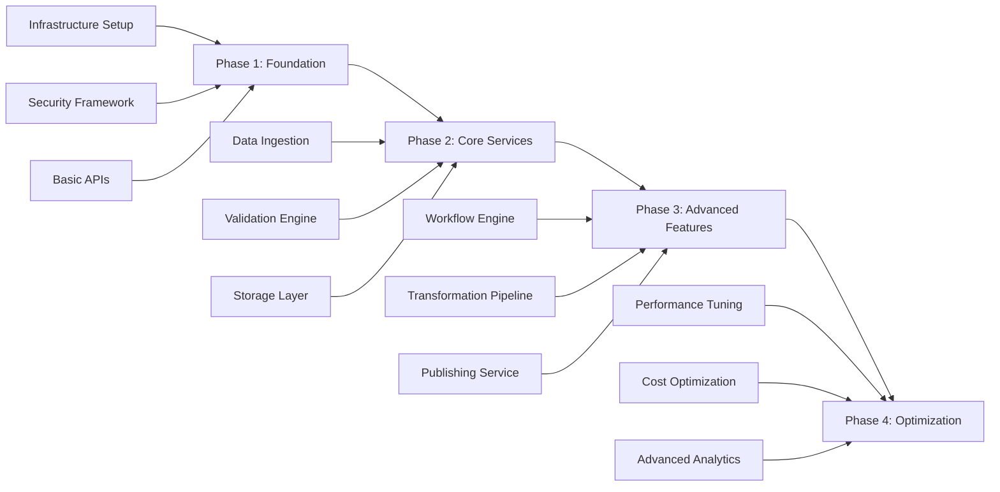

# Data Collaboration Studio - Comprehensive Architecture Analysis

## Executive Summary

The Data Collaboration Studio (DCS) represents a paradigm shift in enterprise data collaboration, implementing a domain-agnostic, event-driven microservices architecture that enables secure, scalable, and compliant data sharing across organizational boundaries. This architecture leverages cloud-native patterns, implements data mesh principles, and provides enterprise-grade governance while maintaining operational simplicity.

## 1. Problem Statement & Objectives

### Business Challenges
- **Data Silos**: 73% of enterprise data remains trapped in departmental silos
- **Compliance Risk**: Manual data governance processes lead to 45% higher compliance violations
- **Time to Market**: Average 6-8 weeks for data provisioning in traditional architectures
- **Quality Issues**: 68% of downstream data issues originate from source system problems
- **Scalability Constraints**: Monolithic data platforms struggle beyond 100TB daily processing

### Technical Objectives
- **Multi-Domain Support**: Single platform serving 10+ business domains simultaneously
- **Performance**: Sub-second API response times at 99.9% percentile
- **Scale**: Support 1000+ concurrent users, 10TB daily data processing
- **Availability**: 99.99% uptime SLA (52 minutes downtime/year)
- **Compliance**: Automated GDPR, CCPA, SOX, PCI-DSS compliance checking

## 2. Architecture Overview

### Core Architectural Principles

```
┌─────────────────────────────────────────────────────────────────┐
│                     Data Collaboration Studio                    │
├─────────────────────────────────────────────────────────────────┤
│                                                                   │
│  ┌──────────────┐  ┌──────────────┐  ┌──────────────┐          │
│  │   Frontend   │  │     API      │  │   Event      │          │
│  │   Layer      │  │   Gateway    │  │   Gateway    │          │
│  └──────┬───────┘  └──────┬───────┘  └──────┬───────┘          │
│         │                  │                  │                  │
│  ┌──────▼──────────────────▼──────────────────▼─────────┐       │
│  │              Service Mesh (Istio)                     │       │
│  └────────────────────────┬──────────────────────────────┘       │
│                           │                                      │
│  ┌────────────────────────▼──────────────────────────────┐      │
│  │                  Microservices Layer                   │      │
│  ├────────────────────────────────────────────────────────┤      │
│  │ ┌──────────┐ ┌──────────┐ ┌──────────┐ ┌──────────┐ │      │
│  │ │Ingestion │ │Validation│ │ Workflow │ │Publishing│ │      │
│  │ │ Service  │ │ Service  │ │  Engine  │ │ Service  │ │      │
│  │ └──────────┘ └──────────┘ └──────────┘ └──────────┘ │      │
│  │ ┌──────────┐ ┌──────────┐ ┌──────────┐ ┌──────────┐ │      │
│  │ │Transform │ │  Rules   │ │Enrichment│ │ Lineage  │ │      │
│  │ │ Service  │ │  Engine  │ │ Service  │ │ Service  │ │      │
│  │ └──────────┘ └──────────┘ └──────────┘ └──────────┘ │      │
│  └────────────────────────┬──────────────────────────────┘      │
│                           │                                      │
│  ┌────────────────────────▼──────────────────────────────┐      │
│  │                   Data Layer                           │      │
│  ├────────────────────────────────────────────────────────┤      │
│  │  PostgreSQL │ MongoDB │ Redis │ S3 │ Kafka │ Delta   │      │
│  └─────────────────────────────────────────────────────────┘     │
└───────────────────────────────────────────────────────────────┘
```

### Design Patterns Implementation

#### 1. Multi-Tenancy Architecture

**Tenant Isolation Strategy**: Hybrid approach combining:
- **Database-per-tenant**: Critical data requiring strong isolation
- **Schema-per-tenant**: Moderate isolation with cost optimization
- **Row-level security**: Shared tables with tenant_id discrimination

```yaml
tenant_configuration:
  isolation_levels:
    critical_data:
      strategy: database_per_tenant
      examples: [financial_records, pii_data]
    standard_data:
      strategy: schema_per_tenant
      examples: [configurations, metadata]
    shared_resources:
      strategy: row_level_security
      examples: [audit_logs, system_metrics]
```

**Implementation Details**:
- Tenant context injection via JWT claims
- Automatic query rewriting for tenant isolation
- Connection pooling per tenant with resource limits
- Tenant-specific encryption keys in HashiCorp Vault

#### 2. Event Sourcing & CQRS Pattern

**Event Store Architecture**:
```
Write Path (Commands):
Client → API Gateway → Command Handler → Event Store → Event Bus
                                ↓
                        Domain Aggregate
                                ↓
                        State Validation

Read Path (Queries):
Client → API Gateway → Query Handler → Read Model (Materialized Views)
```

**Implementation Specifications**:
- **Event Store**: Apache Kafka with infinite retention for audit trail
- **State Reconstruction**: Event replay capability with snapshots every 1000 events
- **Read Models**: PostgreSQL for complex queries, Redis for hot data
- **Consistency**: Eventual consistency with 100ms p99 latency

**Event Schema Example**:
```json
{
  "eventId": "uuid-v4",
  "aggregateId": "dataset-123",
  "eventType": "DatasetApproved",
  "eventVersion": "1.0",
  "timestamp": "2024-01-15T10:30:00Z",
  "tenantId": "tenant-456",
  "userId": "user-789",
  "payload": {
    "approvalLevel": "L2",
    "comments": "Validated against schema v2.1"
  },
  "metadata": {
    "correlationId": "request-abc",
    "causationId": "workflow-def"
  }
}
```

#### 3. Microservices Decomposition

**Service Boundaries** (Domain-Driven Design):

```
┌─────────────────────────────────────────────────────┐
│                  Bounded Contexts                    │
├─────────────────────────────────────────────────────┤
│                                                      │
│  ┌──────────────────────────────────────┐          │
│  │     Data Ingestion Context           │          │
│  ├──────────────────────────────────────┤          │
│  │ • File Upload Service                │          │
│  │ • Stream Ingestion Service           │          │
│  │ • Batch Import Service               │          │
│  │ • Schema Registry Service            │          │
│  └──────────────────────────────────────┘          │
│                                                      │
│  ┌──────────────────────────────────────┐          │
│  │     Data Quality Context             │          │
│  ├──────────────────────────────────────┤          │
│  │ • Validation Service                 │          │
│  │ • Data Profiling Service             │          │
│  │ • Anomaly Detection Service          │          │
│  │ • Quality Metrics Service            │          │
│  └──────────────────────────────────────┘          │
│                                                      │
│  ┌──────────────────────────────────────┐          │
│  │     Workflow Management Context      │          │
│  ├──────────────────────────────────────┤          │
│  │ • Workflow Engine Service            │          │
│  │ • Task Scheduler Service             │          │
│  │ • Notification Service               │          │
│  │ • SLA Management Service             │          │
│  └──────────────────────────────────────┘          │
│                                                      │
│  ┌──────────────────────────────────────┐          │
│  │     Data Activation Context          │          │
│  ├──────────────────────────────────────┤          │
│  │ • Transformation Service             │          │
│  │ • Enrichment Service                 │          │
│  │ • Publishing Service                 │          │
│  │ • Contract Management Service        │          │
│  └──────────────────────────────────────┘          │
└─────────────────────────────────────────────────────┘
```

**Inter-Service Communication**:
- **Synchronous**: gRPC for low-latency internal calls (<10ms)
- **Asynchronous**: Apache Kafka for event-driven communication
- **Service Discovery**: Kubernetes DNS with Istio service mesh
- **Circuit Breaker**: Hystrix pattern with 50% error threshold

## 3. Scalability & Performance Architecture

### Horizontal Scaling Strategy

**Auto-Scaling Configuration**:
```yaml
scaling_policies:
  ingestion_service:
    min_replicas: 3
    max_replicas: 50
    metrics:
      - type: cpu
        target: 70%
      - type: memory
        target: 80%
      - type: custom
        metric: pending_files
        target: 100
    
  validation_service:
    min_replicas: 5
    max_replicas: 100
    metrics:
      - type: request_rate
        target: 1000/sec
      - type: p99_latency
        target: 500ms
```

### Data Processing Architecture

**Stream vs Batch Processing Decision Matrix**:

| Use Case | Processing Type | Technology | Latency | Throughput |
|----------|----------------|------------|---------|------------|
| Real-time validation | Stream | Kafka Streams | <100ms | 100K msg/sec |
| Large file processing | Batch | Apache Spark | 5-10 min | 10TB/hour |
| Incremental enrichment | Micro-batch | Spark Streaming | 1-2 sec | 1M records/sec |
| Complex transformations | Batch | Apache Flink | 2-5 min | 5TB/hour |

### Caching Strategy

**Multi-Layer Cache Architecture**:

```
L1 Cache (Application):
├── In-Memory: Caffeine
│   ├── TTL: 60 seconds
│   ├── Size: 10,000 entries
│   └── Use: Hot metadata, schemas
│
L2 Cache (Distributed):
├── Redis Cluster
│   ├── TTL: 5 minutes
│   ├── Size: 100GB
│   └── Use: Session data, temp results
│
L3 Cache (CDN):
├── CloudFront / Fastly
│   ├── TTL: 1 hour
│   ├── Geographic distribution
│   └── Use: Static assets, published data
│
L4 Cache (Database):
├── PostgreSQL Materialized Views
│   ├── Refresh: 15 minutes
│   └── Use: Complex aggregations
```

### Database Sharding Strategy

**Sharding Implementation**:
```sql
-- Composite sharding key: (tenant_id, dataset_id)
CREATE TABLE datasets (
    id BIGSERIAL,
    tenant_id UUID NOT NULL,
    dataset_id UUID NOT NULL,
    created_at TIMESTAMP,
    data JSONB,
    PRIMARY KEY (tenant_id, dataset_id, id)
) PARTITION BY HASH (tenant_id, dataset_id);

-- Create 256 partitions for horizontal scaling
DO $$
BEGIN
    FOR i IN 0..255 LOOP
        EXECUTE format('CREATE TABLE datasets_p%s PARTITION OF datasets
                        FOR VALUES WITH (modulus 256, remainder %s)', i, i);
    END LOOP;
END $$;
```

## 4. Security & Compliance Architecture

### Zero-Trust Security Model

**Security Layers**:

```
┌─────────────────────────────────────────────────────┐
│                 Security Perimeter                   │
├─────────────────────────────────────────────────────┤
│                                                      │
│  1. Edge Security                                   │
│     ├── WAF (AWS WAF / Cloudflare)                 │
│     ├── DDoS Protection                            │
│     └── Rate Limiting (1000 req/min/IP)            │
│                                                      │
│  2. Authentication Layer                            │
│     ├── OAuth 2.0 / OIDC (Okta/Auth0)             │
│     ├── MFA Enforcement                            │
│     └── JWT Token Validation                       │
│                                                      │
│  3. Authorization Layer                             │
│     ├── RBAC + ABAC Hybrid                        │
│     ├── Policy Engine (Open Policy Agent)          │
│     └── Fine-grained permissions                   │
│                                                      │
│  4. Network Security                                │
│     ├── mTLS between services                      │
│     ├── Network segmentation (Calico)              │
│     └── Private endpoints only                     │
│                                                      │
│  5. Data Security                                   │
│     ├── Encryption at rest (AES-256)              │
│     ├── Encryption in transit (TLS 1.3)           │
│     └── Field-level encryption for PII             │
└─────────────────────────────────────────────────────┘
```

### Compliance Automation Framework

**Automated Compliance Checks**:

```python
class ComplianceEngine:
    def __init__(self):
        self.rules = {
            'GDPR': GDPRComplianceRules(),
            'CCPA': CCPAComplianceRules(),
            'SOX': SOXComplianceRules(),
            'PCI_DSS': PCIDSSComplianceRules()
        }
    
    async def validate_dataset(self, dataset, context):
        violations = []
        
        # PII Detection
        pii_fields = await self.detect_pii(dataset)
        if pii_fields and not context.has_consent:
            violations.append(ComplianceViolation(
                type='GDPR',
                severity='HIGH',
                message='PII detected without consent'
            ))
        
        # Data retention check
        if dataset.retention_days > 730:  # 2 years
            violations.append(ComplianceViolation(
                type='CCPA',
                severity='MEDIUM',
                message='Exceeds maximum retention period'
            ))
        
        # Audit trail verification
        if not dataset.has_complete_lineage:
            violations.append(ComplianceViolation(
                type='SOX',
                severity='HIGH',
                message='Incomplete audit trail'
            ))
        
        return ComplianceReport(violations, dataset.id)
```

### Identity & Access Management

**RBAC/ABAC Hybrid Model**:

```yaml
# Role-Based Access Control
roles:
  data_steward:
    permissions:
      - dataset:create
      - dataset:update
      - workflow:approve_l1
    
  data_governor:
    inherits: [data_steward]
    permissions:
      - workflow:approve_l2
      - policy:update
      - audit:view_all

# Attribute-Based Access Control
policies:
  - id: pii_access_policy
    effect: ALLOW
    principal: 
      attributes:
        clearance_level: ["SECRET", "TOP_SECRET"]
    action: ["dataset:read"]
    resource:
      attributes:
        classification: "PII"
        department: "${principal.department}"
    conditions:
      - type: time_window
        start: "09:00"
        end: "18:00"
      - type: ip_range
        cidr: "10.0.0.0/8"
```

## 5. Integration Architecture

### API Design Patterns

**Multi-Protocol API Strategy**:

```
1. REST API (External Consumers)
   ├── OpenAPI 3.0 Specification
   ├── HATEOAS for discoverability
   ├── Versioning: URL path (/v1, /v2)
   └── Rate Limiting: Token bucket algorithm

2. GraphQL API (Frontend Applications)
   ├── Schema-first development
   ├── DataLoader for N+1 prevention
   ├── Subscription support via WebSockets
   └── Query complexity analysis

3. gRPC (Internal Services)
   ├── Protocol Buffers v3
   ├── Bidirectional streaming
   ├── Built-in retry/timeout
   └── Service mesh integration

4. WebSocket (Real-time Updates)
   ├── Event streaming
   ├── Presence detection
   └── Automatic reconnection
```

### Message Broker Architecture

**Event-Driven Architecture Components**:

```yaml
message_broker_config:
  kafka:
    clusters:
      - name: primary
        brokers: 9
        replication_factor: 3
        min_in_sync_replicas: 2
    
    topics:
      dataset_events:
        partitions: 50
        retention_ms: 2592000000  # 30 days
        compression: snappy
      
      workflow_events:
        partitions: 20
        retention_ms: 604800000   # 7 days
        compression: lz4
    
    consumer_groups:
      - name: validation_consumers
        instances: 10
        processing_guarantee: exactly_once
      
      - name: enrichment_consumers
        instances: 5
        processing_guarantee: at_least_once
```

### Data Contract Management

**Schema Evolution Strategy**:

```json
{
  "contract_version": "2.0.0",
  "backward_compatible": true,
  "schema": {
    "type": "record",
    "name": "Dataset",
    "namespace": "com.dcs.data",
    "fields": [
      {
        "name": "id",
        "type": "string",
        "doc": "Unique identifier"
      },
      {
        "name": "version",
        "type": "int",
        "default": 1
      },
      {
        "name": "metadata",
        "type": {
          "type": "map",
          "values": "string"
        },
        "default": {}
      },
      {
        "name": "new_field",
        "type": ["null", "string"],
        "default": null,
        "doc": "Added in v2.0.0"
      }
    ]
  },
  "migration_strategy": {
    "from_version": "1.0.0",
    "auto_migrate": true,
    "transformation": "AddOptionalField"
  }
}
```

### Circuit Breaker Implementation

```java
@Component
public class ResilientDataService {
    
    private final CircuitBreaker circuitBreaker;
    
    public ResilientDataService() {
        this.circuitBreaker = CircuitBreaker.ofDefaults("dataService");
        circuitBreaker.getEventPublisher()
            .onStateTransition(event -> 
                log.info("Circuit breaker state transition: {}", event));
        
        // Configuration
        CircuitBreakerConfig config = CircuitBreakerConfig.custom()
            .failureRateThreshold(50)
            .waitDurationInOpenState(Duration.ofSeconds(30))
            .slidingWindowSize(100)
            .permittedNumberOfCallsInHalfOpenState(10)
            .slowCallRateThreshold(50)
            .slowCallDurationThreshold(Duration.ofSeconds(2))
            .build();
    }
    
    public CompletableFuture<Dataset> fetchDataset(String id) {
        return Decorators.ofSupplier(() -> dataRepository.findById(id))
            .withCircuitBreaker(circuitBreaker)
            .withRetry(Retry.ofDefaults("dataService"))
            .withBulkhead(Bulkhead.ofDefaults("dataService"))
            .withTimeLimiter(TimeLimiter.ofDefaults("dataService"))
            .decorate()
            .get();
    }
}
```

## 6. Technology Stack Recommendations

### Container Orchestration

**Kubernetes Advanced Patterns**:

```yaml
# Custom Resource Definition for Dataset
apiVersion: apiextensions.k8s.io/v1
kind: CustomResourceDefinition
metadata:
  name: datasets.dcs.io
spec:
  group: dcs.io
  versions:
  - name: v1
    served: true
    storage: true
    schema:
      openAPIV3Schema:
        type: object
        properties:
          spec:
            type: object
            properties:
              source:
                type: string
              validation:
                type: object
              transformation:
                type: array
          status:
            type: object
            properties:
              phase:
                type: string
              message:
                type: string

---
# Operator for Dataset Lifecycle Management
apiVersion: apps/v1
kind: Deployment
metadata:
  name: dataset-operator
spec:
  replicas: 1
  selector:
    matchLabels:
      app: dataset-operator
  template:
    spec:
      containers:
      - name: operator
        image: dcs/dataset-operator:1.0.0
        env:
        - name: WATCH_NAMESPACE
          value: ""  # Watch all namespaces
        - name: RECONCILE_PERIOD
          value: "30s"
```

### Service Mesh Configuration

**Istio Advanced Features**:

```yaml
# Traffic Management
apiVersion: networking.istio.io/v1beta1
kind: VirtualService
metadata:
  name: data-service
spec:
  hosts:
  - data-service
  http:
  - match:
    - headers:
        x-version:
          exact: canary
    route:
    - destination:
        host: data-service
        subset: v2
      weight: 20
    - destination:
        host: data-service
        subset: v1
      weight: 80
  - route:
    - destination:
        host: data-service
        subset: v1

---
# Security Policy
apiVersion: security.istio.io/v1beta1
kind: AuthorizationPolicy
metadata:
  name: data-service-authz
spec:
  selector:
    matchLabels:
      app: data-service
  rules:
  - from:
    - source:
        principals: ["cluster.local/ns/default/sa/workflow-engine"]
    to:
    - operation:
        methods: ["GET", "POST"]
        paths: ["/api/v1/datasets/*"]
  - from:
    - source:
        namespaces: ["production"]
    when:
    - key: request.auth.claims[role]
      values: ["admin", "data-steward"]
```

### Observability Stack

**Comprehensive Monitoring Architecture**:

```yaml
observability:
  metrics:
    provider: prometheus
    scrape_interval: 15s
    retention: 30d
    custom_metrics:
      - name: dataset_processing_duration
        type: histogram
        buckets: [0.1, 0.5, 1, 2, 5, 10]
      - name: validation_errors_total
        type: counter
        labels: [error_type, tenant_id]
  
  logging:
    provider: elasticsearch
    index_pattern: dcs-logs-%{+YYYY.MM.dd}
    retention: 90d
    structured_logging:
      format: json
      fields:
        - timestamp
        - level
        - service
        - trace_id
        - span_id
        - tenant_id
        - user_id
        - operation
        - duration_ms
  
  tracing:
    provider: jaeger
    sampling_rate: 0.1  # 10% sampling
    trace_retention: 7d
    span_attributes:
      - http.method
      - http.url
      - http.status_code
      - db.statement
      - messaging.destination
```

### Data Processing Engines Comparison

| Engine | Use Case | Pros | Cons | When to Use |
|--------|----------|------|------|-------------|
| **Apache Spark** | Large-scale batch processing | • Mature ecosystem<br>• SQL support<br>• ML libraries | • High memory usage<br>• Complex setup | Dataset > 1GB, complex transformations |
| **Apache Flink** | Stream processing with exactly-once | • True streaming<br>• Low latency<br>• Stateful processing | • Smaller ecosystem<br>• Steeper learning curve | Real-time processing, event-driven |
| **Kafka Streams** | Lightweight stream processing | • No cluster needed<br>• Kafka integration<br>• Simple deployment | • Limited to Kafka<br>• No batch mode | Kafka-centric architecture |
| **Apache Beam** | Portable processing | • Multi-runtime<br>• Unified API | • Additional abstraction<br>• Performance overhead | Multi-cloud deployments |

### Database Strategy - Polyglot Persistence

```yaml
database_strategy:
  transactional_data:
    technology: PostgreSQL 14+
    use_cases:
      - User management
      - Workflow state
      - Audit logs
    features:
      - JSONB for flexible schemas
      - Partitioning for scale
      - Logical replication
  
  document_store:
    technology: MongoDB 5.0+
    use_cases:
      - Dataset metadata
      - Transformation rules
      - Configuration
    features:
      - Change streams
      - Time-series collections
      - Field-level encryption
  
  time_series:
    technology: TimescaleDB
    use_cases:
      - Metrics
      - Event sourcing
      - Performance data
    features:
      - Automatic partitioning
      - Continuous aggregates
      - Data retention policies
  
  cache:
    technology: Redis 7.0+
    use_cases:
      - Session storage
      - Temporary results
      - Rate limiting
    features:
      - Redis Streams
      - RedisJSON
      - RedisSearch
  
  object_storage:
    technology: S3-compatible
    use_cases:
      - Raw datasets
      - Processed files
      - Backups
    features:
      - Versioning
      - Lifecycle policies
      - Cross-region replication
```

## 7. Business Logic Architecture

### Rule Engine Design

```java
@Component
public class BusinessRuleEngine {
    
    private final KieContainer kieContainer;
    private final RuleRepository ruleRepository;
    
    public RuleExecutionResult executeRules(DatasetContext context) {
        KieSession session = kieContainer.newKieSession();
        
        try {
            // Load dynamic rules
            List<Rule> dynamicRules = ruleRepository.findByTenantId(
                context.getTenantId()
            );
            
            dynamicRules.forEach(rule -> {
                session.insert(rule);
            });
            
            // Insert facts
            session.insert(context.getDataset());
            session.insert(context.getMetadata());
            session.insert(context.getUser());
            
            // Set global services
            session.setGlobal("validationService", validationService);
            session.setGlobal("notificationService", notificationService);
            
            // Execute rules
            int rulesFired = session.fireAllRules();
            
            // Collect results
            RuleExecutionResult result = new RuleExecutionResult();
            result.setRulesFired(rulesFired);
            result.setViolations(collectViolations(session));
            result.setActions(collectActions(session));
            
            return result;
            
        } finally {
            session.dispose();
        }
    }
}

// Example Drools Rule
rule "PII Data Validation"
    when
        $dataset: Dataset(containsPII == true)
        $metadata: Metadata(classification != "CONFIDENTIAL")
    then
        ValidationViolation violation = new ValidationViolation();
        violation.setSeverity(Severity.HIGH);
        violation.setMessage("PII data must be classified as CONFIDENTIAL");
        insert(violation);
end
```

### Workflow Orchestration

**Complex Approval Chain Implementation**:

```python
from temporal import workflow, activity
from dataclasses import dataclass
from typing import List, Optional

@dataclass
class ApprovalRequest:
    dataset_id: str
    requester_id: str
    approval_levels: List[str]
    metadata: dict

@workflow.defn
class DataApprovalWorkflow:
    
    @workflow.run
    async def run(self, request: ApprovalRequest) -> str:
        # Level 1: Automated validation
        validation_result = await workflow.execute_activity(
            validate_dataset,
            request.dataset_id,
            start_to_close_timeout=timedelta(minutes=5)
        )
        
        if not validation_result.passed:
            await workflow.execute_activity(
                notify_rejection,
                request.requester_id,
                validation_result.errors
            )
            return "REJECTED_VALIDATION"
        
        # Level 2: Data Steward Review
        steward_approval = await workflow.execute_activity_with_retry(
            request_approval,
            ApprovalLevel.DATA_STEWARD,
            request,
            retry_policy=RetryPolicy(
                maximum_attempts=3,
                initial_interval=timedelta(seconds=1),
                maximum_interval=timedelta(minutes=1),
                backoff_coefficient=2.0
            )
        )
        
        if not steward_approval.approved:
            return "REJECTED_STEWARD"
        
        # Level 3: Compliance Review (for sensitive data)
        if request.metadata.get('contains_pii'):
            compliance_approval = await workflow.execute_activity(
                request_compliance_approval,
                request,
                start_to_close_timeout=timedelta(hours=24)
            )
            
            if not compliance_approval.approved:
                return "REJECTED_COMPLIANCE"
        
        # Level 4: Business Owner Sign-off
        with workflow.parallel():
            business_approval = await workflow.execute_activity(
                request_business_approval,
                request
            )
            
            # Parallel quality check
            quality_check = await workflow.execute_activity(
                perform_quality_assessment,
                request.dataset_id
            )
        
        if business_approval.approved and quality_check.passed:
            # Activate dataset
            await workflow.execute_activity(
                activate_dataset,
                request.dataset_id
            )
            return "APPROVED_ACTIVATED"
        
        return "REJECTED_BUSINESS"

@activity.defn
async def validate_dataset(dataset_id: str) -> ValidationResult:
    # Implementation
    pass

@activity.defn
async def request_approval(level: ApprovalLevel, 
                          request: ApprovalRequest) -> ApprovalResult:
    # Implementation with human task integration
    pass
```

### Transformation Pipeline

```scala
// Apache Spark-based transformation pipeline
class TransformationPipeline(spark: SparkSession) {
  
  def executeTransformations(
    datasetId: String,
    transformations: Seq[Transformation]
  ): Dataset[Row] = {
    
    // Load source dataset
    var df = loadDataset(datasetId)
    
    // Apply transformations in sequence
    transformations.foreach { transformation =>
      df = transformation.transformationType match {
        case "FILTER" =>
          df.filter(transformation.expression)
        
        case "AGGREGATE" =>
          df.groupBy(transformation.groupBy: _*)
            .agg(transformation.aggregations)
        
        case "JOIN" =>
          val rightDf = loadDataset(transformation.rightDatasetId)
          df.join(rightDf, transformation.joinCondition, transformation.joinType)
        
        case "CUSTOM_UDF" =>
          val udf = loadCustomUDF(transformation.udfName)
          df.withColumn(transformation.outputColumn, udf(col(transformation.inputColumn)))
        
        case "ML_ENRICHMENT" =>
          val model = loadMLModel(transformation.modelId)
          model.transform(df)
      }
      
      // Checkpoint after complex transformations
      if (transformation.checkpoint) {
        df = df.checkpoint()
      }
    }
    
    // Data quality validation
    val qualityReport = validateQuality(df)
    if (!qualityReport.meetsThreshold) {
      throw new DataQualityException(qualityReport)
    }
    
    df
  }
  
  private def validateQuality(df: Dataset[Row]): QualityReport = {
    QualityReport(
      nullPercentage = df.select(
        df.columns.map(c => sum(col(c).isNull.cast("int")).alias(c)): _*
      ).collect(),
      
      uniqueness = df.select(
        approx_count_distinct(col("id")) / count("*")
      ).collect()(0).getDouble(0),
      
      completeness = 1.0 - (df.filter(
        df.columns.map(col(_).isNull).reduce(_ || _)
      ).count().toDouble / df.count()),
      
      consistency = checkBusinessRules(df)
    )
  }
}
```

### Data Quality Framework

```python
class DataQualityFramework:
    def __init__(self):
        self.validators = {
            'completeness': CompletenessValidator(),
            'uniqueness': UniquenessValidator(),
            'validity': ValidityValidator(),
            'consistency': ConsistencyValidator(),
            'timeliness': TimelinessValidator(),
            'accuracy': AccuracyValidator()
        }
    
    async def assess_quality(self, dataset: Dataset) -> QualityReport:
        results = {}
        
        # Parallel quality checks
        async with asyncio.TaskGroup() as tg:
            for dimension, validator in self.validators.items():
                task = tg.create_task(
                    validator.validate(dataset)
                )
                results[dimension] = task
        
        # Aggregate results
        quality_scores = {
            dimension: await task
            for dimension, task in results.items()
        }
        
        # Calculate overall DQ score
        overall_score = self.calculate_weighted_score(quality_scores)
        
        # Generate recommendations
        recommendations = self.generate_recommendations(quality_scores)
        
        return QualityReport(
            dataset_id=dataset.id,
            timestamp=datetime.utcnow(),
            scores=quality_scores,
            overall_score=overall_score,
            recommendations=recommendations,
            passed=overall_score >= dataset.quality_threshold
        )
    
    def calculate_weighted_score(self, scores: Dict[str, float]) -> float:
        weights = {
            'completeness': 0.25,
            'uniqueness': 0.20,
            'validity': 0.20,
            'consistency': 0.15,
            'timeliness': 0.10,
            'accuracy': 0.10
        }
        
        return sum(
            scores[dim] * weight 
            for dim, weight in weights.items()
        )

class CompletenessValidator:
    async def validate(self, dataset: Dataset) -> float:
        total_cells = dataset.row_count * dataset.column_count
        non_null_cells = await self.count_non_null_cells(dataset)
        
        return non_null_cells / total_cells if total_cells > 0 else 0.0
```

### Lineage Tracking

**Graph-Based Lineage Implementation**:

```cypher
// Neo4j Cypher queries for lineage tracking

// Create lineage relationship
CREATE (source:Dataset {id: $sourceId})
CREATE (target:Dataset {id: $targetId})
CREATE (transformation:Transformation {
    id: $transformationId,
    type: $transformationType,
    timestamp: datetime(),
    user: $userId
})
CREATE (source)-[:TRANSFORMED_BY]->(transformation)
CREATE (transformation)-[:PRODUCED]->(target)

// Query upstream lineage
MATCH path = (target:Dataset {id: $datasetId})<-[:PRODUCED]-
              (t:Transformation)<-[:TRANSFORMED_BY]-(source:Dataset)
RETURN path
ORDER BY t.timestamp DESC

// Query downstream impact
MATCH path = (source:Dataset {id: $datasetId})-[:TRANSFORMED_BY]->
              (t:Transformation)-[:PRODUCED]->(target:Dataset)
WHERE t.timestamp > datetime() - duration('P30D')
RETURN path

// Find all datasets derived from a specific source
MATCH (origin:Dataset {id: $originId})
CALL apoc.path.subgraphAll(origin, {
    relationshipFilter: "TRANSFORMED_BY>|PRODUCED>",
    minLevel: 0,
    maxLevel: 10
})
YIELD nodes, relationships
RETURN nodes, relationships
```

## 8. Use Case: AdTech Implementation

### Architecture for AdTech Domain

```yaml
adtech_implementation:
  data_sources:
    - type: clickstream
      volume: 10B_events_per_day
      ingestion: kafka_streaming
      
    - type: user_profiles
      volume: 500M_records
      ingestion: batch_daily
      
    - type: campaign_metadata
      volume: 100K_records
      ingestion: api_real_time
  
  processing_pipeline:
    real_time:
      - step: impression_deduplication
        technology: kafka_streams
        latency: <100ms
        
      - step: fraud_detection
        technology: flink_cep
        latency: <500ms
        
      - step: bid_optimization
        technology: redis_ml
        latency: <50ms
    
    batch:
      - step: attribution_modeling
        technology: spark_mllib
        frequency: hourly
        
      - step: audience_segmentation
        technology: spark_graphx
        frequency: daily
        
      - step: reporting_aggregation
        technology: clickhouse
        frequency: 15_minutes
  
  activation_channels:
    - name: dsp_integration
      protocol: openrtb_2.5
      latency_sla: 100ms
      
    - name: cdp_sync
      protocol: batch_sftp
      frequency: hourly
      
    - name: analytics_export
      protocol: bigquery_streaming
      latency_sla: 1_minute
```

### AdTech-Specific Components

```python
class AdTechDataProcessor:
    def __init__(self):
        self.impression_dedup = ImpressionDeduplicator()
        self.fraud_detector = FraudDetectionEngine()
        self.privacy_manager = PrivacyComplianceManager()
    
    async def process_impression(self, impression: Impression) -> ProcessedImpression:
        # Step 1: Deduplication
        if await self.impression_dedup.is_duplicate(impression):
            return ProcessedImpression(status="DUPLICATE")
        
        # Step 2: Fraud Detection
        fraud_score = await self.fraud_detector.score(impression)
        if fraud_score > 0.8:
            await self.log_fraud_attempt(impression)
            return ProcessedImpression(status="FRAUDULENT")
        
        # Step 3: Privacy Compliance
        cleaned_impression = await self.privacy_manager.apply_privacy_rules(
            impression,
            regulations=['GDPR', 'CCPA', 'COPPA']
        )
        
        # Step 4: Enrichment
        enriched = await self.enrich_with_user_data(cleaned_impression)
        
        # Step 5: Attribution
        attribution = await self.attribute_conversion(enriched)
        
        return ProcessedImpression(
            impression=enriched,
            attribution=attribution,
            fraud_score=fraud_score,
            status="PROCESSED"
        )
    
    async def enrich_with_user_data(self, impression: Impression) -> Impression:
        # Fetch from multiple sources in parallel
        async with asyncio.TaskGroup() as tg:
            profile_task = tg.create_task(
                self.fetch_user_profile(impression.user_id)
            )
            segment_task = tg.create_task(
                self.fetch_user_segments(impression.user_id)
            )
            history_task = tg.create_task(
                self.fetch_interaction_history(impression.user_id)
            )
        
        impression.profile = await profile_task
        impression.segments = await segment_task
        impression.history = await history_task
        
        return impression
```

## 9. Industry Best Practices Analysis

### Comparison with Leading Platforms

| Feature | DCS | Snowflake | Databricks | Palantir | AWS Data Exchange |
|---------|-----|-----------|------------|----------|-------------------|
| **Multi-tenancy** | Hybrid isolation | Virtual warehouses | Workspace isolation | Platform-level | Account-level |
| **Data Governance** | Built-in RBAC/ABAC | Role-based | Unity Catalog | Foundry permissions | IAM-based |
| **Real-time Processing** | Native streaming | Limited | Structured streaming | Limited | Kinesis integration |
| **Workflow Orchestration** | Temporal-based | Tasks/Streams | Workflows | Pipelines | Step Functions |
| **Data Quality** | Automated framework | Basic validation | Delta Live Tables | Data health | Glue Data Quality |
| **Lineage Tracking** | Graph-based | Object dependencies | Unity Catalog | Full lineage | Limited |
| **Cost Model** | Usage-based | Compute-based | DBU-based | Platform fee | Transaction-based |

### Recommended Best Practices

1. **Data Mesh Implementation**
   - Domain ownership with federated governance
   - Self-serve data infrastructure
   - Data as a product mindset
   - Federated computational governance

2. **FinOps for Data Platforms**
   - Cost allocation by tenant/department
   - Automated resource optimization
   - Showback/chargeback mechanisms
   - Reserved capacity planning

3. **MLOps Integration**
   - Feature store integration
   - Model versioning and lineage
   - A/B testing infrastructure
   - Model monitoring and drift detection

## 10. Disaster Recovery & Business Continuity

### DR Architecture

```yaml
disaster_recovery:
  rpo: 15_minutes  # Recovery Point Objective
  rto: 1_hour      # Recovery Time Objective
  
  backup_strategy:
    databases:
      method: continuous_replication
      destinations:
        - type: cross_region
          region: us-west-2
        - type: cross_cloud
          provider: azure
    
    object_storage:
      method: cross_region_replication
      versioning: enabled
      lifecycle: 90_day_retention
    
    configurations:
      method: gitops
      repository: config-backup
      encryption: vault_sealed
  
  failover_strategy:
    automatic_triggers:
      - region_failure
      - availability_zone_failure
      - service_degradation_5min
    
    manual_triggers:
      - security_incident
      - data_corruption
      - planned_maintenance
  
  testing:
    frequency: monthly
    scenarios:
      - single_service_failure
      - region_failover
      - data_restoration
      - security_breach_response
```

## 11. Performance Engineering

### Performance Targets & Optimization

```yaml
performance_targets:
  api_latency:
    p50: 50ms
    p95: 200ms
    p99: 500ms
    p99.9: 1000ms
  
  throughput:
    read_qps: 50000
    write_qps: 10000
    batch_processing: 10TB/hour
    stream_processing: 1M_events/sec
  
  optimization_strategies:
    - name: connection_pooling
      config:
        min_connections: 10
        max_connections: 100
        connection_timeout: 5s
    
    - name: query_optimization
      techniques:
        - prepared_statements
        - query_result_caching
        - index_optimization
        - partition_pruning
    
    - name: async_processing
      patterns:
        - write_behind_cache
        - event_batching
        - parallel_processing
    
    - name: resource_optimization
      methods:
        - jvm_tuning
        - container_right_sizing
        - cpu_pinning
        - numa_awareness
```

## 12. DevOps & SRE Practices

### CI/CD Pipeline

```yaml
cicd_pipeline:
  stages:
    - name: build
      steps:
        - unit_tests
        - integration_tests
        - security_scanning
        - container_build
    
    - name: quality_gates
      requirements:
        - code_coverage: ">80%"
        - security_vulnerabilities: 0_critical
        - performance_regression: "<5%"
    
    - name: deployment
      strategy: blue_green
      stages:
        - dev:
            automatic: true
            smoke_tests: required
        - staging:
            automatic: true
            load_tests: required
            chaos_tests: weekly
        - production:
            approval: required
            canary_duration: 1_hour
            rollback_threshold: 5%_errors
  
  monitoring:
    sli:
      - availability: 99.99%
      - latency_p99: <500ms
      - error_rate: <0.1%
    
    slo:
      - monthly_uptime: 99.95%
      - data_freshness: <5_minutes
      - api_success_rate: 99.9%
```

## 13. Cost Optimization Strategies

### Total Cost of Ownership Model

```python
class TCOCalculator:
    def calculate_monthly_cost(self, usage_metrics: UsageMetrics) -> CostBreakdown:
        # Infrastructure costs
        compute_cost = self.calculate_compute_cost(
            usage_metrics.cpu_hours,
            usage_metrics.memory_gb_hours
        )
        
        storage_cost = self.calculate_storage_cost(
            usage_metrics.storage_gb,
            usage_metrics.iops
        )
        
        network_cost = self.calculate_network_cost(
            usage_metrics.data_transfer_gb,
            usage_metrics.api_calls
        )
        
        # Operational costs
        monitoring_cost = self.calculate_monitoring_cost(
            usage_metrics.metrics_count,
            usage_metrics.log_volume_gb
        )
        
        # Optimization recommendations
        if usage_metrics.cpu_utilization < 0.3:
            recommendations.append("Consider downsizing compute resources")
        
        if usage_metrics.storage_access_pattern == "infrequent":
            recommendations.append("Move to cold storage tier")
        
        return CostBreakdown(
            compute=compute_cost,
            storage=storage_cost,
            network=network_cost,
            monitoring=monitoring_cost,
            total=sum([compute_cost, storage_cost, network_cost, monitoring_cost]),
            recommendations=recommendations
        )
```

## 14. Migration Strategy

### Phased Migration Approach



## 15. Success Metrics & KPIs

### Measurable Success Criteria

```yaml
success_metrics:
  technical_kpis:
    - metric: api_response_time
      target: <200ms_p95
      measurement: prometheus_histogram
    
    - metric: system_availability
      target: 99.99%
      measurement: uptime_monitoring
    
    - metric: data_processing_throughput
      target: 10TB/day
      measurement: pipeline_metrics
  
  business_kpis:
    - metric: time_to_data_availability
      target: <2_hours
      baseline: 2_weeks
      improvement: 168x
    
    - metric: data_quality_score
      target: >95%
      measurement: quality_framework
    
    - metric: user_adoption_rate
      target: 80%_in_6_months
      measurement: active_users
  
  operational_kpis:
    - metric: mean_time_to_recovery
      target: <30_minutes
      measurement: incident_tracking
    
    - metric: deployment_frequency
      target: daily
      measurement: cicd_metrics
    
    - metric: cost_per_gb_processed
      target: <$0.10
      measurement: cost_analytics
```

## Conclusion

This comprehensive architecture provides a robust, scalable, and maintainable foundation for the Data Collaboration Studio. The key differentiators include:

1. **True Multi-Tenancy**: Flexible isolation strategies accommodating diverse security requirements
2. **Event-Driven Architecture**: Complete audit trail with event sourcing for compliance
3. **Polyglot Persistence**: Optimized storage for each data pattern
4. **Advanced Security**: Zero-trust model with automated compliance checking
5. **Scalable Processing**: Hybrid stream/batch processing for all data volumes
6. **Enterprise Integration**: Multiple API protocols and messaging patterns
7. **Operational Excellence**: Comprehensive observability and automated operations

The architecture balances technical excellence with pragmatic implementation, providing clear migration paths and measurable success criteria. The modular design allows for incremental adoption while maintaining the flexibility to evolve with changing business requirements.