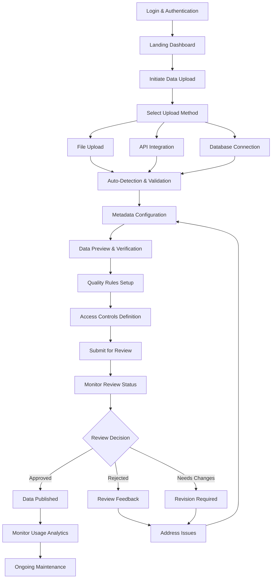
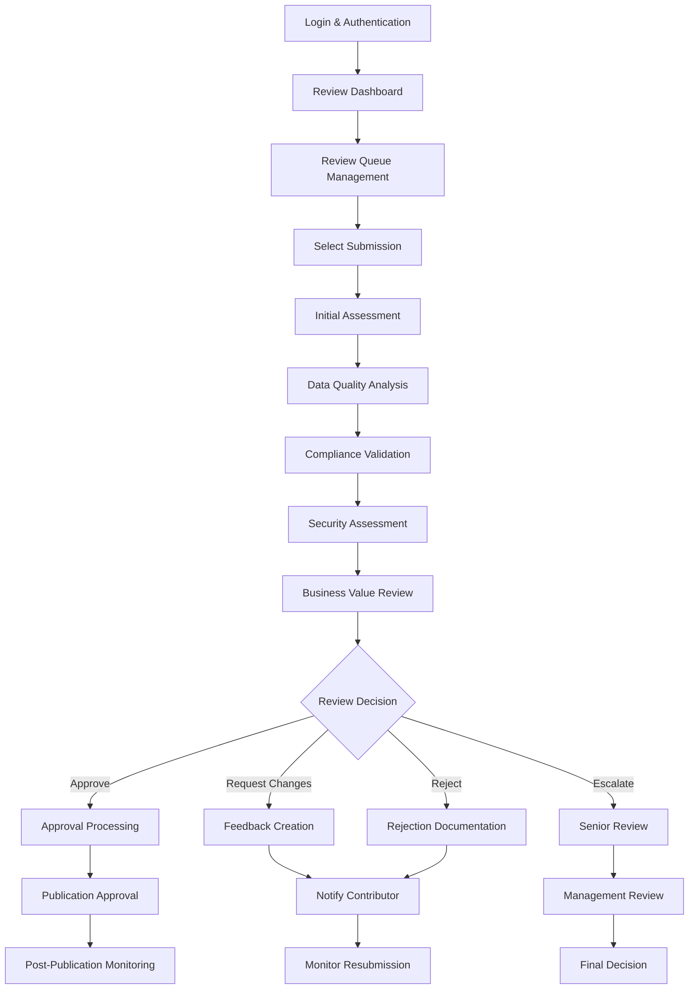
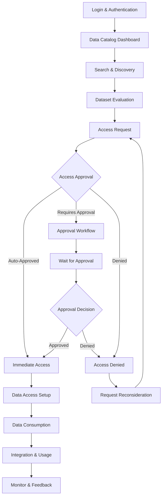
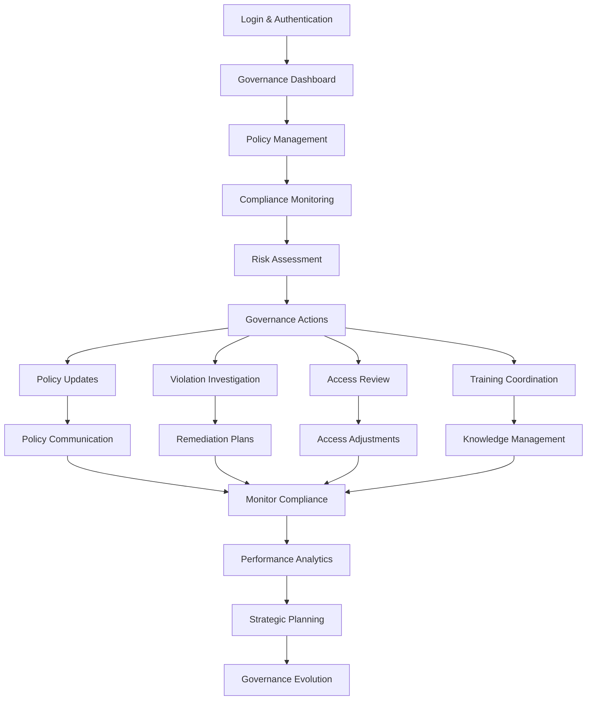
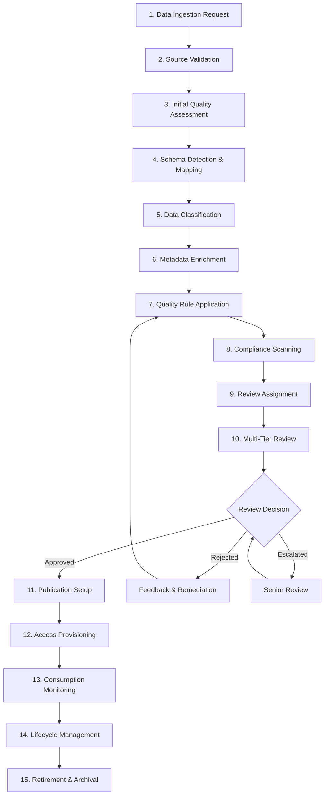
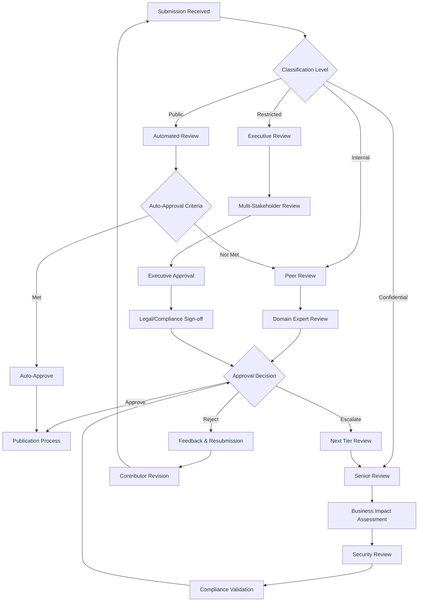
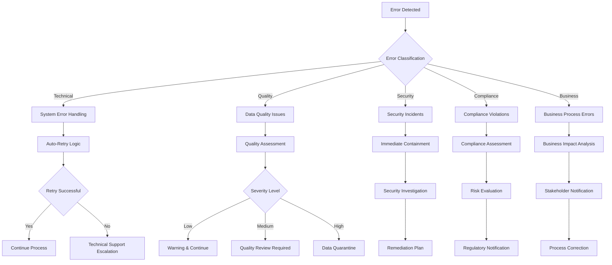

# Data Collaboration Studio - User Workflows & Interface Design

## Table of Contents

1. [Overview](#overview)
2. [User Journey Maps](#user-journey-maps)
   - [Data Contributor Journey](#data-contributor-journey)
   - [Data Reviewer Journey](#data-reviewer-journey)
   - [Data Consumer Journey](#data-consumer-journey)
   - [Data Steward Journey](#data-steward-journey)
3. [Core Workflow Processes](#core-workflow-processes)
4. [Interface Design Specifications](#interface-design-specifications)
5. [Exception Handling](#exception-handling)

## Overview

The Data Collaboration Studio provides four distinct user experiences optimized for different roles in the data lifecycle. Each workflow balances business usability with technical robustness, ensuring seamless collaboration while maintaining data quality and governance standards.

### Design Principles

- **Simplicity**: Business-user friendly interfaces without technical complexity
- **Transparency**: Clear status indicators and progress tracking throughout all workflows
- **Efficiency**: Streamlined processes with intelligent defaults and automation
- **Collaboration**: Seamless handoffs between roles with clear communication channels
- **Trust**: Comprehensive quality assurance and full audit capabilities

### User Roles & Responsibilities

| Role | Primary Focus | Key Activities |
|------|---------------|----------------|
| **Data Contributor** | Data Upload & Preparation | Upload datasets, configure metadata, monitor approval status |
| **Data Reviewer** | Quality Assurance | Validate data quality, assess compliance, approve/reject submissions |
| **Data Consumer** | Data Discovery & Usage | Search datasets, request access, consume approved data |
| **Data Steward** | Governance & Policy | Set policies, monitor compliance, oversee data governance |

---

## User Journey Maps

### Data Contributor Journey

**Journey Overview**: Upload → Prepare → Submit → Monitor → Consume

The Data Contributor represents business users who need to share data with other teams or external partners. This journey prioritizes ease of use while ensuring data quality and compliance.

#### Journey Flow Diagram



#### Detailed User Steps

##### Phase 1: Upload & Discovery (Steps 1-4)

**Step 1: Authentication & Landing**
- **User Action**: Login with SSO credentials
- **System Response**:
  - Validate user identity
  - Load role-based dashboard
  - Display recent submissions and notifications
- **UI Elements**:
  - Welcome message with user name
  - Quick action buttons (Upload Data, View My Submissions)
  - Status dashboard showing pending/approved/rejected items
- **Business Rules**:
  - Users must have "Data Contributor" role
  - Failed login attempts trigger security alerts after 3 attempts

**Step 2: Initiate Data Upload**
- **User Action**: Click "Upload New Dataset" button
- **System Response**:
  - Launch upload wizard interface
  - Display available upload methods
  - Show storage quota and usage
- **UI Elements**:
  - Upload method selection (File, API, Database)
  - Progress indicator (Step 1 of 8)
  - Storage usage meter with remaining capacity
- **Business Rules**:
  - Check user storage quota (default: 100GB per user)
  - Validate user has upload permissions for selected domain

**Step 3: Select Upload Method**
- **User Action**: Choose between File Upload, API Integration, or Database Connection
- **System Response**: Display method-specific configuration interface
- **Options**:

  **Option A: File Upload**
  - Drag-and-drop zone for files
  - Supported formats: CSV, JSON, Parquet, Excel, XML
  - Maximum file size: 10GB
  - Batch upload support for multiple files

  **Option B: API Integration**
  - API endpoint configuration form
  - Authentication method selection (OAuth, API Key, Basic Auth)
  - Data format specification
  - Schedule configuration for recurring uploads

  **Option C: Database Connection**
  - Database type selection (PostgreSQL, MySQL, Oracle, SQL Server)
  - Connection string builder with validation
  - Query builder interface for data selection
  - Preview of selected data with row count

**Step 4: Auto-Detection & Initial Validation**
- **User Action**: Upload file or configure connection
- **System Response**:
  - Perform automatic schema detection
  - Run initial data quality checks
  - Generate data profile and statistics
- **Validations**:
  - File format verification
  - Schema consistency checks
  - Data type inference and validation
  - Duplicate detection
  - Basic quality metrics (null rates, uniqueness, distributions)

##### Phase 2: Preparation & Configuration (Steps 5-7)

**Step 5: Metadata Configuration**
- **User Action**: Review and enhance auto-detected metadata
- **System Response**: Present editable metadata form with intelligent suggestions
- **Configuration Fields**:
  - **Dataset Information**:
    - Name (auto-generated, editable)
    - Description (required, min 50 characters)
    - Business domain (dropdown)
    - Data classification (Public, Internal, Confidential, Restricted)
  - **Schema Definition**:
    - Column names and descriptions
    - Data types with validation rules
    - Business definitions and glossary links
    - Primary key and foreign key relationships
  - **Data Lineage**:
    - Source system identification
    - Transformation history
    - Related datasets
    - Update frequency and schedule

**Step 6: Data Preview & Verification**
- **User Action**: Review data sample and validate accuracy
- **System Response**:
  - Display interactive data preview (first 1000 rows)
  - Show data quality metrics and potential issues
  - Provide column profiling statistics
- **Preview Features**:
  - Sortable and filterable data grid
  - Column statistics (min, max, avg, null count, unique values)
  - Data quality indicators (red/yellow/green status)
  - Sample value distribution charts
- **Validation Checks**:
  - Missing value patterns
  - Outlier detection
  - Format consistency
  - Business rule compliance

**Step 7: Quality Rules & Access Controls**
- **User Action**: Configure data quality rules and access permissions
- **System Response**: Present rule configuration interface with templates
- **Quality Rules**:
  - **Built-in Rules**: Null checks, format validation, range checks
  - **Custom Rules**: Business-specific validation logic
  - **Threshold Settings**: Acceptable error rates for each rule
- **Access Controls**:
  - **Default Access**: Organization-wide, department-only, or custom
  - **User Groups**: Select specific teams or individuals
  - **Permission Levels**: View, Download, Transform, or Full Access
  - **Compliance Tags**: Automatic classification based on data content

##### Phase 3: Submission & Monitoring (Steps 8-12)

**Step 8: Submit for Review**
- **User Action**: Review submission summary and submit for approval
- **System Response**:
  - Generate submission package
  - Assign to review queue
  - Send notifications to assigned reviewers
- **Submission Summary**:
  - Dataset overview with key statistics
  - Configured metadata and rules
  - Access control settings
  - Estimated review timeline
- **Automatic Processing**:
  - Generate unique submission ID
  - Create audit trail entry
  - Trigger automated quality checks
  - Route to appropriate reviewer based on data classification

**Step 9: Monitor Review Status**
- **User Action**: Check submission status and respond to reviewer feedback
- **System Response**:
  - Display real-time status updates
  - Show reviewer comments and requirements
  - Provide notification alerts for status changes
- **Status Dashboard**:
  - Progress indicator with current stage
  - Reviewer assignment and contact information
  - Timeline with estimated completion dates
  - Action items requiring contributor response

**Step 10: Handle Review Feedback**
- **User Action**: Address reviewer comments and resubmit if needed
- **System Response**:
  - Present feedback in context with specific data elements
  - Provide revision tools for quick fixes
  - Track version history and changes
- **Feedback Types**:
  - **Clarification Requests**: Additional metadata or documentation
  - **Quality Issues**: Data corrections or filtering requirements
  - **Compliance Concerns**: Access control or classification adjustments
  - **Enhancement Suggestions**: Optional improvements for better usability

##### Phase 4: Publication & Ongoing Management (Steps 11-15)

**Step 11: Data Publication**
- **User Action**: Receive approval notification and verify published dataset
- **System Response**:
  - Make dataset available in data catalog
  - Generate access APIs and documentation
  - Create usage analytics dashboard
- **Publication Features**:
  - Automatic API endpoint generation
  - Sample code snippets for common languages
  - Interactive documentation with examples
  - Version control and change tracking

**Step 12: Usage Analytics & Monitoring**
- **User Action**: Monitor how data is being used and consumed
- **System Response**:
  - Display usage metrics and consumption patterns
  - Show user feedback and ratings
  - Provide performance and availability statistics
- **Analytics Dashboard**:
  - **Usage Metrics**: Download counts, API calls, unique users
  - **Performance Data**: Query response times, availability uptime
  - **User Feedback**: Ratings, comments, and enhancement requests
  - **Data Quality Trends**: Ongoing quality metrics and alerts

#### Key Decision Points

**Upload Method Selection** (Step 3)
- **File Upload**: Best for one-time or infrequent data sharing
- **API Integration**: Ideal for real-time or frequent data updates
- **Database Connection**: Suitable for large datasets or direct database access

**Data Classification** (Step 5)
- **Public**: No restrictions, available to all users
- **Internal**: Organization-wide access with basic authentication
- **Confidential**: Restricted access with approval workflow
- **Restricted**: Highest security, requires special permissions

**Quality Rule Strictness** (Step 7)
- **Strict**: Zero tolerance for quality issues, rejects any data with errors
- **Moderate**: Allows minor issues with warnings and documentation
- **Flexible**: Accepts data with quality flags, lets consumers decide

#### Success Metrics

- **Time to Publication**: Average time from upload to approval (Target: < 2 business days)
- **First-Time Approval Rate**: Percentage of submissions approved without revisions (Target: > 80%)
- **User Satisfaction**: Rating of upload experience (Target: > 4.5/5)
- **Data Quality Score**: Average quality rating of published datasets (Target: > 90%)

#### Common Pain Points & Solutions

**Pain Point**: Complex metadata requirements overwhelming users
**Solution**: Smart defaults, auto-population from similar datasets, progressive disclosure

**Pain Point**: Unclear quality rules leading to rejection
**Solution**: Pre-validation checks, clear rule explanations, example data

**Pain Point**: Long review times causing delays
**Solution**: Automated pre-checks, reviewer workload balancing, escalation procedures

**Pain Point**: Difficulty understanding access control implications
**Solution**: Visual permission preview, impact assessment, common templates

### Data Reviewer Journey

**Journey Overview**: Assignment → Assessment → Validation → Decision → Feedback

The Data Reviewer ensures data quality, compliance, and security before datasets are published. This journey emphasizes thorough evaluation tools while maintaining efficiency to prevent bottlenecks.

#### Journey Flow Diagram



#### Detailed User Steps

##### Phase 1: Assignment & Prioritization (Steps 1-3)

**Step 1: Authentication & Dashboard Access**
- **User Action**: Login with reviewer credentials
- **System Response**:
  - Load reviewer-specific dashboard
  - Display pending review queue with priorities
  - Show performance metrics and SLA status
- **Dashboard Elements**:
  - **Active Queue**: List of assigned submissions with deadlines
  - **Priority Indicators**: High/Medium/Low based on business impact
  - **SLA Tracking**: Time remaining for each review
  - **Workload Balance**: Current capacity vs. assigned reviews
- **Business Rules**:
  - Reviews auto-assigned based on domain expertise
  - High-priority submissions (Restricted/Confidential) assigned to senior reviewers
  - Maximum concurrent reviews per reviewer (default: 10)

**Step 2: Review Queue Management**
- **User Action**: Prioritize and organize review workload
- **System Response**:
  - Provide filtering and sorting options
  - Display submission context and complexity indicators
  - Show contributor information and submission history
- **Queue Features**:
  - **Filter Options**: By data classification, business domain, submission date
  - **Sort Options**: By deadline, priority, complexity score, contributor rating
  - **Batch Actions**: Assign to other reviewers, request additional information
  - **Context Preview**: Quick view of dataset size, format, and contributor
- **Prioritization Logic**:
  - Regulatory compliance requirements (highest priority)
  - Business-critical datasets
  - First-time contributors (higher attention needed)
  - Resubmissions (expedited review)

**Step 3: Submission Selection & Context Loading**
- **User Action**: Select submission for detailed review
- **System Response**:
  - Load comprehensive submission package
  - Display reviewer toolkit and assessment forms
  - Start review session with time tracking
- **Context Information**:
  - **Contributor Profile**: Previous submissions, approval rate, contact info
  - **Dataset Overview**: Size, format, source system, business purpose
  - **Submission History**: Previous versions, reviewer comments, changes made
  - **Related Datasets**: Similar data already in catalog, potential conflicts

##### Phase 2: Assessment & Validation (Steps 4-8)

**Step 4: Initial Assessment**
- **User Action**: Perform high-level evaluation of submission completeness
- **System Response**:
  - Display automated check results
  - Highlight missing or incomplete elements
  - Provide assessment checklist
- **Assessment Checklist**:
  - [ ] Metadata completeness (all required fields populated)
  - [ ] Documentation quality (clear descriptions, business context)
  - [ ] Data sample representativeness
  - [ ] Access control configuration appropriateness
  - [ ] Business justification adequacy
- **Red Flags Check**:
  - Suspicious data patterns (all nulls, unrealistic values)
  - Inadequate documentation
  - Overly permissive access controls
  - Potential compliance violations

**Step 5: Data Quality Analysis**
- **User Action**: Review automated quality metrics and perform manual validation
- **System Response**:
  - Display comprehensive data quality report
  - Provide interactive data exploration tools
  - Highlight quality issues requiring attention
- **Quality Dimensions**:
  - **Completeness**: Missing values analysis with acceptable thresholds
  - **Accuracy**: Cross-validation with known data sources
  - **Consistency**: Format and value consistency across columns
  - **Validity**: Business rule compliance and constraint validation
  - **Uniqueness**: Duplicate detection and primary key validation
- **Quality Tools**:
  - Interactive data profiling dashboard
  - Statistical outlier detection
  - Pattern matching for common data issues
  - Comparison with similar approved datasets

**Step 6: Compliance Validation**
- **User Action**: Assess regulatory and policy compliance
- **System Response**:
  - Run automated compliance scanning
  - Display regulatory framework checkpoints
  - Provide compliance documentation templates
- **Compliance Areas**:
  - **Data Privacy**: PII detection, anonymization requirements, consent verification
  - **Regulatory**: GDPR, CCPA, HIPAA, SOX compliance based on data content
  - **Industry Standards**: Sector-specific requirements (financial, healthcare, etc.)
  - **Internal Policies**: Company data governance rules and procedures
- **Compliance Tools**:
  - PII detection algorithms with confidence scores
  - Regulatory framework mapping
  - Risk assessment calculator
  - Compliance gap analysis

**Step 7: Security Assessment**
- **User Action**: Evaluate security controls and access permissions
- **System Response**:
  - Display security risk analysis
  - Show access control impact assessment
  - Provide security recommendations
- **Security Evaluation**:
  - **Access Controls**: Appropriate permission levels for data classification
  - **Data Sensitivity**: Classification accuracy and handling requirements
  - **Encryption**: At-rest and in-transit protection adequacy
  - **Audit Trail**: Logging and monitoring configuration
- **Risk Assessment**:
  - Data exposure potential
  - Unauthorized access likelihood
  - Business impact of security breach
  - Mitigation strategy effectiveness

**Step 8: Business Value Review**
- **User Action**: Assess business justification and strategic alignment
- **System Response**:
  - Display business impact analysis
  - Show related datasets and potential synergies
  - Provide value assessment framework
- **Value Dimensions**:
  - **Business Need**: Clear use case and expected outcomes
  - **Strategic Alignment**: Fit with organizational data strategy
  - **Resource Utilization**: Expected usage vs. maintenance cost
  - **Innovation Potential**: Opportunities for new insights or products

##### Phase 3: Decision & Documentation (Steps 9-12)

**Step 9: Review Decision**
- **User Action**: Make approval decision based on comprehensive assessment
- **System Response**:
  - Provide decision framework with scoring
  - Generate decision documentation
  - Route submission based on decision type
- **Decision Options**:
  - **Approve**: Dataset meets all requirements, ready for publication
  - **Approve with Conditions**: Minor issues, approve with monitoring requirements
  - **Request Changes**: Specific improvements needed, return to contributor
  - **Reject**: Fundamental issues, cannot be addressed with current submission
  - **Escalate**: Complex decision requiring senior review or multiple reviewers

**Step 10: Feedback Creation**
- **User Action**: Document detailed feedback for contributor
- **System Response**:
  - Provide structured feedback templates
  - Link feedback to specific data elements
  - Generate actionable improvement recommendations
- **Feedback Categories**:
  - **Required Changes**: Must be addressed before resubmission
  - **Recommended Improvements**: Optional enhancements for better quality
  - **Clarification Requests**: Additional information or documentation needed
  - **Best Practice Suggestions**: General guidance for future submissions
- **Feedback Tools**:
  - In-context commenting on specific columns or rows
  - Severity rating for each issue (Critical, High, Medium, Low)
  - Suggested solutions and examples
  - Links to documentation and best practices

**Step 11: Approval Processing**
- **User Action**: Complete approval workflow and publication setup
- **System Response**:
  - Execute publication process
  - Configure monitoring and alerting
  - Generate approval documentation
- **Approval Tasks**:
  - Final access control validation
  - Publication schedule configuration
  - Monitoring threshold setup
  - Documentation generation
- **Post-Approval Actions**:
  - Send approval notification to contributor
  - Add dataset to searchable catalog
  - Configure usage analytics
  - Set up quality monitoring alerts

##### Phase 4: Monitoring & Follow-up (Steps 12-15)

**Step 12: Post-Publication Monitoring**
- **User Action**: Monitor published dataset for issues and performance
- **System Response**:
  - Display usage analytics and quality metrics
  - Alert on threshold violations or user complaints
  - Provide ongoing assessment tools
- **Monitoring Areas**:
  - **Usage Patterns**: Access frequency, user types, query patterns
  - **Quality Trends**: Ongoing data quality degradation detection
  - **User Feedback**: Ratings, comments, and reported issues
  - **Performance**: Query response times, availability metrics

#### Review Decision Matrix

| Quality Score | Compliance Status | Security Risk | Business Value | Decision |
|---------------|-------------------|---------------|----------------|----------|
| > 90% | Compliant | Low | High | Approve |
| 80-90% | Compliant | Low | Medium | Approve with Conditions |
| 70-80% | Minor Issues | Medium | High | Request Changes |
| < 70% | Non-Compliant | High | Any | Reject |
| Any | Critical Issues | Critical | Any | Reject |

#### Escalation Triggers

**Automatic Escalation**:
- Restricted data classification
- Compliance violations detected
- Security risk score > 8/10
- Conflicting reviewer opinions
- High business impact datasets

**Manual Escalation**:
- Reviewer uncertainty about decision
- Complex business context requiring domain expertise
- Novel data types or use cases
- Potential policy implications

#### SLA Requirements

| Data Classification | Review SLA | Escalation SLA |
|---------------------|------------|----------------|
| Public | 2 business days | 1 business day |
| Internal | 3 business days | 2 business days |
| Confidential | 5 business days | 3 business days |
| Restricted | 7 business days | 5 business days |

#### Success Metrics

- **Review Accuracy**: Percentage of decisions upheld after publication (Target: > 95%)
- **SLA Compliance**: On-time review completion rate (Target: > 90%)
- **Quality Improvement**: Contributor resubmission success rate (Target: > 85%)
- **Reviewer Efficiency**: Average time per review vs. complexity (Target: optimize by 20%)

#### Common Challenges & Solutions

**Challenge**: Inconsistent review standards across reviewers
**Solution**: Standardized rubrics, calibration sessions, peer review validation

**Challenge**: Bottlenecks with high-priority submissions
**Solution**: Dynamic workload balancing, priority queuing, reviewer specialization

**Challenge**: Inadequate contributor feedback leading to repeated rejections
**Solution**: Detailed feedback templates, examples library, direct communication channels

**Challenge**: Difficulty assessing business value for technical reviewers
**Solution**: Business analyst collaboration, value assessment training, stakeholder input

### Data Consumer Journey

**Journey Overview**: Discovery → Access → Consumption → Monitoring

The Data Consumer seeks and uses published datasets to drive business insights and decision-making. This journey prioritizes discoverability, self-service access, and seamless integration with existing tools.

#### Journey Flow Diagram



#### Detailed User Steps

##### Phase 1: Discovery & Evaluation (Steps 1-4)

**Step 1: Authentication & Catalog Access**
- **User Action**: Login with consumer credentials
- **System Response**:
  - Load personalized data catalog interface
  - Display recommended datasets based on user profile
  - Show recently accessed and bookmarked datasets
- **Dashboard Elements**:
  - **Personalized Recommendations**: ML-driven suggestions based on role and past usage
  - **Trending Datasets**: Popular datasets in user's domain
  - **Quick Access**: Recently used datasets and saved searches
  - **Update Notifications**: New datasets and updates to subscribed data
- **User Profile Factors**:
  - Department and role-based recommendations
  - Historical usage patterns
  - Skill level and technical preferences
  - Business domain expertise

**Step 2: Search & Discovery**
- **User Action**: Search for datasets using various criteria
- **System Response**:
  - Provide advanced search interface with multiple filter options
  - Display search results with relevance ranking
  - Offer search refinement suggestions
- **Search Capabilities**:
  - **Text Search**: Natural language queries, keyword matching
  - **Faceted Filters**: Business domain, data type, recency, format
  - **Semantic Search**: Concept-based discovery, synonym matching
  - **Visual Browse**: Tag clouds, category trees, relationship maps
- **Search Results Display**:
  - Dataset preview cards with key information
  - Quality scores and user ratings
  - Usage statistics and freshness indicators
  - Quick preview functionality

**Step 3: Dataset Evaluation**
- **User Action**: Examine dataset details to assess suitability
- **System Response**:
  - Display comprehensive dataset profile
  - Provide sample data and schema information
  - Show related datasets and dependencies
- **Evaluation Information**:
  - **Dataset Overview**:
    - Business description and use cases
    - Data lineage and source information
    - Update frequency and reliability metrics
    - Owner contact information
  - **Technical Details**:
    - Schema definition with column descriptions
    - Data format and access methods
    - Sample data preview (first 100 rows)
    - API documentation and code examples
  - **Quality & Trust Indicators**:
    - Data quality scores with breakdown
    - User ratings and reviews
    - Usage statistics and success stories
    - Compliance and security certifications

**Step 4: Compatibility Assessment**
- **User Action**: Evaluate technical and business fit
- **System Response**:
  - Provide compatibility analysis tools
  - Display integration options and requirements
  - Show potential data combination opportunities
- **Assessment Areas**:
  - **Technical Compatibility**: Format support, API availability, size constraints
  - **Business Alignment**: Use case fit, expected value, resource requirements
  - **Integration Effort**: Existing tool compatibility, transformation needs
  - **Compliance Alignment**: Security requirements, regulatory constraints

##### Phase 2: Access Request & Approval (Steps 5-7)

**Step 5: Access Request Submission**
- **User Action**: Request access to selected dataset
- **System Response**:
  - Display access request form with auto-populated information
  - Show approval workflow and timeline
  - Provide access level options based on user permissions
- **Request Form Elements**:
  - **Business Justification**: Use case description, expected value
  - **Access Level**: View-only, Download, API access, Transform permissions
  - **Duration**: Time-limited or permanent access
  - **Integration Details**: Tools and systems for data consumption
- **Auto-Population**:
  - User profile information
  - Previous successful justifications
  - Common use cases for user's role
  - Suggested access levels based on data classification

**Step 6: Approval Process**
- **User Action**: Monitor approval status and respond to requests for information
- **System Response**:
  - Provide real-time status updates
  - Route requests through appropriate approval workflow
  - Send notifications for status changes
- **Approval Workflows**:
  - **Auto-Approval**: Public datasets, pre-approved user groups
  - **Manager Approval**: Internal datasets, standard business use
  - **Data Owner Approval**: Sensitive data, external sharing
  - **Multi-Level Approval**: Restricted data, high-risk use cases
- **Status Tracking**:
  - Current approval stage with progress indicator
  - Estimated timeline and next steps
  - Required actions from requestor
  - Escalation options for urgent requests

**Step 7: Access Provisioning**
- **User Action**: Receive access credentials and setup instructions
- **System Response**:
  - Generate secure access tokens or credentials
  - Provide setup instructions and code examples
  - Configure usage monitoring and limits
- **Access Methods**:
  - **Web Interface**: Browser-based data exploration and export
  - **API Access**: RESTful endpoints with authentication
  - **Database Connection**: Direct connection strings for SQL access
  - **File Download**: Secure download links with expiration
- **Security Setup**:
  - Time-limited access tokens
  - IP address restrictions if required
  - Usage quotas and rate limiting
  - Audit logging configuration

##### Phase 3: Data Consumption & Integration (Steps 8-11)

**Step 8: Initial Data Access**
- **User Action**: Connect to dataset using provided credentials
- **System Response**:
  - Validate access permissions
  - Log initial access for audit purposes
  - Provide welcome guidance and tips
- **First Access Experience**:
  - Connection validation and testing
  - Sample queries and common operations
  - Best practices and optimization tips
  - Support contact information
- **Quick Start Options**:
  - Pre-built dashboard templates
  - Common query examples
  - Integration code snippets
  - Data transformation recipes

**Step 9: Data Exploration**
- **User Action**: Explore data structure and content
- **System Response**:
  - Provide interactive exploration tools
  - Track exploration patterns for recommendations
  - Offer guided discovery features
- **Exploration Tools**:
  - **Interactive Querying**: SQL interface, visual query builder
  - **Data Profiling**: Statistical analysis, distribution charts
  - **Sampling**: Representative subsets for testing
  - **Comparison**: Side-by-side analysis with other datasets
- **Discovery Features**:
  - Automated insight generation
  - Anomaly detection and highlighting
  - Pattern recognition and suggestions
  - Correlation analysis with other datasets

**Step 10: Integration Development**
- **User Action**: Integrate dataset into business processes and tools
- **System Response**:
  - Provide integration support and documentation
  - Monitor integration performance
  - Offer optimization suggestions
- **Integration Patterns**:
  - **ETL Pipelines**: Batch processing and transformation
  - **Real-time Streaming**: Live data feeds and updates
  - **Dashboard Integration**: BI tool connections
  - **Application APIs**: Direct application consumption
- **Development Support**:
  - Code templates and libraries
  - Testing sandbox environments
  - Performance optimization guidance
  - Error handling best practices

**Step 11: Production Deployment**
- **User Action**: Deploy integrated solution to production
- **System Response**:
  - Validate production readiness
  - Configure production monitoring
  - Provide ongoing support resources
- **Production Considerations**:
  - Load testing and capacity planning
  - Error handling and retry logic
  - Monitoring and alerting setup
  - Backup and disaster recovery

##### Phase 4: Ongoing Usage & Monitoring (Steps 12-15)

**Step 12: Usage Monitoring**
- **User Action**: Monitor data consumption and performance
- **System Response**:
  - Provide usage analytics dashboard
  - Alert on performance issues or anomalies
  - Track business impact metrics
- **Monitoring Metrics**:
  - **Usage Statistics**: Query volume, data volume, user count
  - **Performance Metrics**: Response times, error rates, availability
  - **Business Impact**: Business outcomes, ROI measurement
  - **Quality Tracking**: Data freshness, accuracy over time

**Step 13: Feedback & Reviews**
- **User Action**: Provide feedback on data quality and usability
- **System Response**:
  - Capture structured feedback and ratings
  - Route feedback to data owners
  - Aggregate reviews for other consumers
- **Feedback Categories**:
  - **Data Quality**: Accuracy, completeness, timeliness
  - **Usability**: Documentation, ease of integration, support
  - **Business Value**: Usefulness, impact, recommendations
  - **Technical Performance**: Speed, reliability, availability

**Step 14: Optimization & Enhancement**
- **User Action**: Optimize usage patterns and request enhancements
- **System Response**:
  - Provide optimization recommendations
  - Process enhancement requests
  - Share optimization learnings with other users
- **Optimization Areas**:
  - Query performance tuning
  - Data transformation efficiency
  - Integration pattern improvements
  - Cost optimization strategies

#### Access Control Matrix

| Data Classification | Auto-Approval Eligible | Approval Required | Access Methods |
|---------------------|------------------------|-------------------|----------------|
| Public | All authenticated users | None | Web, API, Download |
| Internal | Department members | Manager approval | Web, API, Limited download |
| Confidential | Pre-approved users | Data owner approval | Web, API only |
| Restricted | None | Multi-level approval | Web only, monitored |

#### Integration Patterns

**Self-Service Analytics**
- Dashboard creation in BI tools
- Ad-hoc analysis and reporting
- Data exploration and visualization
- Business user empowerment

**Application Integration**
- Real-time API consumption
- Batch data processing
- Microservices integration
- Mobile app data feeds

**Data Science Workflows**
- Model training and validation
- Feature engineering
- Experiment tracking
- Collaborative analysis

**Business Process Automation**
- Workflow data enrichment
- Decision support systems
- Automated reporting
- Alert and notification systems

#### Success Metrics

- **Time to First Value**: Duration from access request to first business insight (Target: < 1 day)
- **Self-Service Rate**: Percentage of access requests requiring no manual intervention (Target: > 70%)
- **Integration Success**: Percentage of accessed datasets successfully integrated (Target: > 85%)
- **User Satisfaction**: Consumer rating of discovery and access experience (Target: > 4.2/5)

#### Common Challenges & Solutions

**Challenge**: Difficulty finding relevant datasets in large catalog
**Solution**: Enhanced search with ML recommendations, semantic tagging, usage-based ranking

**Challenge**: Complex access approval processes causing delays
**Solution**: Risk-based access tiers, automated approval workflows, clear escalation paths

**Challenge**: Integration complexity and technical barriers
**Solution**: Standard APIs, code templates, integration guides, developer support

**Challenge**: Unclear data quality and fitness for purpose
**Solution**: Comprehensive data profiling, user reviews, quality scores, usage examples

### Data Steward Journey

**Journey Overview**: Policy Setup → Compliance Monitoring → Governance Oversight

The Data Steward maintains organizational data governance, ensures compliance with regulations and policies, and provides strategic oversight of the data collaboration platform. This journey emphasizes control, visibility, and proactive governance.

#### Journey Flow Diagram



#### Detailed User Steps

##### Phase 1: Governance Setup & Policy Management (Steps 1-4)

**Step 1: Authentication & Governance Dashboard**
- **User Action**: Login with data steward administrative credentials
- **System Response**:
  - Load comprehensive governance dashboard
  - Display organizational data health metrics
  - Show compliance status and risk indicators
- **Dashboard Components**:
  - **Compliance Overview**: Real-time status across all regulatory frameworks
  - **Risk Heat Map**: Visual representation of data risks by domain and classification
  - **Policy Effectiveness**: Metrics on policy adherence and enforcement
  - **Stewardship Metrics**: Platform usage, user behavior, and governance KPIs
- **Key Metrics Displayed**:
  - Active datasets and their compliance status
  - User access patterns and potential violations
  - Data quality trends across the organization
  - Pending governance actions and escalations

**Step 2: Policy Framework Configuration**
- **User Action**: Define and configure organizational data policies
- **System Response**:
  - Provide policy management interface with templates
  - Enable policy creation with enforcement rules
  - Configure automated policy checking and alerts
- **Policy Categories**:
  - **Data Classification Policies**: Rules for automatic and manual classification
  - **Access Control Policies**: Permission frameworks and approval workflows
  - **Quality Standards**: Minimum quality thresholds and validation rules
  - **Retention Policies**: Data lifecycle management and deletion schedules
  - **Compliance Frameworks**: Regulatory requirement mapping and controls
- **Policy Configuration Tools**:
  - Visual policy builder with drag-and-drop rules
  - Template library for common regulatory requirements
  - Policy testing and simulation capabilities
  - Impact analysis for policy changes

**Step 3: Regulatory Framework Implementation**
- **User Action**: Configure specific regulatory compliance requirements
- **System Response**:
  - Provide framework-specific configuration interfaces
  - Map regulations to technical controls
  - Configure compliance monitoring and reporting
- **Supported Frameworks**:
  - **GDPR**: Data subject rights, consent management, breach notification
  - **CCPA**: Consumer privacy rights, data inventory, disclosure tracking
  - **HIPAA**: PHI protection, access controls, audit requirements
  - **SOX**: Financial data controls, change management, audit trails
  - **Industry-Specific**: Sector regulations and standards
- **Implementation Features**:
  - Automated regulation-to-control mapping
  - Compliance checklist generation
  - Regulatory change tracking and updates
  - Audit preparation and documentation

**Step 4: Organizational Structure Mapping**
- **User Action**: Define organizational data governance structure
- **System Response**:
  - Configure roles, responsibilities, and hierarchies
  - Set up delegation and escalation paths
  - Define domain ownership and stewardship
- **Organizational Elements**:
  - **Data Domains**: Business area definitions and ownership
  - **Stewardship Hierarchy**: Primary, secondary, and domain stewards
  - **Approval Workflows**: Role-based decision trees and escalation paths
  - **Responsibility Matrix**: RACI model for data governance activities

##### Phase 2: Monitoring & Compliance Oversight (Steps 5-8)

**Step 5: Real-Time Compliance Monitoring**
- **User Action**: Monitor ongoing compliance across all data operations
- **System Response**:
  - Display real-time compliance dashboard
  - Alert on policy violations and potential risks
  - Provide drill-down capabilities for investigation
- **Monitoring Dimensions**:
  - **Access Compliance**: Unauthorized access attempts, permission violations
  - **Quality Compliance**: Data quality degradation, threshold violations
  - **Process Compliance**: Workflow deviations, approval bypasses
  - **Regulatory Compliance**: Framework-specific requirement adherence
- **Alert Management**:
  - Severity-based alert prioritization
  - Automated escalation for critical violations
  - Integration with incident management systems
  - Notification routing to appropriate stakeholders

**Step 6: Risk Assessment & Prioritization**
- **User Action**: Assess and prioritize identified risks and violations
- **System Response**:
  - Provide risk scoring and impact analysis
  - Suggest remediation approaches and timelines
  - Track risk mitigation progress
- **Risk Assessment Framework**:
  - **Likelihood Scoring**: Probability of risk occurrence or violation impact
  - **Impact Assessment**: Business, financial, and regulatory consequences
  - **Risk Matrix**: Combined likelihood and impact for prioritization
  - **Mitigation Tracking**: Progress on risk reduction activities
- **Risk Categories**:
  - Data breach and unauthorized access
  - Regulatory compliance violations
  - Data quality degradation
  - Process control failures

**Step 7: Investigation & Root Cause Analysis**
- **User Action**: Investigate violations and identify systemic issues
- **System Response**:
  - Provide investigation tools and audit trails
  - Enable evidence collection and documentation
  - Support collaborative investigation workflows
- **Investigation Tools**:
  - **Audit Trail Analysis**: Complete activity logs and access patterns
  - **Data Lineage Tracking**: Source-to-consumption mapping for impact analysis
  - **User Behavior Analysis**: Pattern detection and anomaly identification
  - **System Integration**: External security and monitoring tool integration
- **Documentation Requirements**:
  - Investigation timeline and findings
  - Root cause identification and evidence
  - Impact assessment and affected parties
  - Recommended remediation actions

**Step 8: Remediation Planning & Execution**
- **User Action**: Develop and execute remediation plans for identified issues
- **System Response**:
  - Provide remediation workflow templates
  - Track remediation progress and effectiveness
  - Measure improvement and prevent recurrence
- **Remediation Categories**:
  - **Immediate Actions**: Emergency access revocation, data quarantine
  - **Short-term Fixes**: Process adjustments, additional controls
  - **Long-term Solutions**: Policy updates, system enhancements, training
  - **Preventive Measures**: Monitoring improvements, control strengthening

##### Phase 3: Strategic Governance & Optimization (Steps 9-12)

**Step 9: Performance Analytics & Reporting**
- **User Action**: Analyze governance effectiveness and platform performance
- **System Response**:
  - Generate comprehensive governance reports
  - Provide trend analysis and benchmarking
  - Enable executive-level dashboard creation
- **Analytics Dimensions**:
  - **Compliance Metrics**: Adherence rates, violation trends, resolution times
  - **Platform Adoption**: User engagement, dataset growth, feature usage
  - **Value Realization**: Business impact, ROI measurement, efficiency gains
  - **Risk Management**: Risk reduction, incident frequency, mitigation effectiveness
- **Reporting Capabilities**:
  - Automated periodic reports for stakeholders
  - Ad-hoc analysis and custom reporting
  - Executive dashboard with key governance KPIs
  - Regulatory reporting and audit preparation

**Step 10: Stakeholder Communication & Training**
- **User Action**: Communicate governance requirements and provide training
- **System Response**:
  - Support communication workflow management
  - Track training completion and effectiveness
  - Provide knowledge management capabilities
- **Communication Activities**:
  - **Policy Communication**: Updates, changes, and new requirements
  - **Training Programs**: Role-based education and certification
  - **Awareness Campaigns**: Best practices and compliance reminders
  - **Stakeholder Engagement**: Regular meetings and feedback collection
- **Training Management**:
  - Role-specific training curricula
  - Competency tracking and certification
  - Training effectiveness measurement
  - Continuous learning and updates

**Step 11: Governance Evolution & Improvement**
- **User Action**: Continuously improve governance processes and policies
- **System Response**:
  - Provide improvement analytics and recommendations
  - Support policy versioning and change management
  - Enable governance maturity assessment
- **Improvement Areas**:
  - **Policy Optimization**: Effectiveness analysis and refinement
  - **Process Efficiency**: Workflow streamlining and automation
  - **Technology Enhancement**: Tool integration and capability expansion
  - **Organizational Maturity**: Governance culture and capability development
- **Change Management**:
  - Impact assessment for governance changes
  - Stakeholder consultation and approval processes
  - Change communication and training updates
  - Implementation tracking and success measurement

##### Phase 4: Strategic Planning & Innovation (Steps 12-15)

**Step 12: Data Strategy Alignment**
- **User Action**: Align governance with organizational data strategy
- **System Response**:
  - Provide strategic planning tools and frameworks
  - Enable collaboration with business and IT leadership
  - Support roadmap development and tracking
- **Strategic Alignment Areas**:
  - Business objectives and data governance goals
  - Technology roadmap and governance capabilities
  - Regulatory landscape and compliance requirements
  - Industry best practices and benchmarking

**Step 13: Innovation & Emerging Technologies**
- **User Action**: Evaluate and integrate new governance technologies and practices
- **System Response**:
  - Provide technology assessment frameworks
  - Support pilot programs and proof-of-concepts
  - Enable gradual rollout and impact measurement
- **Innovation Areas**:
  - AI/ML for automated policy enforcement
  - Advanced analytics for risk prediction
  - Blockchain for data provenance and trust
  - Privacy-enhancing technologies integration

#### Governance Maturity Model

| Level | Characteristics | Key Capabilities | Typical Timeline |
|-------|----------------|------------------|------------------|
| **Initial** | Ad-hoc governance, reactive approach | Basic policies, manual processes | 0-6 months |
| **Managed** | Defined processes, some automation | Policy enforcement, monitoring | 6-18 months |
| **Defined** | Standardized governance, proactive | Risk management, compliance | 18-36 months |
| **Quantitatively Managed** | Metrics-driven, optimized processes | Performance analytics, prediction | 3-5 years |
| **Optimizing** | Continuous improvement, innovation | AI-driven governance, strategic value | 5+ years |

#### Policy Framework Templates

**Data Classification Policy**
```yaml
policy_name: "Data Classification Framework"
purpose: "Standardize data classification and handling requirements"
scope: "All organizational data assets"
classification_levels:
  - public: "No restrictions, publicly available"
  - internal: "Organization-wide access, standard controls"
  - confidential: "Restricted access, enhanced controls"
  - restricted: "Highly sensitive, maximum controls"
enforcement:
  - automatic_classification: true
  - manual_override: "data_steward_approval"
  - compliance_monitoring: "continuous"
```

**Access Control Policy**
```yaml
policy_name: "Data Access Management"
purpose: "Control and monitor data access permissions"
scope: "All data consumers and applications"
access_principles:
  - least_privilege: "Minimum necessary access"
  - need_to_know: "Business justification required"
  - regular_review: "Quarterly access certification"
approval_workflows:
  - public: "automatic"
  - internal: "manager_approval"
  - confidential: "data_owner_approval"
  - restricted: "multi_level_approval"
```

#### Compliance Monitoring Framework

**Automated Checks**
- PII detection and classification verification
- Access permission alignment with data classification
- Data retention policy compliance
- Quality threshold adherence
- Audit trail completeness

**Manual Reviews**
- High-risk access requests
- Policy exception requests
- Incident investigation findings
- Vendor data sharing agreements
- Cross-border data transfer approvals

#### Success Metrics

- **Compliance Rate**: Percentage of data operations meeting policy requirements (Target: > 95%)
- **Risk Reduction**: Decrease in high-severity risks over time (Target: 30% annually)
- **Policy Effectiveness**: Reduction in violations after policy implementation (Target: 50% reduction)
- **Governance Maturity**: Progress through maturity levels (Target: Level 3 within 3 years)

#### Common Challenges & Solutions

**Challenge**: Balancing governance control with business agility
**Solution**: Risk-based governance, automated controls, self-service with guardrails

**Challenge**: Keeping pace with regulatory changes
**Solution**: Regulatory intelligence services, policy versioning, automated updates

**Challenge**: Measuring governance value and ROI
**Solution**: Business impact metrics, risk quantification, efficiency measurement

**Challenge**: Ensuring consistent governance across diverse business domains
**Solution**: Federated governance model, domain-specific customization, central standards

---

## Core Workflow Processes

This section details the four essential workflow processes that orchestrate the Data Collaboration Studio operations, ensuring seamless data lifecycle management, quality assurance, error recovery, and cross-team collaboration.

### End-to-End Data Lifecycle Process

**Process Overview**: A comprehensive 15-step process governing data from initial ingestion through consumption and eventual retirement.

#### Lifecycle Flow Diagram



#### Detailed Process Steps

**Phase 1: Ingestion & Preparation (Steps 1-6)**

**Step 1: Data Ingestion Request**
- **Trigger**: User initiates data upload or system scheduled ingestion
- **Activities**:
  - Capture ingestion request with metadata
  - Validate user permissions and quotas
  - Generate unique dataset identifier
  - Initialize audit trail
- **Outputs**: Ingestion request record, dataset ID, audit log entry
- **SLA**: Immediate processing (< 30 seconds)

**Step 2: Source Validation**
- **Trigger**: Successful ingestion request
- **Activities**:
  - Verify data source authenticity and accessibility
  - Validate file formats and data structures
  - Check for malware and security threats
  - Assess data volume and complexity
- **Outputs**: Validation report, security clearance, complexity score
- **SLA**: < 5 minutes for files < 1GB, < 30 minutes for larger datasets

**Step 3: Initial Quality Assessment**
- **Trigger**: Successful source validation
- **Activities**:
  - Run automated data profiling
  - Execute basic quality checks (completeness, validity, consistency)
  - Identify data anomalies and outliers
  - Generate preliminary quality score
- **Outputs**: Quality assessment report, anomaly alerts, quality score
- **SLA**: < 15 minutes for standard datasets

**Step 4: Schema Detection & Mapping**
- **Trigger**: Completion of quality assessment
- **Activities**:
  - Automatic schema inference and validation
  - Map to organizational data model
  - Identify relationships with existing datasets
  - Detect data types and constraints
- **Outputs**: Schema definition, data model mapping, relationship graph
- **SLA**: < 10 minutes for structured data

**Step 5: Data Classification**
- **Trigger**: Schema mapping completion
- **Activities**:
  - Apply automated classification rules
  - Scan for PII and sensitive data patterns
  - Assign appropriate security controls
  - Flag for manual classification review if needed
- **Outputs**: Classification labels, sensitivity score, control requirements
- **SLA**: < 5 minutes for automated classification

**Step 6: Metadata Enrichment**
- **Trigger**: Classification completion
- **Activities**:
  - Auto-populate metadata from classification and profiling
  - Apply business glossary terms and definitions
  - Link to data lineage and dependencies
  - Suggest additional metadata based on similar datasets
- **Outputs**: Enriched metadata record, lineage links, glossary associations
- **SLA**: < 5 minutes for enrichment

**Phase 2: Validation & Review (Steps 7-10)**

**Step 7: Quality Rule Application**
- **Trigger**: Metadata enrichment completion
- **Activities**:
  - Apply domain-specific quality rules
  - Execute custom validation logic
  - Calculate comprehensive quality metrics
  - Generate quality improvement recommendations
- **Outputs**: Quality validation report, rule execution results, recommendations
- **SLA**: < 30 minutes depending on dataset size and rule complexity

**Step 8: Compliance Scanning**
- **Trigger**: Quality rule application completion
- **Activities**:
  - Scan against regulatory frameworks (GDPR, CCPA, etc.)
  - Check organizational policy compliance
  - Assess cross-border data transfer requirements
  - Generate compliance risk assessment
- **Outputs**: Compliance report, risk assessment, required controls
- **SLA**: < 15 minutes for standard frameworks

**Step 9: Review Assignment**
- **Trigger**: Compliance scanning completion
- **Activities**:
  - Route to appropriate reviewer based on classification and domain
  - Apply workload balancing algorithms
  - Set review priority and SLA targets
  - Send reviewer notifications
- **Outputs**: Review assignment, priority level, SLA targets
- **SLA**: Immediate assignment (< 1 minute)

**Step 10: Multi-Tier Review**
- **Trigger**: Review assignment
- **Activities**:
  - Execute reviewer workflow (see Data Reviewer Journey)
  - Escalate based on classification and risk level
  - Collect reviewer feedback and decisions
  - Track review SLA compliance
- **Outputs**: Review decision, feedback documentation, approval/rejection
- **SLA**: Variable by classification (2-7 business days)

**Phase 3: Publication & Access (Steps 11-13)**

**Step 11: Publication Setup**
- **Trigger**: Review approval
- **Activities**:
  - Configure data catalog entry
  - Generate API endpoints and documentation
  - Set up access control infrastructure
  - Create usage monitoring and alerting
- **Outputs**: Catalog entry, API configuration, access controls, monitoring setup
- **SLA**: < 2 hours for standard datasets

**Step 12: Access Provisioning**
- **Trigger**: Publication setup completion
- **Activities**:
  - Process pending access requests
  - Generate access credentials and tokens
  - Configure user-specific permissions
  - Send access notifications to requestors
- **Outputs**: Access credentials, permission configurations, notifications
- **SLA**: < 1 hour for approved requests

**Step 13: Consumption Monitoring**
- **Trigger**: Access provisioning completion
- **Activities**:
  - Track usage patterns and performance
  - Monitor data quality degradation
  - Collect user feedback and ratings
  - Alert on anomalous usage or issues
- **Outputs**: Usage analytics, quality trends, user feedback, alerts
- **SLA**: Real-time monitoring with hourly reporting

**Phase 4: Lifecycle Management (Steps 14-15)**

**Step 14: Lifecycle Management**
- **Trigger**: Ongoing consumption monitoring
- **Activities**:
  - Apply data retention policies
  - Manage dataset versioning and updates
  - Handle deprecation and sunset processes
  - Coordinate with source system changes
- **Outputs**: Retention actions, version management, deprecation notices
- **SLA**: Policy-driven, typically monthly reviews

**Step 15: Retirement & Archival**
- **Trigger**: Retention policy expiration or business decision
- **Activities**:
  - Notify users of impending retirement
  - Archive data according to compliance requirements
  - Update catalog and remove active access
  - Maintain audit trails and metadata
- **Outputs**: Retirement notifications, archived data, updated catalog
- **SLA**: 30-day notice for retirement, immediate access removal

### Review & Approval Process

**Process Overview**: Multi-tier approval system with dynamic routing and escalation paths based on data classification and business impact.

#### Approval Flow Diagram



#### Approval Tiers & Criteria

**Tier 1: Automated Review**
- **Scope**: Public datasets with standard formats
- **Criteria**:
  - Quality score > 90%
  - No PII detected
  - Standard file formats (CSV, JSON, Parquet)
  - File size < 100MB
  - From trusted source systems
- **SLA**: < 30 minutes
- **Escalation**: Any criteria failure triggers human review

**Tier 2: Peer Review**
- **Scope**: Internal datasets, standard business data
- **Criteria**:
  - Domain expert available
  - Quality score > 75%
  - Standard business classification
  - Clear business justification
- **SLA**: 2 business days
- **Escalation**: Complex data patterns, quality issues, or reviewer uncertainty

**Tier 3: Senior Review**
- **Scope**: Confidential datasets, cross-functional data
- **Criteria**:
  - Senior reviewer available
  - Business impact assessment completed
  - Security review passed
  - Compliance validation successful
- **SLA**: 5 business days
- **Escalation**: High business impact, regulatory implications, or cross-domain concerns

**Tier 4: Executive Review**
- **Scope**: Restricted datasets, external sharing, high-risk data
- **Criteria**:
  - Executive sponsor identified
  - Multi-stakeholder consensus
  - Legal review completed
  - Risk mitigation plan approved
- **SLA**: 10 business days
- **Escalation**: Board-level decisions, major regulatory implications

#### Escalation Triggers

**Automatic Escalation**:
- Data classification upgrade during review
- Security threats or vulnerabilities detected
- Regulatory compliance violations identified
- Cross-border data transfer requirements
- Conflicting reviewer opinions

**Manual Escalation**:
- Reviewer requests additional expertise
- Novel data types or use cases
- Business criticality requires senior input
- Stakeholder conflicts need resolution

### Error Handling & Remediation Process

**Process Overview**: Comprehensive error recovery patterns addressing common failure scenarios with automated recovery where possible and guided manual intervention for complex issues.

#### Error Classification & Response



#### Error Categories & Remediation

**Technical Errors**
- **File Corruption**: Automatic re-upload, backup restoration, integrity checks
- **System Downtime**: Queuing, retry mechanisms, failover to backup systems
- **API Failures**: Circuit breakers, retry with exponential backoff, alternative endpoints
- **Storage Issues**: Space management, migration to alternative storage, cleanup processes

**Data Quality Errors**
- **Missing Values**: Imputation suggestions, contributor notification, quality flags
- **Format Issues**: Automatic conversion, format validation, contributor guidance
- **Schema Mismatches**: Schema evolution, mapping assistance, manual intervention
- **Duplicate Detection**: Deduplication tools, merge recommendations, resolution workflows

**Security Incidents**
- **Unauthorized Access**: Immediate access revocation, audit trail analysis, security review
- **Data Breaches**: Incident response plan, containment measures, regulatory notification
- **Malware Detection**: Quarantine, scanning, safe disposal, source investigation
- **Privacy Violations**: Data masking, access restriction, privacy impact assessment

**Compliance Violations**
- **Regulatory Breaches**: Immediate containment, legal consultation, regulatory reporting
- **Policy Violations**: Policy review, training requirements, process corrections
- **Audit Failures**: Evidence collection, remediation planning, control improvements
- **Retention Violations**: Data cleanup, policy enforcement, process automation

#### Recovery Procedures

**Immediate Response (< 1 hour)**
1. Error detection and classification
2. Automatic containment measures
3. Stakeholder notification for critical issues
4. Preliminary impact assessment

**Short-term Resolution (< 24 hours)**
1. Detailed investigation and root cause analysis
2. Temporary workarounds and fixes
3. User communication and guidance
4. Progress monitoring and reporting

**Long-term Prevention (< 1 week)**
1. Permanent fix implementation
2. Process improvements and automation
3. Training and documentation updates
4. Monitoring enhancement and testing

### Collaboration Patterns

**Process Overview**: Structured cross-team handoffs and communication flows ensuring seamless collaboration while maintaining accountability and transparency.

#### Collaboration Flow Types

**Sequential Handoffs**
```
Contributor → Reviewer → Data Steward → Consumer
     ↓           ↓            ↓           ↓
  Upload     Validation  Governance   Consumption
```

**Parallel Collaboration**
```
        Contributor
           ↓
    ┌──────┼──────┐
    ↓      ↓      ↓
Reviewer Security Business
   ↓    Expert   Analyst
   └──────┼──────┘
         ↓
    Data Steward
```

**Feedback Loops**
```
Contributor ←→ Reviewer ←→ Data Steward
     ↑                        ↓
     └────── Consumer ←────────┘
```

#### Communication Protocols

**Handoff Requirements**
- Clear deliverable definition
- Acceptance criteria specification
- Timeline and SLA communication
- Contact information and escalation paths
- Knowledge transfer documentation

**Status Communication**
- Real-time status updates in platform
- Automated notifications for status changes
- Weekly progress reports for complex workflows
- Escalation alerts for SLA violations

**Feedback Mechanisms**
- In-context commenting on specific data elements
- Structured feedback forms with severity ratings
- Video calls for complex issues requiring discussion
- Knowledge base updates based on common issues

**Knowledge Management**
- Centralized documentation repository
- Best practices and lessons learned sharing
- Training materials and certification programs
- Expert networks and communities of practice

#### Success Metrics for Core Processes

**End-to-End Lifecycle**
- **Cycle Time**: Average time from ingestion to publication (Target: < 5 business days)
- **Throughput**: Number of datasets processed per week (Target: 100+ datasets)
- **Success Rate**: Percentage of datasets successfully published (Target: > 85%)

**Review & Approval**
- **Review SLA Compliance**: On-time completion rate (Target: > 90%)
- **First-Pass Approval**: Approval without revision rate (Target: > 70%)
- **Escalation Rate**: Percentage requiring escalation (Target: < 15%)

**Error Handling**
- **Error Resolution Time**: Average time to resolve issues (Target: < 4 hours)
- **Repeat Error Rate**: Percentage of recurring errors (Target: < 5%)
- **User Satisfaction**: Rating of error resolution experience (Target: > 4.0/5)

**Collaboration**
- **Handoff Efficiency**: Time between role transitions (Target: < 2 hours)
- **Communication Effectiveness**: Feedback clarity rating (Target: > 4.2/5)
- **Knowledge Sharing**: Documentation usage and updates (Target: 80% coverage)

---

## Interface Design Specifications

This section provides detailed interface designs for the three key interaction areas of the Data Collaboration Studio, emphasizing role-based user experiences and intuitive workflows.

### Dashboard & Navigation

**Design Philosophy**: Context-aware, role-specific dashboards that surface the most relevant information and actions for each user type while maintaining consistent navigation patterns.

#### Role-Based Landing Pages

**Data Contributor Dashboard**

```
┌─────────────────────────────────────────────────────────────────────────────┐
│ Data Collaboration Studio                                   [User Menu] [Help] │
├─────────────────────────────────────────────────────────────────────────────┤
│ Welcome back, Sarah Johnson                                                   │
│ Data Contributor • Marketing Analytics Team                                  │
├─────────────────────────────────────────────────────────────────────────────┤
│                                                                               │
│ ┌─────────────────┐  ┌─────────────────┐  ┌─────────────────┐               │
│ │   🗂️ Upload New   │  │   📊 My Data    │  │   📈 Usage      │               │
│ │     Dataset      │  │   Submissions   │  │   Analytics     │               │
│ │                  │  │                 │  │                 │               │
│ │   Start sharing  │  │   Track status  │  │   See impact    │               │
│ │   your data      │  │   and feedback  │  │   and feedback  │               │
│ └─────────────────┘  └─────────────────┘  └─────────────────┘               │
│                                                                               │
│ Quick Status Overview                                                         │
│ ┌─────────────────────────────────────────────────────────────────────────┐ │
│ │ 📋 My Submissions Status                                                  │ │
│ │                                                                           │ │
│ │ ✅ Marketing Campaign Data (Approved) - 45 downloads this week           │ │
│ │ ⏳ Customer Survey Results (Under Review) - Due: Tomorrow                │ │
│ │ ❌ Product Analytics (Needs Changes) - Address 3 feedback items          │ │
│ │ 🔄 Sales Funnel Data (Resubmitted) - In priority queue                  │ │
│ │                                                                           │ │
│ │ [View All Submissions →]                                                  │ │
│ └─────────────────────────────────────────────────────────────────────────┘ │
│                                                                               │
│ Recent Activity                           Helpful Resources                   │
│ ┌─────────────────────────────┐         ┌─────────────────────────────┐       │
│ │ • New comment on Survey     │         │ 📚 Data Sharing Guidelines  │       │
│ │   Results from reviewer     │         │ 🎥 Upload Tutorial Videos   │       │
│ │ • Campaign Data accessed    │         │ 💬 Contributor Community    │       │
│ │   by Sales Team (15 times) │         │ 🎯 Quality Best Practices   │       │
│ │ • Storage quota: 75% used  │         │ ❓ Submit Support Ticket    │       │
│ └─────────────────────────────┘         └─────────────────────────────┘       │
└─────────────────────────────────────────────────────────────────────────────┘
```

**Data Reviewer Dashboard**

```
┌─────────────────────────────────────────────────────────────────────────────┐
│ Data Collaboration Studio                                   [User Menu] [Help] │
├─────────────────────────────────────────────────────────────────────────────┤
│ Welcome back, Dr. Michael Chen                                               │
│ Senior Data Reviewer • Data Quality & Compliance                            │
├─────────────────────────────────────────────────────────────────────────────┤
│                                                                               │
│ ⚠️  SLA Alert: 2 reviews approaching deadline                                │
│                                                                               │
│ My Review Queue (8 pending)                                     [⚙️ Settings] │
│ ┌─────────────────────────────────────────────────────────────────────────┐ │
│ │ Priority | Dataset Name          | Submitted | Due      | Status        │ │
│ │ 🔴 HIGH  │ Customer PII Extract  │ 2d ago    │ Today    │ [Review Now]  │ │
│ │ 🟡 MED   │ Sales Performance Q3  │ 1d ago    │ Tomorrow │ [Start Review]│ │
│ │ 🟢 LOW   │ Marketing Analytics   │ 3h ago    │ 3d       │ [Quick View]  │ │
│ │ 🔴 HIGH  │ Financial Reports     │ 4h ago    │ Tomorrow │ [Review Now]  │ │
│ └─────────────────────────────────────────────────────────────────────────┘ │
│                                                                               │
│ My Performance Metrics                    Team Performance                    │
│ ┌─────────────────────────┐             ┌─────────────────────────┐         │
│ │ This Month:             │             │ Department Metrics:     │         │
│ │ • 23 Reviews Completed  │             │ • 156 Reviews This Week │         │
│ │ • 94% On-Time Rate      │             │ • 89% SLA Compliance    │         │
│ │ • 4.8/5 Reviewer Rating │             │ • 2.1 Avg Review Days  │         │
│ │ • 78% First-Pass Rate   │             │ • 91% Approval Rate     │         │
│ └─────────────────────────┘             └─────────────────────────┘         │
│                                                                               │
│ Recent Alerts & Updates                   Knowledge Center                   │
│ ┌─────────────────────────────┐         ┌─────────────────────────────┐       │
│ │ • New GDPR compliance rule  │         │ 📖 Review Guidelines       │       │
│ │ • Quality threshold updated │         │ 🔍 Common Issues Database  │       │
│ │ • 3 escalations this week   │         │ 👥 Reviewer Training       │       │
│ │ • Policy update: Retention  │         │ 📊 Quality Metrics Guide   │       │
│ └─────────────────────────────┘         └─────────────────────────────┘       │
└─────────────────────────────────────────────────────────────────────────────┘
```

**Data Consumer Dashboard**

```
┌─────────────────────────────────────────────────────────────────────────────┐
│ Data Collaboration Studio                                   [User Menu] [Help] │
├─────────────────────────────────────────────────────────────────────────────┤
│ Welcome back, Alex Rivera                                                    │
│ Data Analyst • Business Intelligence Team                                   │
├─────────────────────────────────────────────────────────────────────────────┤
│                                                                               │
│ Search Data Catalog                                                          │
│ ┌─────────────────────────────────────────────────────────────────────────┐ │
│ │ 🔍 [What data are you looking for?                            ] [Search]  │ │
│ │                                                                           │ │
│ │ Popular: customer data, sales metrics, marketing campaigns, product data │ │
│ └─────────────────────────────────────────────────────────────────────────┘ │
│                                                                               │
│ Recommended for You                       My Data Access                     │
│ ┌─────────────────────────────┐         ┌─────────────────────────────┐       │
│ │ 📊 Customer Behavior Trends │         │ Active Access (5):          │       │
│ │ Updated yesterday           │         │ • Customer Demographics     │       │
│ │ ⭐⭐⭐⭐⭐ (23 reviews)        │         │ • Sales Pipeline Data       │       │
│ │ [Access Now]               │         │ • Marketing Campaign ROI    │       │
│ │                             │         │ • Product Performance       │       │
│ │ 🔢 Q3 Financial Metrics     │         │ • Support Ticket Analysis   │       │
│ │ Updated 2 days ago          │         │                             │       │
│ │ ⭐⭐⭐⭐⭐ (41 reviews)        │         │ Pending Requests (2):       │       │
│ │ [Request Access]           │         │ • HR Analytics (Approval)    │       │
│ │                             │         │ • Financial KPIs (Review)   │       │
│ └─────────────────────────────┘         └─────────────────────────────┘       │
│                                                                               │
│ Recent Activity                           Data Discovery                      │
│ ┌─────────────────────────────┐         ┌─────────────────────────────┐       │
│ │ • Downloaded Customer Data  │         │ 📂 Browse by Category       │       │
│ │ • Created dashboard using   │         │ 🏷️  Browse by Tags           │       │
│ │   Sales Pipeline data       │         │ 🔄 Recently Updated          │       │
│ │ • Rated Product Performance │         │ 📈 Trending Datasets         │       │
│ │   dataset (5 stars)        │         │ 💡 Data Stories & Use Cases  │       │
│ └─────────────────────────────┘         └─────────────────────────────┘       │
└─────────────────────────────────────────────────────────────────────────────┘
```

**Data Steward Dashboard**

```
┌─────────────────────────────────────────────────────────────────────────────┐
│ Data Collaboration Studio                                   [User Menu] [Help] │
├─────────────────────────────────────────────────────────────────────────────┤
│ Welcome back, Director Jennifer Wu                                           │
│ Chief Data Steward • Enterprise Data Governance                             │
├─────────────────────────────────────────────────────────────────────────────┤
│                                                                               │
│ Governance Health Overview                                   🔴 2 Critical    │
│ ┌─────────────────────────────────────────────────────────────────────────┐ │
│ │ Compliance Status:     94% ✅    Risk Level:        Medium ⚠️             │ │
│ │ Policy Adherence:      97% ✅    Active Datasets:   1,247 📊             │ │
│ │ Quality Score:         89% ✅    Users This Month:  2,891 👥             │ │
│ │ Security Score:        96% ✅    Data Volume:       847TB 💾             │ │
│ └─────────────────────────────────────────────────────────────────────────┘ │
│                                                                               │
│ Critical Alerts Requiring Action                                             │
│ ┌─────────────────────────────────────────────────────────────────────────┐ │
│ │ 🔴 PII detected in "Marketing Contacts" - immediate review required       │ │
│ │ 🔴 GDPR violation: Data retention exceeded for 3 datasets                 │ │
│ │ 🟡 Quality degradation trend in Sales domain (5-day decline)              │ │
│ │ 🟡 Access review overdue for 12 high-privilege users                      │ │
│ └─────────────────────────────────────────────────────────────────────────┘ │
│                                                                               │
│ Domain Performance Summary                                                   │
│ ┌─────────────────────────────────────────────────────────────────────────┐ │
│ │ Domain        │ Datasets │ Quality │ Compliance │ Usage   │ Issues        │ │
│ │ Sales         │ 312      │ 92%     │ 98%        │ High    │ 1 Medium      │ │
│ │ Marketing     │ 245      │ 87%     │ 89%        │ High    │ 2 Critical    │ │
│ │ Finance       │ 156      │ 96%     │ 99%        │ Medium  │ 0             │ │
│ │ HR            │ 89       │ 91%     │ 95%        │ Low     │ 1 Low         │ │
│ │ Operations    │ 445      │ 85%     │ 93%        │ Medium  │ 3 Medium      │ │
│ └─────────────────────────────────────────────────────────────────────────┘ │
│                                                                               │
│ Quick Actions                             Strategic Metrics                  │
│ ┌─────────────────────────────┐         ┌─────────────────────────────┐       │
│ │ 🛡️  Review Security Policies │         │ • Data ROI: $2.4M this qtr  │       │
│ │ 📋 Update Compliance Rules   │         │ • Time to Value: 3.2 days  │       │
│ │ 👥 Manage User Permissions   │         │ • Platform Adoption: 89%   │       │
│ │ 📊 Generate Audit Report     │         │ • Governance Maturity: L3  │       │
│ │ 🎓 Schedule Training Session │         │ • Incident Reduction: 34%  │       │
│ └─────────────────────────────┘         └─────────────────────────────┘       │
└─────────────────────────────────────────────────────────────────────────────┘
```

#### Navigation Architecture

**Primary Navigation** (consistent across all roles):
- **Home**: Role-specific dashboard
- **Data Catalog**: Browse and search all accessible datasets
- **My Data**: Personal data management (submissions, access, usage)
- **Analytics**: Usage and performance metrics
- **Help**: Documentation, training, and support

**Role-Specific Secondary Navigation**:

**Contributors**: Upload Wizard, Submission History, Quality Guides
**Reviewers**: Review Queue, Assessment Tools, Policy References
**Consumers**: My Requests, Integration Guides, Success Stories
**Stewards**: Governance Center, Policy Management, Audit Reports

### Data Upload & Preparation

**Design Philosophy**: Progressive disclosure with intelligent guidance, supporting multiple ingestion methods while maintaining simplicity for business users.

#### Multi-Modal Upload Interface

**Upload Method Selection Screen**

```
┌─────────────────────────────────────────────────────────────────────────────┐
│ Upload New Dataset - Step 1 of 8: Choose Upload Method                      │
├─────────────────────────────────────────────────────────────────────────────┤
│                                                                               │
│ How would you like to share your data?                                       │
│                                                                               │
│ ┌─────────────────────┐  ┌─────────────────────┐  ┌─────────────────────┐   │
│ │   📁 File Upload     │  │   🔗 API Connect    │  │   🗄️  Database      │   │
│ │                     │  │                     │  │    Connection       │   │
│ │   Upload files from │  │   Connect to live   │  │                     │   │
│ │   your computer or  │  │   API endpoints for │  │   Query data from   │   │
│ │   network drive     │  │   real-time data    │  │   existing databases│   │
│ │                     │  │                     │  │   and data warehouses│  │
│ │   ✅ One-time share  │  │   ✅ Automatic sync  │  │   ✅ Large datasets  │   │
│ │   ✅ Quick & simple  │  │   ✅ Always current  │  │   ✅ SQL queries     │   │
│ │   ✅ Any file size   │  │   ✅ Scheduled       │  │   ✅ Live connection │   │
│ │                     │  │                     │  │                     │   │
│ │   [Select Method]   │  │   [Select Method]   │  │   [Select Method]   │   │
│ └─────────────────────┘  └─────────────────────┘  └─────────────────────┘   │
│                                                                               │
│ 💡 Not sure? File Upload is great for getting started!                       │
│                                                                               │
│ [← Back to Dashboard]                                     [Get Help →]       │
└─────────────────────────────────────────────────────────────────────────────┘
```

**File Upload Interface**

```
┌─────────────────────────────────────────────────────────────────────────────┐
│ Upload New Dataset - Step 2 of 8: File Upload                               │
├─────────────────────────────────────────────────────────────────────────────┤
│                                                                               │
│ Drag and Drop Files Here                                                     │
│ ┌─────────────────────────────────────────────────────────────────────────┐ │
│ │                              📁                                          │ │
│ │                                                                           │ │
│ │           Drop your files here or click to browse                        │ │
│ │                                                                           │ │
│ │         Supported formats: CSV, Excel, JSON, Parquet, XML                │ │
│ │              Maximum size: 10GB per file, 50GB total                     │ │
│ │                                                                           │ │
│ │                     [Browse Computer Files]                              │ │
│ │                                                                           │ │
│ └─────────────────────────────────────────────────────────────────────────┘ │
│                                                                               │
│ Selected Files:                                                              │
│ ┌─────────────────────────────────────────────────────────────────────────┐ │
│ │ 📊 sales_data_q3.csv                    2.3 MB    ✅ Valid              │ │
│ │ 📊 customer_demographics.xlsx           5.7 MB    ⏳ Analyzing...       │ │
│ │ 📊 product_catalog.json                 892 KB    ✅ Valid              │ │
│ │                                                                           │ │
│ │ Total: 3 files, 8.9 MB                                                   │ │
│ └─────────────────────────────────────────────────────────────────────────┘ │
│                                                                               │
│ Upload Settings:                                                             │
│ ☑️ Automatically detect schema and data types                                │
│ ☑️ Run quality validation during upload                                      │
│ ☐ Combine files into single dataset (if compatible)                         │
│                                                                               │
│ [← Previous Step]                                         [Continue →]      │
└─────────────────────────────────────────────────────────────────────────────┘
```

**Schema Detection & Validation Results**

```
┌─────────────────────────────────────────────────────────────────────────────┐
│ Upload New Dataset - Step 3 of 8: Schema Validation                         │
├─────────────────────────────────────────────────────────────────────────────┤
│                                                                               │
│ Schema Detection Results                                                     │
│                                                                               │
│ 📊 sales_data_q3.csv (2.3 MB, 1,250 rows)                                  │
│ ┌─────────────────────────────────────────────────────────────────────────┐ │
│ │ Column Name      │ Detected Type │ Null % │ Unique │ Sample Values       │ │
│ │ order_id         │ String        │ 0%     │ 100%   │ ORD-12345, ORD-...  │ │
│ │ customer_id      │ Integer       │ 0%     │ 87%    │ 1001, 1002, 1003   │ │
│ │ order_date       │ Date          │ 0%     │ 42%    │ 2024-07-15, ...     │ │
│ │ product_name     │ String        │ 2%     │ 67%    │ Widget A, ...       │ │
│ │ quantity         │ Integer       │ 0%     │ 23%    │ 1, 2, 5, 10         │ │
│ │ unit_price       │ Decimal       │ 0%     │ 45%    │ 29.99, 15.50, ...   │ │
│ │ total_amount     │ Decimal       │ 0%     │ 78%    │ 59.98, 31.00, ...   │ │
│ └─────────────────────────────────────────────────────────────────────────┘ │
│                                                                               │
│ Quality Assessment: ✅ Excellent (95/100)                                    │
│ • All required fields present                                               │
│ • Consistent data types                                                     │
│ • Minimal missing values                                                    │
│ • No duplicate records detected                                             │
│                                                                               │
│ Potential Issues Found:                                                      │
│ ⚠️  product_name has 2% missing values (25 records)                         │
│ 💡 Consider adding product_category column for better analysis               │
│                                                                               │
│ [← Previous Step]    [Edit Schema]    [Preview Data]    [Continue →]        │
└─────────────────────────────────────────────────────────────────────────────┘
```

#### Data Preview & Quality Verification

**Interactive Data Preview**

```
┌─────────────────────────────────────────────────────────────────────────────┐
│ Upload New Dataset - Step 4 of 8: Data Preview & Verification               │
├─────────────────────────────────────────────────────────────────────────────┤
│                                                                               │
│ Data Preview: sales_data_q3.csv (showing 10 of 1,250 rows)                 │
│                                                                               │
│ [🔍 Search] [🔽 Filter] [📊 Profile] [⚙️ Transform]           [Export Sample] │
│                                                                               │
│ ┌─────────────────────────────────────────────────────────────────────────┐ │
│ │ order_id ↕ │customer_id ↕│order_date ↕│product_name ↕│qty↕│unit_price↕│  │ │
│ │ ORD-12345   │ 1001        │2024-07-15  │ Widget A     │ 2  │ 29.99     │  │ │
│ │ ORD-12346   │ 1002        │2024-07-15  │ Gadget B     │ 1  │ 45.00     │  │ │
│ │ ORD-12347   │ 1001        │2024-07-16  │ Widget A     │ 3  │ 29.99     │  │ │
│ │ ORD-12348   │ 1003        │2024-07-16  │ Tool C       │ 1  │ 15.50     │  │ │
│ │ ORD-12349   │ 1004        │2024-07-17  │ [missing]    │ 2  │ 22.00     │  │ │
│ │ ...         │ ...         │...         │ ...          │... │ ...       │  │ │
│ └─────────────────────────────────────────────────────────────────────────┘ │
│                                                                               │
│ Column Statistics:                                                           │
│ ┌─────────────────────┐ ┌─────────────────────┐ ┌─────────────────────┐     │
│ │ 📊 order_date       │ │ 💰 total_amount     │ │ 🏷️  product_name    │     │
│ │ Date Range:         │ │ Min: $15.50         │ │ Categories: 89      │     │
│ │ 2024-07-01 to       │ │ Max: $299.99        │ │ Most Common:        │     │
│ │ 2024-09-30          │ │ Avg: $67.43         │ │ Widget A (12%)      │     │
│ │                     │ │ [Distribution Chart]│ │ Missing: 25 (2%)    │     │
│ └─────────────────────┘ └─────────────────────┘ └─────────────────────┘     │
│                                                                               │
│ Quality Flags:                                                               │
│ ⚠️  25 rows with missing product names - [Review] [Auto-fix] [Ignore]        │
│ ✅ No duplicates detected                                                     │
│ ✅ All dates within expected range                                            │
│ ✅ Price values are reasonable                                                │
│                                                                               │
│ [← Previous Step]                                         [Continue →]      │
└─────────────────────────────────────────────────────────────────────────────┘
```

### Review & Approval Interfaces

**Design Philosophy**: Streamlined reviewer workflows with comprehensive assessment tools, clear decision frameworks, and efficient feedback mechanisms.

#### Reviewer Dashboard & Queue Management

**Review Queue Interface**

```
┌─────────────────────────────────────────────────────────────────────────────┐
│ Review Queue - Data Quality & Compliance Review                             │
├─────────────────────────────────────────────────────────────────────────────┤
│                                                                               │
│ Queue Filters: [All] [High Priority] [My Domain] [Overdue] [New]            │
│ Sort by: [Due Date ↓] [Priority] [Submission Date] [Complexity]             │
│                                                                               │
│ ┌─────────────────────────────────────────────────────────────────────────┐ │
│ │Pri│Dataset Name              │Contributor    │Submitted │Due    │Status  │ │
│ │🔴 │Customer PII Extract      │Sarah Johnson  │2d ago    │Today  │[REVIEW]│ │
│ │   │├ Confidential • 2.3GB • Finance Domain                              │ │
│ │   │├ 🚨 PII Detected • GDPR Implications                                │ │
│ │   │└ Complexity: High • Est. Review Time: 2 hours                       │ │
│ │   │                                                                     │ │
│ │🟡 │Sales Performance Q3      │Mike Zhang     │1d ago    │2d     │[START] │ │
│ │   │├ Internal • 450MB • Sales Domain                                    │ │
│ │   │├ Quality Score: 89% • Standard Business Data                        │ │
│ │   │└ Complexity: Medium • Est. Review Time: 45 min                      │ │
│ │   │                                                                     │ │
│ │🟢 │Marketing Campaign ROI    │Lisa Chen      │3h ago    │3d     │[VIEW]  │ │
│ │   │├ Internal • 12MB • Marketing Domain                                 │ │
│ │   │├ Quality Score: 94% • Previous Submissions: 8                       │ │
│ │   │└ Complexity: Low • Est. Review Time: 20 min                         │ │
│ └─────────────────────────────────────────────────────────────────────────┘ │
│                                                                               │
│ Workload Summary:                                                            │
│ • 8 total assignments • 2 due today • 3 due this week • 3 next week         │
│ • Estimated time: 6.5 hours • Available capacity: 8 hours                   │
│                                                                               │
│ [Reassign Selected] [Bulk Actions ↓] [Request Help] [Update Availability]   │
└─────────────────────────────────────────────────────────────────────────────┘
```

#### Comprehensive Review Interface

**Review Assessment Screen**

```
┌─────────────────────────────────────────────────────────────────────────────┐
│ Review: Customer PII Extract • Confidential • Finance Domain                │
├─────────────────────────────────────────────────────────────────────────────┤
│                                                                               │
│ [Assessment] [Data Preview] [Lineage] [Similar Datasets] [Discussion]       │
│                                                                               │
│ Assessment Checklist                                   Overall Score: 68/100 │
│ ┌─────────────────────────────────────────────────────────────────────────┐ │
│ │ METADATA QUALITY                                               78/100 ✅  │ │
│ │ ✅ Business description complete and clear                              │ │
│ │ ✅ All required fields populated                                        │ │
│ │ ⚠️  Data lineage partially documented (missing source details)          │ │
│ │ ✅ Update frequency specified                                           │ │
│ │                                                                           │ │
│ │ DATA QUALITY                                                   85/100 ✅  │ │
│ │ ✅ Schema consistency validated                                         │ │
│ │ ✅ Data types appropriate                                               │ │
│ │ ✅ Minimal missing values (< 2%)                                        │ │
│ │ ⚠️  5 potential duplicate records detected                              │ │
│ │                                                                           │ │
│ │ COMPLIANCE & SECURITY                                          45/100 ❌  │ │
│ │ ❌ PII detected without proper anonymization                            │ │
│ │ ❌ GDPR consent documentation missing                                   │ │
│ │ ⚠️  Data classification may be too permissive                          │ │
│ │ ✅ Appropriate access controls configured                               │ │
│ │                                                                           │ │
│ │ BUSINESS VALUE                                                 84/100 ✅  │ │
│ │ ✅ Clear business justification provided                                │ │
│ │ ✅ Use cases well-defined                                               │ │
│ │ ✅ Expected value articulated                                           │ │
│ │ ⚠️  Similar datasets exist - justify uniqueness                        │ │
│ └─────────────────────────────────────────────────────────────────────────┘ │
│                                                                               │
│ Critical Issues Requiring Action:                                            │
│ ┌─────────────────────────────────────────────────────────────────────────┐ │
│ │ 🚨 BLOCKING: PII columns (SSN, Email) detected without anonymization    │ │
│ │    Action Required: Remove PII or apply anonymization                   │ │
│ │    Suggestion: Hash email addresses, mask SSN to last 4 digits          │ │
│ │                                                                           │ │
│ │ 🚨 BLOCKING: Missing GDPR consent documentation                          │ │
│ │    Action Required: Provide consent records or legal basis              │ │
│ │    Suggestion: Contact legal team for guidance                          │ │
│ └─────────────────────────────────────────────────────────────────────────┘ │
│                                                                               │
│ Review Decision:                                                             │
│ ◉ Reject - Critical issues must be resolved                                 │ │
│ ○ Request Changes - Address issues before resubmission                      │ │
│ ○ Approve with Conditions - Monitor after publication                       │ │
│ ○ Approve - Ready for publication                                           │ │
│ ○ Escalate - Requires senior review                                         │ │
│                                                                               │
│ [Save Draft] [Submit Review] [Discuss with Contributor] [Request Consult]   │
└─────────────────────────────────────────────────────────────────────────────┘
```

#### Feedback Creation Interface

**Structured Feedback Form**

```
┌─────────────────────────────────────────────────────────────────────────────┐
│ Review Feedback: Customer PII Extract                                       │
├─────────────────────────────────────────────────────────────────────────────┤
│                                                                               │
│ Review Decision: Reject                                                      │
│                                                                               │
│ Feedback Summary for Contributor:                                            │
│ ┌─────────────────────────────────────────────────────────────────────────┐ │
│ │ Thank you for your submission. Unfortunately, this dataset cannot be      │ │
│ │ approved in its current form due to critical compliance issues that       │ │
│ │ must be addressed before resubmission.                                    │ │
│ │                                                                           │ │
│ │ The primary concerns relate to PII handling and GDPR compliance. Please  │ │
│ │ review the detailed feedback below and feel free to contact me with any  │ │
│ │ questions.                                                                │ │
│ └─────────────────────────────────────────────────────────────────────────┘ │
│                                                                               │
│ Detailed Issues & Actions Required:                                          │
│                                                                               │
│ ⛔ CRITICAL - Must Fix Before Resubmission                                   │
│ ┌─────────────────────────────────────────────────────────────────────────┐ │
│ │ 1. PII Anonymization Required                                            │ │
│ │    Problem: SSN and email columns contain personal identifiers           │ │
│ │    Solution: Apply anonymization techniques:                             │ │
│ │    • Hash email addresses using SHA-256                                  │ │
│ │    • Mask SSN to show only last 4 digits                                │ │
│ │    • Consider tokenization for reversible anonymization                  │ │
│ │    Resources: [PII Handling Guide] [Anonymization Tools]                 │ │
│ │                                                                           │ │
│ │ 2. GDPR Compliance Documentation                                          │ │
│ │    Problem: No consent records or legal basis provided                   │ │
│ │    Solution: Provide one of the following:                               │ │
│ │    • Explicit consent records from data subjects                         │ │
│ │    • Legal basis under GDPR Article 6                                    │ │
│ │    • Data processing agreement documentation                             │ │
│ │    Contact: Legal team (legal@company.com) for guidance                  │ │
│ └─────────────────────────────────────────────────────────────────────────┘ │
│                                                                               │
│ ⚠️  RECOMMENDED - Address for Better Quality                                 │
│ ┌─────────────────────────────────────────────────────────────────────────┐ │
│ │ 3. Data Lineage Documentation                                            │ │
│ │    Issue: Source system details incomplete                               │ │
│ │    Suggestion: Add extraction timestamp, source database version         │ │
│ │                                                                           │ │
│ │ 4. Duplicate Record Review                                               │ │
│ │    Issue: 5 potential duplicates detected in rows 234, 567, 890...      │ │
│ │    Suggestion: Review and remove or justify duplicates                   │ │
│ └─────────────────────────────────────────────────────────────────────────┘ │
│                                                                               │
│ Next Steps:                                                                  │
│ 1. Address critical issues above                                            │ │
│ 2. Resubmit dataset with updated documentation                              │ │
│ 3. Priority review will be provided (24-hour turnaround)                    │ │
│                                                                               │
│ Questions? Contact: Dr. Michael Chen (mchen@company.com)                     │ │
│                                                                               │
│ [Send Feedback] [Save Draft] [Schedule Discussion] [Add Attachments]        │
└─────────────────────────────────────────────────────────────────────────────┘
```

These interface designs emphasize:

**Usability Principles**:
- Progressive disclosure to avoid overwhelming users
- Context-aware guidance and smart defaults
- Clear visual hierarchy and consistent navigation
- Mobile-responsive design for accessibility

**Business User Focus**:
- Natural language descriptions over technical jargon
- Visual indicators for status and quality
- Guided workflows with clear next steps
- Integration with existing business tools

**Technical Robustness**:
- Comprehensive validation and quality checking
- Detailed audit trails and version control
- Security and compliance built into every interaction
- Scalable interface patterns for large datasets

This completes the Interface Design Specifications section. The designs balance simplicity for business users with the technical depth needed for robust data collaboration while maintaining consistency across all user roles and workflows.

---

## Exception Handling

This section addresses critical failure scenarios and provides comprehensive recovery procedures to maintain platform reliability and user confidence.

### Data Quality Failures & Validation Errors

**Scenario Overview**: Data quality issues that prevent successful ingestion, processing, or publication of datasets.

#### Quality Failure Classification

**Severity Levels**:
- **Critical**: Data corruption, security violations, complete schema mismatch
- **High**: Missing required fields, significant quality threshold violations
- **Medium**: Format inconsistencies, minor quality issues, documentation gaps
- **Low**: Warnings, style violations, optimization suggestions

#### Critical Quality Failures

**Data Corruption Detection**
```
Failure Scenario: File corruption during upload
├─ Detection: Checksum mismatch, parsing errors, unexpected EOF
├─ Immediate Response:
│  ├─ Quarantine corrupted data
│  ├─ Alert contributor and support team
│  ├─ Log incident for investigation
│  └─ Initiate automatic re-upload if available
├─ Recovery Options:
│  ├─ Re-upload from original source
│  ├─ Restore from backup if available
│  ├─ Manual data reconstruction
│  └─ Contact source system administrator
└─ Prevention:
   ├─ Enhanced upload validation
   ├─ Network stability improvements
   ├─ Incremental upload capabilities
   └─ Real-time integrity checking
```

**Schema Validation Failures**
```
Failure Scenario: Major schema inconsistencies
├─ Detection: Column mismatches, type conflicts, constraint violations
├─ Immediate Response:
│  ├─ Stop processing pipeline
│  ├─ Generate detailed error report
│  ├─ Notify contributor with specific issues
│  └─ Preserve original data for analysis
├─ Recovery Procedures:
│  ├─ Schema Evolution Path:
│  │  ├─ Automatic column mapping suggestions
│  │  ├─ Data type conversion recommendations
│  │  ├─ Default value assignments
│  │  └─ Manual schema adjustment tools
│  ├─ Data Transformation Options:
│  │  ├─ Automated data cleaning scripts
│  │  ├─ Custom transformation pipelines
│  │  ├─ Data quality improvement tools
│  │  └─ Professional services consultation
│  └─ Rollback and Restart:
│     ├─ Return to last known good state
│     ├─ Clear intermediate processing files
│     ├─ Reset workflow to beginning
│     └─ Provide fresh start with guidance
└─ User Guidance:
   ├─ Schema template library
   ├─ Data preparation tutorials
   ├─ Best practices documentation
   └─ Expert consultation booking
```

**Quality Threshold Violations**
```
Failure Scenario: Data quality below acceptable thresholds
├─ Common Issues:
│  ├─ Excessive missing values (>15%)
│  ├─ High duplicate rates (>10%)
│  ├─ Outlier concentrations (>5%)
│  ├─ Format inconsistencies (>20%)
│  └─ Business rule violations
├─ Response Framework:
│  ├─ Automated Quality Assessment:
│  │  ├─ Generate quality metrics report
│  │  ├─ Identify specific problem areas
│  │  ├─ Calculate improvement recommendations
│  │  └─ Estimate fix effort and timeline
│  ├─ Contributor Notification:
│  │  ├─ Clear problem description
│  │  ├─ Visual quality dashboard
│  │  ├─ Step-by-step fixing guide
│  │  └─ Timeline for resolution
│  └─ Support Escalation:
│     ├─ Data quality expert assignment
│     ├─ Priority support queue
│     ├─ Custom remediation scripting
│     └─ Training session scheduling
└─ Resolution Paths:
   ├─ Automated Fixing (Low Impact):
   │  ├─ Missing value imputation
   │  ├─ Format standardization
   │  ├─ Duplicate removal suggestions
   │  └─ Outlier flagging and review
   ├─ Manual Review Required:
   │  ├─ Business rule interpretation
   │  ├─ Domain expert consultation
   │  ├─ Custom cleaning procedures
   │  └─ Phased improvement planning
   └─ Accept with Conditions:
      ├─ Quality warnings for consumers
      ├─ Usage restriction recommendations
      ├─ Improvement timeline agreement
      └─ Enhanced monitoring setup
```

### Approval Bottlenecks & Escalation Procedures

**Scenario Overview**: Review and approval process delays that prevent timely data publication and business value realization.

#### Bottleneck Detection & Response

**SLA Violation Monitoring**
```
Detection Framework:
├─ Real-time SLA Tracking:
│  ├─ Review assignment delays (>2 hours)
│  ├─ Review completion overdue (>SLA)
│  ├─ Escalation request delays (>1 day)
│  └─ Decision communication delays (>4 hours)
├─ Automated Alerts:
│  ├─ Reviewer workload warnings
│  ├─ Critical deadline notifications
│  ├─ Stakeholder escalation triggers
│  └─ Business impact assessments
└─ Response Triggers:
   ├─ Immediate (Critical): Executive notification
   ├─ 4 Hours (High): Manager escalation
   ├─ 24 Hours (Medium): Workload rebalancing
   └─ 48 Hours (Low): Process review
```

**Reviewer Unavailability**
```
Scenario: Primary reviewer unavailable or overloaded
├─ Detection Methods:
│  ├─ Out-of-office status monitoring
│  ├─ Workload capacity tracking
│  ├─ Response time pattern analysis
│  └─ Manual availability updates
├─ Automatic Response:
│  ├─ Backup reviewer assignment
│  ├─ Workload redistribution algorithms
│  ├─ Priority queue adjustments
│  └─ Stakeholder notifications
├─ Escalation Procedures:
│  ├─ Level 1: Peer reviewer reassignment
│  ├─ Level 2: Senior reviewer involvement
│  ├─ Level 3: Department manager escalation
│  └─ Level 4: Cross-department collaboration
└─ Prevention Strategies:
   ├─ Reviewer pool expansion
   ├─ Cross-training programs
   ├─ Capacity planning improvements
   └─ Workload prediction models
```

**Complex Decision Requirements**
```
Scenario: Reviews requiring specialized expertise or stakeholder input
├─ Recognition Patterns:
│  ├─ Multi-domain data implications
│  ├─ Novel regulatory requirements
│  ├─ High business impact datasets
│  ├─ Cross-border data transfers
│  └─ Conflicting stakeholder interests
├─ Escalation Framework:
│  ├─ Expert Panel Assembly:
│  │  ├─ Domain specialists recruitment
│  │  ├─ Legal/compliance consultation
│  │  ├─ Business stakeholder involvement
│  │  └─ Technical architecture review
│  ├─ Collaborative Decision Process:
│  │  ├─ Virtual review sessions
│  │  ├─ Structured decision frameworks
│  │  ├─ Risk/benefit analysis tools
│  │  └─ Consensus building protocols
│  └─ Documentation Requirements:
│     ├─ Decision rationale recording
│     ├─ Precedent establishment
│     ├─ Future guidance creation
│     └─ Lessons learned capture
└─ Timeline Management:
   ├─ Extended SLA agreements
   ├─ Milestone-based progress tracking
   ├─ Stakeholder communication plans
   └─ Interim decision possibilities
```

### System Failures & Recovery Workflows

**Scenario Overview**: Technical system failures that disrupt platform operations and user workflows.

#### Infrastructure Failure Response

**Service Outage Recovery**
```
Failure Types & Response:
├─ Database Failures:
│  ├─ Detection: Health check failures, connection timeouts
│  ├─ Immediate Response:
│  │  ├─ Activate read-only replica
│  │  ├─ Queue write operations
│  │  ├─ Notify users of degraded service
│  │  └─ Initiate database recovery procedures
│  ├─ Recovery Process:
│  │  ├─ Assess data integrity
│  │  ├─ Restore from backup if needed
│  │  ├─ Replay queued operations
│  │  └─ Validate system consistency
│  └─ Prevention: Clustering, replication, regular backups
├─ API Gateway Failures:
│  ├─ Detection: Response time increases, error rate spikes
│  ├─ Immediate Response:
│  │  ├─ Route traffic to backup instances
│  │  ├─ Enable circuit breakers
│  │  ├─ Activate cached responses
│  │  └─ Scale additional capacity
│  ├─ Recovery Process:
│  │  ├─ Identify root cause
│  │  ├─ Apply fixes or restart services
│  │  ├─ Gradually restore traffic
│  │  └─ Monitor performance metrics
│  └─ Prevention: Load balancing, auto-scaling, monitoring
└─ Storage System Failures:
   ├─ Detection: File access errors, storage unavailable
   ├─ Immediate Response:
   │  ├─ Switch to backup storage
   │  ├─ Halt new data ingestion
   │  ├─ Preserve in-progress workflows
   │  └─ Communicate storage limitations
   ├─ Recovery Process:
   │  ├─ Restore storage connectivity
   │  ├─ Verify data integrity
   │  ├─ Resume halted operations
   │  └─ Rebuild indexes if needed
   └─ Prevention: Redundant storage, regular integrity checks
```

**Data Loss Prevention & Recovery**
```
Data Protection Framework:
├─ Prevention Measures:
│  ├─ Real-time replication across regions
│  ├─ Versioned storage with retention policies
│  ├─ Transaction logging and journaling
│  ├─ Periodic integrity verification
│  └─ Immutable audit trails
├─ Loss Detection:
│  ├─ Automated integrity checking
│  ├─ User-reported data issues
│  ├─ Monitoring alert correlations
│  └─ Routine data validation sweeps
├─ Recovery Procedures:
│  ├─ Point-in-time recovery from backups
│  ├─ Transaction log replay
│  ├─ Cross-region data synchronization
│  ├─ Manual data reconstruction
│  └─ User workflow state restoration
└─ Communication Protocol:
   ├─ Immediate user notification
   ├─ Impact assessment communication
   ├─ Recovery timeline updates
   ├─ Post-incident analysis sharing
   └─ Prevention improvement announcements
```

### Compliance Violations & Remediation Paths

**Scenario Overview**: Regulatory compliance violations requiring immediate containment and systematic remediation.

#### Violation Categories & Response

**Data Privacy Violations**
```
GDPR/CCPA Violation Response:
├─ Violation Detection:
│  ├─ Automated PII scanning alerts
│  ├─ User access pattern analysis
│  ├─ Data retention policy violations
│  ├─ Cross-border transfer without consent
│  └─ Inadequate anonymization detection
├─ Immediate Containment (< 1 hour):
│  ├─ Quarantine affected datasets
│  ├─ Revoke unauthorized access
│  ├─ Stop automated data processing
│  ├─ Preserve evidence for investigation
│  └─ Notify privacy officer and legal team
├─ Incident Response (< 24 hours):
│  ├─ Conduct thorough impact assessment
│  ├─ Identify all affected data subjects
│  ├─ Document violation circumstances
│  ├─ Determine regulatory notification requirements
│  └─ Prepare breach notification if needed
├─ Remediation Actions (< 72 hours):
│  ├─ Implement immediate fixes
│  ├─ Enhanced access controls
│  ├─ Data subject notification process
│  ├─ Regulatory authority notification
│  └─ Internal policy reviews and updates
└─ Long-term Prevention:
   ├─ Enhanced PII detection capabilities
   ├─ Improved consent management
   ├─ Regular compliance training
   ├─ Third-party audit scheduling
   └─ Policy automation improvements
```

**Security Breach Response**
```
Data Security Incident Management:
├─ Breach Detection & Classification:
│  ├─ Unauthorized access attempts
│  ├─ Data exfiltration indicators
│  ├─ System compromise evidence
│  ├─ Insider threat activities
│  └─ Third-party security notifications
├─ Immediate Response (< 30 minutes):
│  ├─ Activate incident response team
│  ├─ Isolate affected systems
│  ├─ Preserve forensic evidence
│  ├─ Assess breach scope and impact
│  └─ Initiate communication protocols
├─ Investigation & Containment (< 4 hours):
│  ├─ Forensic analysis of breach
│  ├─ Identify attack vectors
│  ├─ Assess data compromise extent
│  ├─ Implement additional security controls
│  └─ Document investigation findings
├─ Recovery & Communication (< 24 hours):
│  ├─ Restore secure system operations
│  ├─ Notify affected stakeholders
│  ├─ Coordinate with law enforcement
│  ├─ Prepare regulatory notifications
│  └─ Begin user communication process
└─ Post-Incident Activities:
   ├─ Complete forensic investigation
   ├─ Implement security improvements
   ├─ Update incident response procedures
   ├─ Conduct staff training updates
   └─ Third-party security assessment
```

**Regulatory Compliance Gaps**
```
Compliance Framework Violations:
├─ Common Violation Types:
│  ├─ Audit trail inadequacies
│  ├─ Data retention non-compliance
│  ├─ Access control deficiencies
│  ├─ Documentation gaps
│  └─ Process control failures
├─ Detection Methods:
│  ├─ Automated compliance scanning
│  ├─ Internal audit findings
│  ├─ External regulatory reviews
│  ├─ User violation reports
│  └─ Process monitoring alerts
├─ Remediation Framework:
│  ├─ Gap Analysis:
│  │  ├─ Current state assessment
│  │  ├─ Regulatory requirement mapping
│  │  ├─ Risk impact evaluation
│  │  └─ Remediation priority ranking
│  ├─ Corrective Actions:
│  │  ├─ Process improvements
│  │  ├─ Technology enhancements
│  │  ├─ Policy updates
│  │  ├─ Training programs
│  │  └─ Control implementations
│  └─ Validation & Monitoring:
│     ├─ Control effectiveness testing
│     ├─ Continuous monitoring setup
│     ├─ Regular compliance assessments
│     ├─ External validation processes
│     └─ Improvement cycle establishment
└─ Stakeholder Communication:
   ├─ Executive leadership briefings
   ├─ Regulatory authority updates
   ├─ User community notifications
   ├─ Partner/vendor communications
   └─ Public disclosure requirements
```

### Recovery Success Metrics

**Exception Handling Performance Indicators**:

**Recovery Time Objectives (RTO)**:
- Critical system failures: < 1 hour
- Data quality issues: < 4 hours
- Approval bottlenecks: < 24 hours
- Compliance violations: < 72 hours

**Recovery Point Objectives (RPO)**:
- Data loss tolerance: < 15 minutes
- Configuration changes: < 1 hour
- User state preservation: < 30 minutes

**User Impact Metrics**:
- **Service Availability**: 99.9% uptime target
- **Error Resolution Time**: < 2 hours average
- **User Satisfaction**: > 4.0/5 for incident handling
- **Communication Effectiveness**: > 90% of users informed within 1 hour

**Process Improvement Indicators**:
- **Repeat Incident Rate**: < 5% of total incidents
- **Prevention Success**: 50% reduction in similar incidents year-over-year
- **Recovery Automation**: 80% of incidents use automated recovery procedures
- **Knowledge Capture**: 95% of incidents result in documented improvements

This comprehensive exception handling framework ensures the Data Collaboration Studio maintains high availability and user confidence even during critical failure scenarios, with clear escalation paths and recovery procedures for every major risk category.
